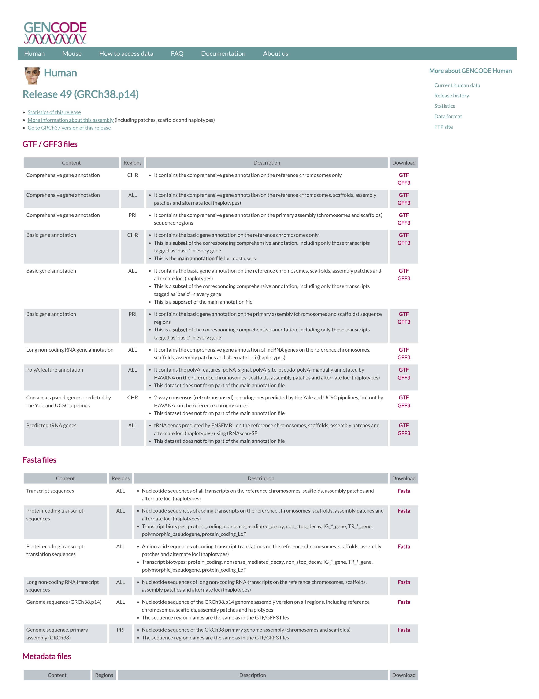
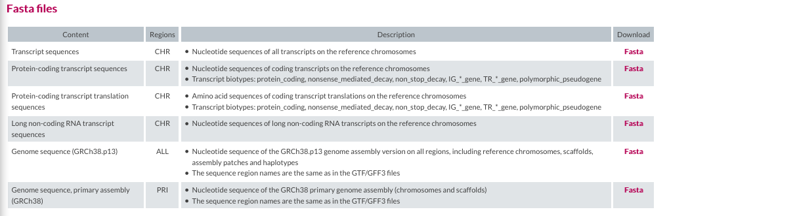
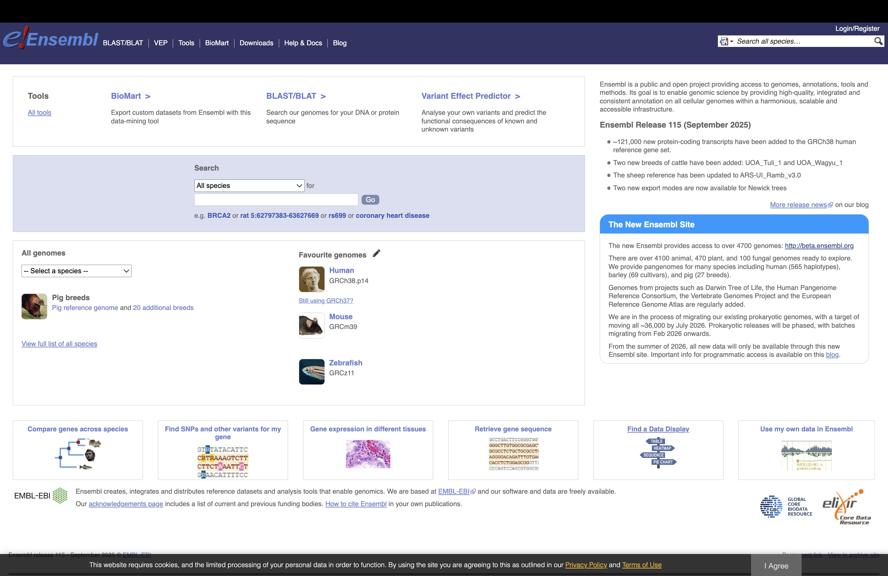
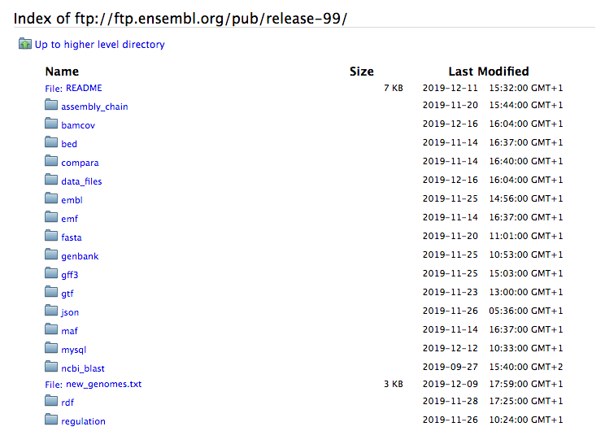

# Read mapping (Hands on)


What does it mean to map reads to a transcriptome? During sequencing, we read both ends of each RNA fragment—these are called "paired-end reads." Mapping to the transcriptome means finding where these paired reads match in our database of known transcript sequences. Since transcripts already have introns removed and exons joined together, the reads align directly without needing to "jump" across gaps like they would when mapping to the genome.

<div align="center">
||
</div>

## Tools for read mapping

Multiples **aligners** were developed over the last decades, using different **algorithms**: 

|Read mappers timeline|
| :---:  |
|
Like the index at the end of a book, an index of a large DNA sequence allows one to **rapidly find shorter sequences embedded in it**. Different tools use different approaches at genome/transcriptome indexing.

|k-mer index|
| :---:  |
||
|from [https://www.coursera.org/learn/dna-sequencing/lecture/d5oFY/lecture-indexing-and-the-k-mer-index](https://www.coursera.org/learn/dna-sequencing/lecture/d5oFY/lecture-indexing-and-the-k-mer-index)|


### Fast (splice-unaware) aligners to a reference transcriptome

These tools can be used for aligning **short reads** to a transcriptome reference.
<br>
If a genome were used as a reference, these tools would not map reads to **splicing junctions**.
<br>
They can be much faster than traditional aligners like [**Blast**](https://blast.ncbi.nlm.nih.gov/Blast.cgi) but less sensitive and may have limitations about the read size. 

* [**Bowtie**](http://bowtie-bio.sourceforge.net/index.shtml) is an ultrafast, memory-efficient short read aligner geared toward quickly aligning large sets of short DNA sequences (reads) to large genomes/transcriptomes. Bowtie uses a **Burrows-Wheeler index**. 
* [**Bowtie2**](http://bowtie-bio.sourceforge.net/bowtie2/index.shtml) is an ultrafast and memory-efficient tool for aligning sequencing reads to long reference sequences. It is particularly good at aligning reads of **length 50 up to 100s or 1,000s** to **relatively long (e.g. mammalian) genomes**. Bowtie 2 indexes the transcriptome with an **FM Index**. 
* [**BWA**](http://bio-bwa.sourceforge.net/) is a software package for mapping **low-divergent sequences** against a **large reference genome**, such as the human genome. BWA indexes the genome with an **FM Index**.
* [**GEM**](https://github.com/smarco/gem3-mapper) is a high-performance mapping tool for aligning sequenced reads against large reference genomes. It is designed to obtain best results when mapping sequences up to 1K bases long. GEM3 indexes the reference genome using a **custom FM-Index** design and performs an adaptive gapped search based on the characteristics of the input and the user settings. 

<br/>

### Splice-aware aligners to a reference genome

These aligners are able to map to the **splicing junctions** described in the annotation and even to detect novel ones. 
<br>
Some of them can detect **gene fusions** and **SNPs** and also **RNA editing**. For some of these tools, the downstream analysis requires the assignation of the aligned reads to a given gene/transcript.

* [**Tophat**](https://ccb.jhu.edu/software/tophat/index.shtml) is a fast splice junction mapper for RNA-Seq reads. It aligns RNA-Seq reads to **mammalian-sized genomes** using the ultra high-throughput short read aligner Bowtie, and then analyzes the mapping results to identify splice junctions between exons.
* [**HISAT2**](http://ccb.jhu.edu/software/hisat2/index.shtml) is **the next generation of spliced aligner from the same group that have developed TopHat**. It is a fast and sensitive alignment program for mapping next-generation sequencing reads (both DNA and RNA) to a population of human genomes (as well as to a single reference genome). The indexing scheme is called a **Hierarchical Graph FM index (HGFM)**. 
* [**STAR**](https://github.com/alexdobin/STAR) is an ultrafast universal RNA-seq aligner. It uses **sequential maximum mappable seed search** in uncompressed suffix arrays followed by seed clustering and stitching procedure. It is also able to search for gene fusions.

<br/>

### Quasi-mappers (alignment-free mappers) to a reference transcriptome

These tools are way faster than the previous ones because they don't need to report the resulting alignments (BAM/SAM files) but only  associate a read to a given transcript for quantification. They don't discover novel transcript variants (or splicing events) or detect variations, etc.

* [**Sailfish**](http://www.cs.cmu.edu/~ckingsf/software/sailfish/) replaces read mapping with intelligent **k-mer indexing and counting**, thus allowing fast quantification of isoform abundance (the authors claim that it takes about 15 minutes for a set of 150 million reads).
* [**Salmon**](https://salmon.readthedocs.io/en/latest/index.html) is **an advanced version of Sailfish, by the same authors**, tool for wicked-fast transcript quantification from RNA-seq data. It requires a set of target transcripts to quantify and a K-mer parameter to make the index (i.e. minimum acceptable alignment). 
* [**Kallisto**](https://pachterlab.github.io/kallisto/) is a program for quantifying abundances of transcripts from **bulk and single-cell RNA-Seq data**. It is based on the novel idea of **pseudoalignment** for rapidly determining the compatibility of reads with targets, without the need for alignment.


<br/>

For the results of different mappers/aligners comparison, see
* [https://www.ecseq.com/support/ngs/best-RNA-seq-aligner-comparison-of-mapping-tools](https://www.ecseq.com/support/ngs/best-RNA-seq-aligner-comparison-of-mapping-tools)
* [https://mikelove.wordpress.com/2018/05/05/salmon-vs-kallisto/](https://mikelove.wordpress.com/2018/05/05/salmon-vs-kallisto/)

<br/>

# Reference genome: FASTA and GTF/GFF

Before proceeding, we need to retrieve a **reference genome or transcriptome** from a public database, along with its **annotation**:
* A **FASTA file** contains the actual genome/transcriptome sequence.
* A **GTF/GFF file** contains the corresponding annotation.


## Public resources on genome/transcriptome sequences and annotations

* [GENCODE](https://www.gencodegenes.org/) contains an accurate annotation of the **human** and **mouse** genes derived either using **manual curation**, **computational analysis** or **targeted experimental approaches**. GENCODE also contains information on functional elements, such as protein-coding loci with alternatively splices variants, non-coding loci and pseudogenes.
* [Ensembl](https://www.ensembl.org/index.html) contains both **automatically generated** and **manually curated** annotations. They host different genomes and also comparative genomics data and variants. [Ensembl genomes](http://ensemblgenomes.org/) extends the genomic information across different taxonomic groups: bacteria, fungi, metazoa, plants, protists. Ensembl integrates also a genome browser.
* [UCSC Genome Browser](https://genome.ucsc.edu/) hosts information about different genomes. It integrates the GENCODE and Ensembl information as additional tracks. 

### Where to find the files

#### GENCODE

The current version for *Homo sapiens* genome is release [**33**](https://www.gencodegenes.org/human/release_33.html).
<br>
The files you would need are:
* FASTA file for the [**Genome sequence, primary assembly**](ftp://ftp.ebi.ac.uk/pub/databases/gencode/Gencode_human/release_33/GRCh38.primary_assembly.genome.fa.gz)
* FASTA file corresponding to the [**transcripts**](ftp://ftp.ebi.ac.uk/pub/databases/gencode/Gencode_human/release_33/gencode.v33.transcripts.fa.gz)
* GTF file of the [**Comprehensive gene annotation**](ftp://ftp.ebi.ac.uk/pub/databases/gencode/Gencode_human/release_33/gencode.v33.annotation.gtf.gz)

|GENCODE website|
| :---:  |
||
||


```{bash}
# genome
wget ftp://ftp.ebi.ac.uk/pub/databases/gencode/Gencode_human/release_33/GRCh38.primary_assembly.genome.fa.gz

# transcriptome
wget ftp://ftp.ebi.ac.uk/pub/databases/gencode/Gencode_human/release_33/gencode.v33.transcripts.fa.gz

# annotation
wget ftp://ftp.ebi.ac.uk/pub/databases/gencode/Gencode_human/release_33/gencode.v33.annotation.gtf.gz
```

#### ENSEMBL

The current version of the *Mus musculus* genome in [Ensembl](https://www.ensembl.org/index.html) is [**release 99**](ftp://ftp.ensembl.org/pub/release-99/)

The files you would need are:
* FASTA file for the [**genome primary assembly**](ftp://ftp.ensembl.org/pub/release-99/fasta/homo_sapiens/dna/Homo_sapiens.GRCh38.dna_rm.primary_assembly.fa.gz)
* FASTA file corresponding to the [**CDS regions / transcripts**](ftp://ftp.ensembl.org/pub/release-99/fasta/homo_sapiens/cds/Homo_sapiens.GRCh38.cds.all.fa.gz)
* GTF file for the [**annotation**](ftp://ftp.ensembl.org/pub/release-99/gtf/homo_sapiens/Homo_sapiens.GRCh38.99.chr.gtf.gz)

|GENCODE website|
| :---:  |
||
||

```{bash}
# genome
wget ftp://ftp.ensembl.org/pub/release-99/fasta/homo_sapiens/dna/Homo_sapiens.GRCh38.dna_rm.primary_assembly.fa.gz

# transcriptome
wget ftp://ftp.ensembl.org/pub/release-99/fasta/homo_sapiens/cds/Homo_sapiens.GRCh38.cds.all.fa.gz

# annotation
wget ftp://ftp.ensembl.org/pub/release-99/gtf/homo_sapiens/Homo_sapiens.GRCh38.99.chr.gtf.gz
```
<br/>

## Our data set

To speed up the mapping process, we retrieved a subset of the FASTA and GTF files that correspond **only to chromosome 6**.
<br>
You can download them from:

```{bash}
# go to the appropriate folder
cd ~/rnaseq_course/reference_genome

# download reference files for chromosome 6
wget https://public-docs.crg.es/biocore/projects/training/PHINDaccess2020/reference_chr6_Hsapiens.tar.gz

# extract archive
tar -xvzf reference_chr6_Hsapiens.tar.gz

# remove remaining .tar.gz archive
rm reference_chr6_Hsapiens.tar.gz
```

### FASTA file

The genome is often stored as a **FASTA file** (.fa file): each header (that can be chromosomes, transcripts, proteins), starts with "**>**":

```{bash}
zcat reference_chr6/Homo_sapiens.GRCh38.dna.chrom6.fa.gz | head -n 1
```

The size of the chromosome (in bp) is already reported in the header, but we can check it as follows:

```{bash}
zcat ~/rnaseq_course/reference_genome/reference_chr6/Homo_sapiens.GRCh38.dna.chrom6.fa.gz | grep -v ">" | tr -d '\n' | wc -m  

# 170805979
```

### GTF file

The annotation is stored in **G**eneral **T**ransfer **F**ormat (**GTF**) format (which is an extension of the older **[GFF format](https://genome.ucsc.edu/FAQ/FAQformat.html#format3)**): a tabular format with one line per genome feature, each one containing 9 columns of data. In general it has a header indicated by the first character **"#"** and one row per feature composed in 9 columns:

| Column number | Column name | Details |
| ----: | :---- | :---- |
| 1 | seqname | name of the chromosome or scaffold; chromosome names can be given with or without the 'chr' prefix. |
| 2 | source | name of the program that generated this feature, or the data source (database or project name) |
| 3 | feature | feature type name, e.g. Gene, Variation, Similarity |
| 4 | start | Start position of the feature, with sequence numbering starting at 1. |
| 5 | end | End position of the feature, with sequence numbering starting at 1. |
| 6 | score | A floating point value. |
| 7 | strand | defined as + (forward) or - (reverse). |
| 8 | frame | One of '0', '1' or '2'. '0' indicates that the first base of the feature is the first base of a codon, '1' that the second base is the first base of a codon, and so on.. |
| 9 | attribute | A semicolon-separated list of tag-value pairs, providing additional information about each feature. |


```{bash}
zcat reference_chr6/Homo_sapiens.GRCh38.88.chr6.gtf.gz | head -n 10
```

Let's check the 9th field:

```{bash}
zcat reference_chr6/Homo_sapiens.GRCh38.88.chr6.gtf.gz | cut -f9 | head
```

Let's check how many genes are in the annotation file:

```{bash}
zcat reference_chr6/Homo_sapiens.GRCh38.88.chr6.gtf.gz | grep -v "#" | awk '$3=="gene"' | wc -l 

# 2860
```

And get a final counts of every feature:

```{bash}
zcat reference_chr6/Homo_sapiens.GRCh38.88.chr6.gtf.gz | grep -v "#" | cut -f3 | sort | uniq -c 
```

<br>
