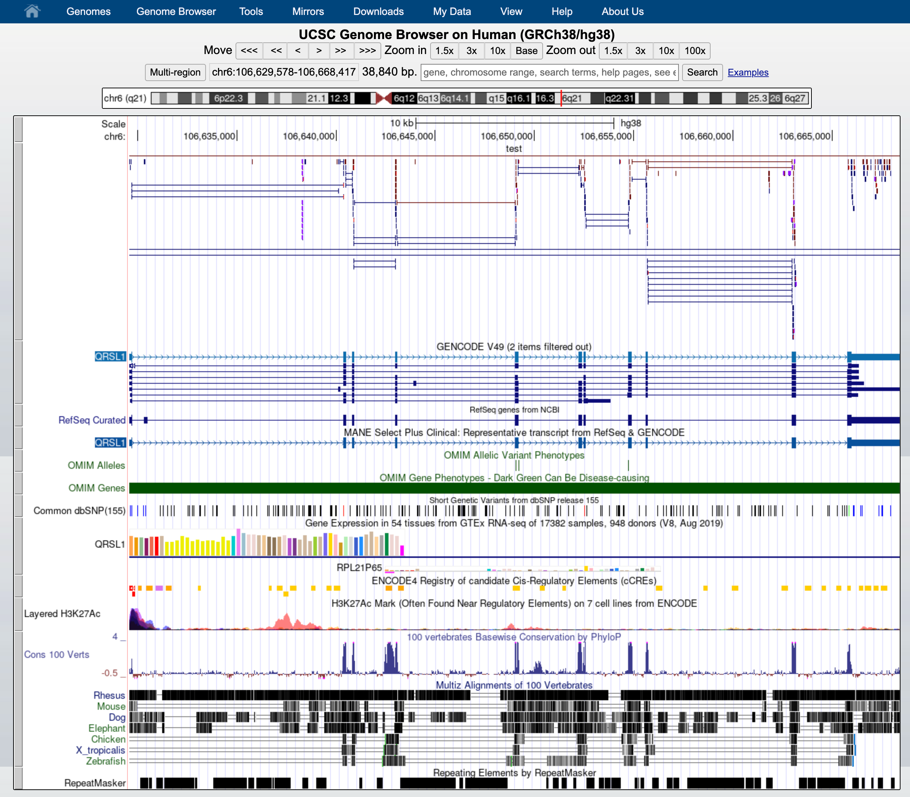

# Hands-on: Reference genome/transcriptome and annotation


After sequencing, reads are pre-processed and quality-checked. The next step is to **map** them to a reference. This raises two key questions: "What references are available?" and "Which one should I use?"

## Reference sequences


Before proceeding, we need to retrieve a **reference genome** or **transcriptome** from a public database, along with its **annotation**:
* A **FASTA file** contains the actual genome/transcriptome sequence.
* A **GTF/GFF file** contains the corresponding annotation.


### Public resources on genome/transcriptome sequences and annotations

* [GENCODE](https://www.gencodegenes.org/) contains an accurate annotation of the **human** and **mouse** genes derived either using **manual curation**, **computational analysis** or **targeted experimental approaches**. GENCODE also contains information on functional elements, such as protein-coding loci with alternative splicing variants, non-coding loci, and pseudogenes.
* [Ensembl](https://www.ensembl.org/index.html) contains both **automatically generated** and **manually curated** annotations. They host different genomes together with comparative genomics data and their variants. [Ensembl genomes](http://ensemblgenomes.org/) extends the genomic information across different taxonomic groups: bacteria, fungi, metazoa, plants, and protists. Ensembl also integrates a genome browser.
* [UCSC Genome Browser](https://genome.ucsc.edu/) hosts information about different genomes. It integrates the GENCODE and Ensembl information as additional tracks. 

### Where to find the files

#### GENCODE

The current version for *Homo sapiens* genome is release [**49**](https://www.gencodegenes.org/human/release_49.html).
<br>
The files you would need are:
* FASTA file for the [**Genome sequence, primary assembly**](https://ftp.ebi.ac.uk/pub/databases/gencode/Gencode_human/release_49/GRCh38.primary_assembly.genome.fa.gz)
* FASTA file corresponding to the [**transcripts**](https://ftp.ebi.ac.uk/pub/databases/gencode/Gencode_human/release_49/gencode.v49.transcripts.fa.gz)
* GTF file of the [**Comprehensive gene annotation**](https://ftp.ebi.ac.uk/pub/databases/gencode/Gencode_human/release_49/gencode.v49.annotation.gtf.gz)


<div align="center">
  
</div>

You can retrieve them via command line typing:

```bash
# genome
wget ftp://ftp.ebi.ac.uk/pub/databases/gencode/Gencode_human/release_49/GRCh38.primary_assembly.genome.fa.gz

# transcriptome
wget ftp://ftp.ebi.ac.uk/pub/databases/gencode/Gencode_human/release_49/gencode.v49.transcripts.fa.gz

# annotation
wget ftp://ftp.ebi.ac.uk/pub/databases/gencode/Gencode_human/release_49/gencode.v49.annotation.gtf.gz
```

#### ENSEMBL

The current version of the *Mus musculus* genome in [Ensembl](https://www.ensembl.org/index.html) is [**release 115**](ftp://ftp.ensembl.org/pub/release-115/)

The files you would need are:
* FASTA file for the [**genome primary assembly**](ftp://ftp.ensembl.org/pub/release-115/fasta/homo_sapiens/dna/Homo_sapiens.GRCh38.dna_rm.primary_assembly.fa.gz)
* FASTA file corresponding to the [**CDS regions / transcripts**](ftp://ftp.ensembl.org/pub/release-115/fasta/homo_sapiens/cds/Homo_sapiens.GRCh38.cds.all.fa.gz)
* GTF file for the [**annotation**](ftp://ftp.ensembl.org/pub/release-115/gtf/homo_sapiens/Homo_sapiens.GRCh38.99.chr.gtf.gz)


<div align="center">
  
</div>

<div align="center">
  
</div>

```bash
# genome
wget ftp://ftp.ensembl.org/pub/release-115/fasta/homo_sapiens/dna/Homo_sapiens.GRCh38.dna_rm.primary_assembly.fa.gz

# transcriptome
wget ftp://ftp.ensembl.org/pub/release-115/fasta/homo_sapiens/cds/Homo_sapiens.GRCh38.cds.all.fa.gz

# annotation
wget ftp://ftp.ensembl.org/pub/release-115/gtf/homo_sapiens/Homo_sapiens.GRCh38.115.chr.gtf.gz
```
<br/>

## Our data set

To speed up the mapping process, we retrieved a subset of the FASTA and GTF files that correspond **only to chromosome 6** here: [reference_chr6_Hsapiens.tar.gz](https://biocorecrg.github.io/RNAseq_coursesCRG_2026/latest/data/annotation/reference_chr6_Hsapiens.tar.gz)

You can download them from:

```bash
# go to the appropriate folder
cd ~/rnaseq_course/reference_genome

# download reference files for chromosome 6
wget https://biocorecrg.github.io/RNAseq_coursesCRG_2026/latest/data/annotation/reference_chr6_Hsapiens.tar.gz

# extract archive
tar -xvzf reference_chr6_Hsapiens.tar.gz

# remove remaining .tar.gz archive
rm reference_chr6_Hsapiens.tar.gz
```

### FASTA file

The genome is often stored as a **FASTA file** (.fa file): each header (that can be chromosomes, transcripts, proteins), starts with "**>**":

```bash
zcat reference_chr6/Homo_sapiens.GRCh38.dna.chrom6.fa.gz | head -n 1
```

The size of the chromosome (in bp) is already reported in the header, but we can check it as follows:

```bash
zcat ~/rnaseq_course/reference_genome/reference_chr6/Homo_sapiens.GRCh38.dna.chrom6.fa.gz | grep -v ">" | tr -d '\n' | wc -m  

# 170805979
```

We can also check the transcriptome sequences. 

```bash
zcat gencode.v49.transcripts.chr6.fa.gz| head -n 4
>ENST00000604449.1|ENSG00000271530.1|OTTHUMG00000184610.1|OTTHUMT00000468943.1|WBP1LP12-201|WBP1LP12|331|processed_pseudogene|
AGGATAAGGAAGCCTGTGTGTGTACCAACAATCAAAGCTACATCTGTGACACAACAGGACACTGCTATGGGCAGTCTCAGTGTTGTAACTACTACTATGAACATTGGTGGTTCTGGCTGGCATGGACCATCACCATCATCCTGAGCTGCTGCTGTGTCTGCCACCACAGCCAAGCCAGCCCTCAAGTCCAGCAGTAGCAACATGAAATCAACCTGACTGCCTATCCAGAAGCCCGCAATTACTCAGTGCTACCATTTTATTTCACCAAACTATTTATTACCTTCTTATGAGGAAGTGGTGAACTAACCTCCACCTGTTTCCCTCCCTGTCT
>ENST00000405102.1|ENSG00000220212.1|OTTHUMG00000014107.1|OTTHUMT00000039615.1|OR4F1P-201|OR4F1P|938|unprocessed_pseudogene|
ATGGATGGAGAGAATCACTCAGTGGTATCTGAGTTTTTGTTTCTGGGACTCACTCATTCATGGGAGATCCAGCTCCTCCTCCTAGTGTTTTCCTCTGTGCTCTATGTGGCAAGCATTACTGGAAACATCCTCATTGTATTTTCTGTGACCACTGACCCTCACTTACACTCCCCCATGTACTTTCTACTGGCCAGTCTCTCCTTCATTGACTTAGGAGCCTGCTCTGTCACTTCTCCCAAGATGATTTATGACCTGTTCAGAAAGCGCAAAGTCATCTCCTTTGGAGGCTGCATCGCTCAAATCTTCTTCATCCACGTCATTGGTGGTGTGGAGATGGTGCTGCTCATAGCCATGGCCTTTGACAGTTATGTGGCCCTATTAAGCCCCTCCACTATCTGACCATTATGAGCCCAAGAATGTGCCTTTCATTTCTGGCTGTTGCCTGGACCCTTGGTGTCAGTCACTCCCTGTTCCAACTGGCATTTCTTGTTAATTTACCCTTCTGTGGCCCTAATGTGTTGGACAGCTTCTACTGTGACCTTCCTCGGCTTCTCAGACTAGCCTGTACCGACACCTACAGATTGCAGTTCATGGTCACTGTTAACAGTGGGTTTATCTGTGTGGGTACTTTCTTCATACTTGTAATCTCCTACATCTTCATCCTGTTTACTGTTTGGAAACATTCCTCAGGTGGTTCATCCAAGGCCCTTTCCACTCTTTCAGCTCACAGCACAGCGGTCCTTTTGTTCTTTGGTCCACCCATGTTTGTGTATACATGGCCACACCCTAATTCACAGATGGACAAGTTTCTGGCTATTTTTGATGCAGTTCTCACTCCTTTTCTGAATCCAGTTGTCTATACATTCAGGAATAAGGAGATGAAGGCAGCAATAAAGAGAGTATGCAAACAGCTAGTGATTTACAAGAAGATCTCATAA
```

As you can see, this is a multi fasta file with several sequences, each one with its own header that contains: 


| Field | Value | Meaning |
|---|---|---|
| Ensembl Transcript ID | ENST00000405102.1 | Transcript identifier from Ensembl. The `.1` indicates the annotation version of the transcript. |
| Ensembl Gene ID | ENSG00000220212.1 | Gene identifier in Ensembl associated with this transcript. `.1` indicates the gene version. |
| HAVANA Gene ID | OTTHUMG00000014107.1 | Gene identifier from the HAVANA manual annotation project |
| HAVANA Transcript ID | OTTHUMT00000039615.1 | Transcript identifier from HAVANA |
| Transcript Name | OR4F1P-201 | Name of the transcript isoform. `201` indicates the isoform number. |
| Gene Symbol | OR4F1P | Gene symbol (olfactory receptor family 4 member F1 pseudogene). |
| Transcript Length | 938 | Length of the transcript in base pairs (bp). |
| Gene Biotype | unprocessed_pseudogene | Gene type indicating a duplicated gene that lost protein-coding ability but retains intron–exon structure. |


#### Exercise

- We can count how many transcripts we have in our fasta file by counting the character ">" that is in the header: 


:::{admonition} **Solution**
:class: dropdown

```bash
zcat gencode.v49.transcripts.chr6.fa.gz| grep ">" -c 
25648
```

:::

- We can count the number of **Gene Biotype** by using a combination of linux commands such as **grep**, **cut**, **sort**, and **uniq**: 

:::{admonition} **Solution**
:class: dropdown

```bash
zcat gencode.v49.transcripts.chr6.fa.gz| grep ">" | cut -d "|" -f8|sort|uniq -c 
  11435 lncRNA
     67 miRNA
    105 misc_RNA
    971 nonsense_mediated_decay
      3 non_stop_decay
    581 processed_pseudogene
      7 processed_transcript
   9665 protein_coding
   1042 protein_coding_CDS_not_defined
      2 protein_coding_LoF
   1335 retained_intron
      1 rRNA
     26 rRNA_pseudogene
      1 scaRNA
     39 snoRNA
    107 snRNA
     34 TEC
     76 transcribed_processed_pseudogene
     11 transcribed_unitary_pseudogene
     63 transcribed_unprocessed_pseudogene
      3 unitary_pseudogene
     74 unprocessed_pseudogene
```
:::

### GTF file

The annotation is stored in **G**eneral **T**ransfer **F**ormat (**GTF**) format (which is an extension of the older **[GFF format](https://genome.ucsc.edu/FAQ/FAQformat.html#format3)**): a tabular format with one line per genome feature, each one containing 9 columns of data. In general it has a header indicated by the first character **"#"** and one row per feature composed in 9 columns:

| Column number | Column name | Details |
| ----: | :---- | :---- |
| 1 | seqname | name of the chromosome or scaffold; chromosome names can be given with or without the 'chr' prefix. |
| 2 | source | name of the program that generated this feature, or the data source (database or project name) |
| 3 | feature | feature type name, e.g. Gene, Variation, Similarity |
| 4 | start | Start position of the feature, with sequence numbering starting at 1. |
| 5 | end | End position of the feature, with sequence numbering starting at 1. |
| 6 | score | A floating point value. |
| 7 | strand | defined as + (forward) or - (reverse). |
| 8 | frame | One of '0', '1' or '2'. '0' indicates that the first base of the feature is the first base of a codon, '1' that the second base is the first base of a codon, and so on.. |
| 9 | attribute | A semicolon-separated list of tag-value pairs, providing additional information about each feature. |


```bash
zcat reference_chr6/Homo_sapiens.GRCh38.115.chr6.gtf.gz | head -n 10
```

Let's check the 9th field:

```bash
zcat reference_chr6/Homo_sapiens.GRCh38.115.chr6.gtf.gz | cut -f9 | head
```

Let's check how many genes are in the annotation file:

```bash
zcat reference_chr6/Homo_sapiens.GRCh38.115.chr6.gtf.gz | grep -v "#" | awk '$3=="gene"' | wc -l 

# 4230
```

You can also extract those genes and put them into a separate file:

```bash
zcat reference_chr6/Homo_sapiens.GRCh38.115.chr6.gtf.gz | grep -v "#" | awk '$3=="gene"' > genes.gtf

```


And get the final count of every feature:

```bash
zcat reference_chr6/Homo_sapiens.GRCh38.115.chr6.gtf.gz | grep -v "#" | cut -f3 | sort | uniq -c 

      1 
 101233 CDS
 172707 exon
  19185 five_prime_utr
   4230 gene
      3 Selenocysteine
  10180 start_codon
   9955 stop_codon
  16561 three_prime_utr
  25648 transcript

```

<br>


## Exercise

Try to download the whole genome and annotation, and try to get the feature counts and count the number of **Gene Biotype** in the transcriptome.   


## Genome Browser

Read alignments (in BAM, CRAM, or BigWig formats) can be displayed in a genome browser, which is a program that allows users to browse, search, retrieve, and analyze genomic sequences and annotation data using a graphical interface.

There are two kinds of genome browsers:
* Web-based genome browsers:
  * [UCSC Genome Broswer](https://genome-euro.ucsc.edu/cgi-bin/hgGateway?redirect=manual&source=genome.ucsc.edu)
  * [Ensembl Genome Browser](https://www.ensembl.org/index.html)
  * [NCBI Genome Data Viewer](https://www.ncbi.nlm.nih.gov/genome/gdv/)

* Desktop applications (some can also be used for generating a web-based genome browser):
  * [JBrowse](https://jbrowse.org/)
  * [GBrowse](http://gmod.org/wiki/GBrowse_2.0_HOWTO)
  * [IGV](https://software.broadinstitute.org/software/igv/)
  
Small-sized data can be directly uploaded to the genome browser, while large files are normally placed on a web server that is accessible to the browser. To explore BAM and CRAM files produced by the STAR mapper, we first need to sort and index the files. 

### UCSC Genome Browser

We uploaded the files for this project (chromosome 6 only) to:[https://biocorecrg.github.io/RNAseq_coursesCRG_2026/latest/data/aln/index.html](https://biocorecrg.github.io/RNAseq_coursesCRG_2026/latest/data/aln/index.html)

Using the mouse's right click, copy the URL address of one of the BAM files.
<br>  

Now go to the [UCSC genome browser website](https://genome-euro.ucsc.edu/cgi-bin/hgGateway?redirect=manual&source=genome.ucsc.edu).


Choose human genome version hg38 (that corresponds to the ENSEMBL annotation we used). Click **GO**. 


At the bottom of the image, click **ADD CUSTOM TRACK** 


and provide information describing the data to be displayed:
* **track type** indicates the kind of file: **bam** (same is used for uploading .cram)
* **name** of the track 
* **bigDataUrl** the URL where the BAM or CRAM file is located 

```bash
track type=bam name="test" bigDataUrl=https://biocorecrg.github.io/RNAseq_coursesCRG_2026/latest/data/aln/SRR3091420_1_chr6Aligned.sortedByCoord.out.bam

```

Click "Submit".


This indicates that everything went ok and we can now display the data. Since our data are restricted to chromosome 6 we have to display that chromosome. For example, let's select the gene **QRSL1** then **go**.


And we can display it. 

The default view can be changed by clicking on the grey bar on the left of the "My BAM" track. You can open a window with different settings; for example, you can change the **Display mode** to **Squish**.

This will change how data is displayed. We can now see single reads aligned to the forward and reverse DNA strands (blue is to **+strand** and red, to **-strand**).  You can also see that many reads are broken; that is, they are mapped to splice junctions.



We can also display only the coverage by selecting in "My BAM Track Settings" **Display data as a density graph** and  **Display mode: full**. 


These expression signal plots can be helpful for comparing different samples (in this case, make sure to set comparable scales on the Y-axes). 


<br/>


