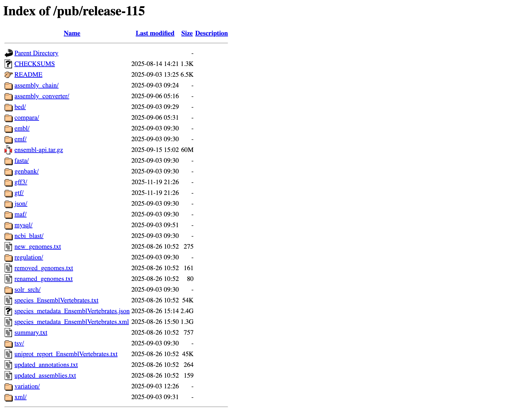
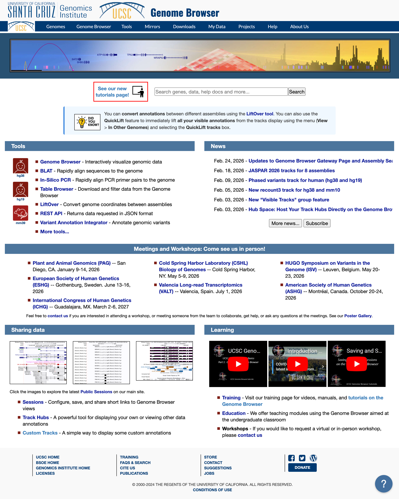
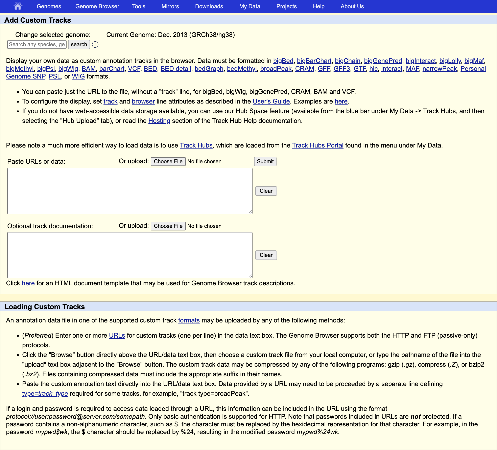
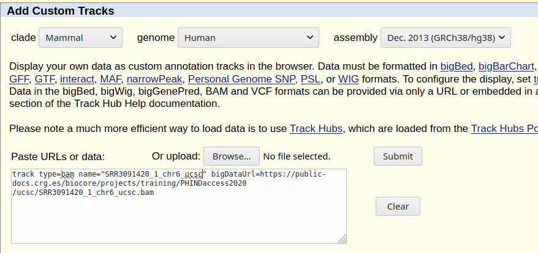
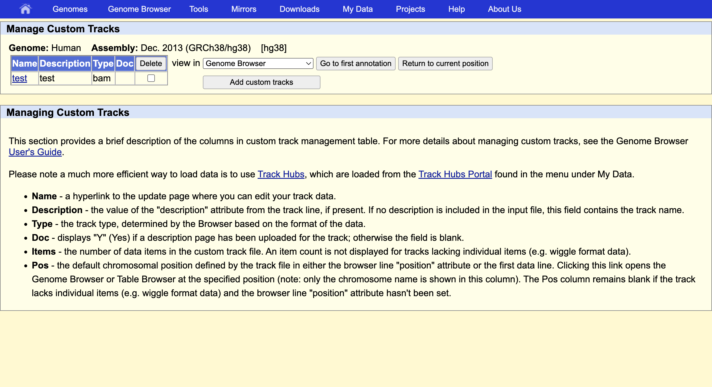
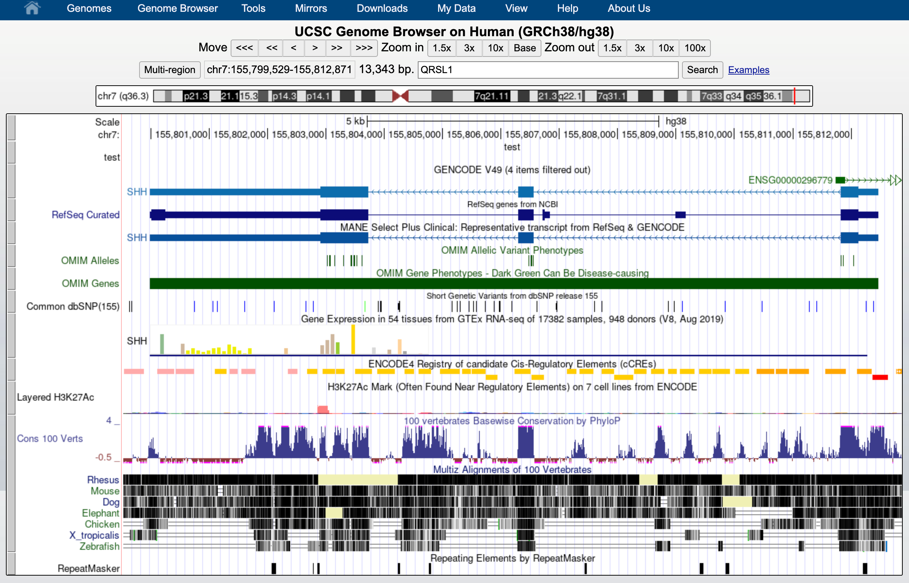
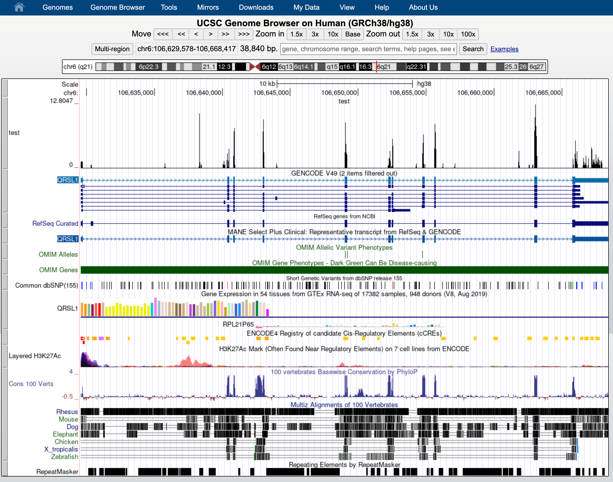
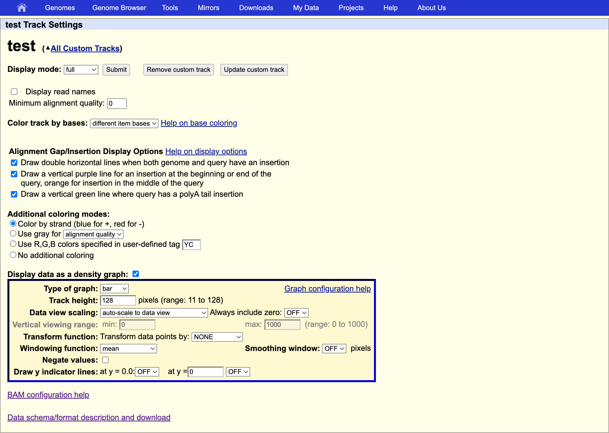
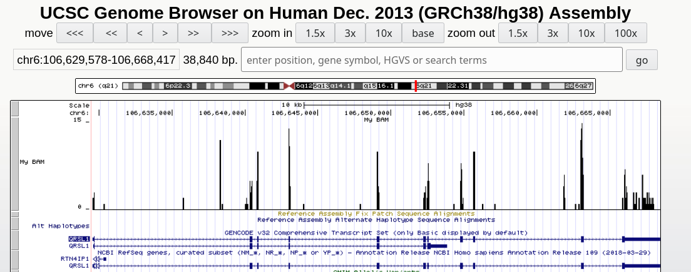

# Reference genome/transcriptome and annotation


After sequencing, reads are pre-processed and quality-checked. The next step is to **map** them to a reference. This raises two key questions: "What references are available?" and "Which one should I use?"

## Reference sequences


Before proceeding, we need to retrieve a **reference genome** or **transcriptome** from a public database, along with its **annotation**:
* A **FASTA file** contains the actual genome/transcriptome sequence.
* A **GTF/GFF file** contains the corresponding annotation.


### Public resources on genome/transcriptome sequences and annotations

* [GENCODE](https://www.gencodegenes.org/) contains an accurate annotation of the **human** and **mouse** genes derived either using **manual curation**, **computational analysis** or **targeted experimental approaches**. GENCODE also contains information on functional elements, such as protein-coding loci with alternative splicing variants, non-coding loci, and pseudogenes.
* [Ensembl](https://www.ensembl.org/index.html) contains both **automatically generated** and **manually curated** annotations. They host different genomes together with comparative genomics data and their variants. [Ensembl genomes](http://ensemblgenomes.org/) extends the genomic information across different taxonomic groups: bacteria, fungi, metazoa, plants, and protists. Ensembl also integrates a genome browser.
* [UCSC Genome Browser](https://genome.ucsc.edu/) hosts information about different genomes. It integrates the GENCODE and Ensembl information as additional tracks. 

### Where to find the files

#### GENCODE

The current version for *Homo sapiens* genome is release [**49**](https://www.gencodegenes.org/human/release_49.html).
<br>
The files you would need are:
* FASTA file for the [**Genome sequence, primary assembly**](ftp://ftp.ebi.ac.uk/pub/databases/gencode/Gencode_human/release_49/GRCh38.primary_assembly.genome.fa.gz)
* FASTA file corresponding to the [**transcripts**](ftp://ftp.ebi.ac.uk/pub/databases/gencode/Gencode_human/release_49/gencode.v49.transcripts.fa.gz)
* GTF file of the [**Comprehensive gene annotation**](ftp://ftp.ebi.ac.uk/pub/databases/gencode/Gencode_human/release_49/gencode.v49.annotation.gtf.gz)


<div align="center">
  
</div>

You can retrieve them via command line typing:

```bash
# genome
wget ftp://ftp.ebi.ac.uk/pub/databases/gencode/Gencode_human/release_49/GRCh38.primary_assembly.genome.fa.gz

# transcriptome
wget ftp://ftp.ebi.ac.uk/pub/databases/gencode/Gencode_human/release_49/gencode.v49.transcripts.fa.gz

# annotation
wget ftp://ftp.ebi.ac.uk/pub/databases/gencode/Gencode_human/release_49/gencode.v49.annotation.gtf.gz
```

#### ENSEMBL

The current version of the *Mus musculus* genome in [Ensembl](https://www.ensembl.org/index.html) is [**release 115**](ftp://ftp.ensembl.org/pub/release-115/)

The files you would need are:
* FASTA file for the [**genome primary assembly**](ftp://ftp.ensembl.org/pub/release-115/fasta/homo_sapiens/dna/Homo_sapiens.GRCh38.dna_rm.primary_assembly.fa.gz)
* FASTA file corresponding to the [**CDS regions / transcripts**](ftp://ftp.ensembl.org/pub/release-115/fasta/homo_sapiens/cds/Homo_sapiens.GRCh38.cds.all.fa.gz)
* GTF file for the [**annotation**](ftp://ftp.ensembl.org/pub/release-115/gtf/homo_sapiens/Homo_sapiens.GRCh38.99.chr.gtf.gz)


<div align="center">
  
</div>

<div align="center">
  
</div>

```bash
# genome
wget ftp://ftp.ensembl.org/pub/release-115/fasta/homo_sapiens/dna/Homo_sapiens.GRCh38.dna_rm.primary_assembly.fa.gz

# transcriptome
wget ftp://ftp.ensembl.org/pub/release-115/fasta/homo_sapiens/cds/Homo_sapiens.GRCh38.cds.all.fa.gz

# annotation
wget ftp://ftp.ensembl.org/pub/release-115/gtf/homo_sapiens/Homo_sapiens.GRCh38.115.chr.gtf.gz
```
<br/>

## Our data set

To speed up the mapping process, we retrieved a subset of the FASTA and GTF files that correspond **only to chromosome 6** here: [reference_chr6_Hsapiens.tar.gz)](https://biocorecrg.github.io/RNAseq_coursesCRG_2026/latest/data/annotation/reference_chr6_Hsapiens.tar.gz)

You can download them from:

```bash
# go to the appropriate folder
cd ~/rnaseq_course/reference_genome

# download reference files for chromosome 6
wget https://biocorecrg.github.io/RNAseq_coursesCRG_2026/latest/data/annotation/reference_chr6_Hsapiens.tar.gz

# extract archive
tar -xvzf reference_chr6_Hsapiens.tar.gz

# remove remaining .tar.gz archive
rm reference_chr6_Hsapiens.tar.gz
```

### FASTA file

The genome is often stored as a **FASTA file** (.fa file): each header (that can be chromosomes, transcripts, proteins), starts with "**>**":

```bash
zcat reference_chr6/Homo_sapiens.GRCh38.dna.chrom6.fa.gz | head -n 1
```

The size of the chromosome (in bp) is already reported in the header, but we can check it as follows:

```bash
zcat ~/rnaseq_course/reference_genome/reference_chr6/Homo_sapiens.GRCh38.dna.chrom6.fa.gz | grep -v ">" | tr -d '\n' | wc -m  

# 170805979
```

### GTF file

The annotation is stored in **G**eneral **T**ransfer **F**ormat (**GTF**) format (which is an extension of the older **[GFF format](https://genome.ucsc.edu/FAQ/FAQformat.html#format3)**): a tabular format with one line per genome feature, each one containing 9 columns of data. In general it has a header indicated by the first character **"#"** and one row per feature composed in 9 columns:

| Column number | Column name | Details |
| ----: | :---- | :---- |
| 1 | seqname | name of the chromosome or scaffold; chromosome names can be given with or without the 'chr' prefix. |
| 2 | source | name of the program that generated this feature, or the data source (database or project name) |
| 3 | feature | feature type name, e.g. Gene, Variation, Similarity |
| 4 | start | Start position of the feature, with sequence numbering starting at 1. |
| 5 | end | End position of the feature, with sequence numbering starting at 1. |
| 6 | score | A floating point value. |
| 7 | strand | defined as + (forward) or - (reverse). |
| 8 | frame | One of '0', '1' or '2'. '0' indicates that the first base of the feature is the first base of a codon, '1' that the second base is the first base of a codon, and so on.. |
| 9 | attribute | A semicolon-separated list of tag-value pairs, providing additional information about each feature. |


```bash
zcat reference_chr6/Homo_sapiens.GRCh38.88.chr6.gtf.gz | head -n 10
```

Let's check the 9th field:

```bash
zcat reference_chr6/Homo_sapiens.GRCh38.88.chr6.gtf.gz | cut -f9 | head
```

Let's check how many genes are in the annotation file:

```bash
zcat reference_chr6/Homo_sapiens.GRCh38.88.chr6.gtf.gz | grep -v "#" | awk '$3=="gene"' | wc -l 

# 2860
```

And get a final counts of every feature:

```bash
zcat reference_chr6/Homo_sapiens.GRCh38.88.chr6.gtf.gz | grep -v "#" | cut -f3 | sort | uniq -c 
```

<br>

# Genome Browser

Read alignments (in the BAM, CRAM or BigWig formats) can be displayed in a genome browser, which is a program allowing users to browse, search, retrieve and analyze genomic sequences and annotation data using a graphical interface.

There are two kinds of genome browsers:
* Web-based genome browsers:
  * [UCSC Genome Broswer](https://genome.ucsc.edu/)
  * [Ensembl Genome Browser](https://www.ensembl.org/index.html)
  * [NCBI Genome Data Viewer](https://www.ncbi.nlm.nih.gov/genome/gdv/)

* Desktop applications (some can also be used for generatig a web-based genome browser):
  * [JBrowse2](https://jbrowse.org/)
  * [IGV](https://igv.org/)
  
Small size data can be directly uploaded to the genome browser, while large files are normally placed on a web-server that is accessible to the browser. To explore BAM and CRAM files produced by the STAR mapper, we first need to sort and index the files. In our case, sorting has been already done by STAR's **BAM SortedByCoordinate** option. 
<br>
The indexing can be done with samtools:

```bash

wget -r -np -nH --cut-dirs=5 -A "*.gz" https://biocorecrg.github.io/RNAseq_coursesCRG_2026/latest/data/reads


cd ~/rnaseq_course/mapping

$RUN samtools index bam_chr6/SRR3091420_1_chr6-trimmedAligned.sortedByCoord.out.bam
$RUN samtools index bam_chr6/SRR3091420_1_chr6Aligned.sortedByCoord.out.cram

```


## UCSC Genome Browser

**IMPORTANT!** 
<br>
Be careful with the **chromosome name conventions**!
<br>
Different genome browsers name chromosomes differently. UCSC names chromosomes as **chr1**, **chr2**,...**chrM**; while Ensembl, **1**, **2**, ... **MT**. 
<br>
When you map reads to a genome with a given convention you cannot directly display BAM/CRAM files in the genome browser that uses a different convention.
<br>
**GENCODE** uses the **UCSC convention**, while **ENSEMBL doesn't**: we need to change the chromosomes names before being able to load them in the UCSC Genome Browser. 

```bash
cd ~/rnaseq_course/mapping

# create new sub-directory
mkdir bam_ucsc

# convert chromosome naming (produce a SAM file)
$RUN samtools view -h bam_chr6/SRR3091420_1_chr6-trimmedAligned.sortedByCoord.out.bam | awk -F "\t" 'BEGIN{OFS="\t"}{if($1 ~ /^@/){print $0} else {print $1,$2,"chr"$3,$4,$5,$6,$7,$8,$9,$10,$11,$12}}' | sed 's/chrMT/chrM/g' | sed 's/SN:/SN:chr/g' > bam_ucsc/SRR3091420_1_chr6_ucsc.sam

# convert SAM to BAM
$RUN samtools view -b -o bam_ucsc/SRR3091420_1_chr6_ucsc.bam bam_ucsc/SRR3091420_1_chr6_ucsc.sam

# create index for BAM file
$RUN samtools index bam_ucsc/SRR3091420_1_chr6_ucsc.bam

# remove SAM file
rm bam_ucsc/SRR3091420_1_chr6_ucsc.sam
```

First, you need to upload your sorted bam (or cram) file(s) **together with an index (.bai or .crai) file(s)** to a http server that is accessible from the Internet. 
<br>

We uploaded the files for this project (chromosome 6 only) are in:

```
https://public-docs.crg.es/biocore/projects/training/PHINDaccess2020/ucsc/
```

Using the mouse's right click, copy one of the bam files URL address.
<br>  

Now go to the [UCSC genome browser website](https://genome-euro.ucsc.edu/cgi-bin/hgGateway?redirect=manual&source=genome.ucsc.edu).



Choose human genome version hg38 (that corresponds to the ENSEMBL annotation we used). Click **GO**. 



At the bottom of the image click **ADD CUSTOM TRACK** 



and provide information describing the data to be displayed:
* **track type** indicates the kind of file: **bam** (same is used for uploading .cram)
* **name** of the track 
* **bigDataUrl** the URL where the BAM or CRAM file is located 

```bash
track type=bam name="test" bigDataUrl=https://public-docs.crg.es/biocore/projects/training/PHINDaccess2020/ucsc/SRR3091420_1_chr6_ucsc.bam
```

Click "Submit".



This indicates that everything went ok and we can now display the data. Since our data are restricted to chromosome 6 we have to display that chromosome. For example, let's select the gene **QRSL1** then **go**.



And we can display it. 


The default view can be changed by clicking on the grey bar on the left of the "My BAM" track. You can open a window with different settings; for example, you can change the **Display mode** to **Squish**.


This will change how data are displayed. We can now see single reads aligned to the forward and reverse DNA strands (blue is to **+strand** and red, to **-strand**).  You can also see that many reads are broken; that is, they are mapped to splice junctions.



We can also display only the coverage by selecting in "My BAM Track Settings" **Display data as a density graph** and  **Display mode: full**. 



These expression signal plots can be helpful for comparing different samples (in this case, make sure to set comparable scales on the Y-axes). 



<br/>

