# Hands-on: Differential expression analysis

Once we have the gene counts, we can perform differential expression analysis. The goal of differential expression analysis is to perform statistical analysis to try and discover **changes in expression levels** of defined features (genes, transcripts, exons) between experimental groups with **replicated samples**.

**Flowchart with the steps in RNAseq differential expression analysis.**

<div style="display:flex; justify-content:center;">

```
Read quantification
 ┌───────────────────────────────┐
 │ STAR alignment → gene counts  │
 │        or                     │
 │ Salmon → transcript counts    │
 └───────────────────────────────┘
            │
            │
            ▼
    Import counts into R
    (counts + sample metadata)
            │
            │
            ▼
    Create DESeq2 dataset
    DESeqDataSetFromMatrix()
    or
    tximport (for Salmon)
            │
            │
            ▼
    Filtering
    (remove very low count genes)
            │
            │
            ▼
    Normalization
    (size factor estimation)
            │
            │
            ▼
    Exploratory analysis
    VST / rlog transformation
    PCA / sample correlation
    (outlier detection)
            │
            │
            ▼
    Differential expression model
    Run DESeq()
    • dispersion estimation
    • GLM fitting
    • statistical testing
            │
            │
            ▼
    Results extraction
    results()
    (log2FoldChange, p-value, padj)
            │
            │
            ▼
    Identify DE genes
    (padj < 0.05, |log2FC| threshold)
            │
            │
            ▼
    Downstream analysis
    • heatmaps
    • volcano plots
    • pathway enrichment
    • GO analysis

```

</div>

## Popular tools

Most of the popular tools for differential expression analysis are available as **R / Bioconductor** packages.
Bioconductor is an R project and repository that provides a set of packages and methods for omics data analysis.

The best performing tools for differential expression analysis tend to be:

* [DESeq2](https://bioconductor.org/packages/release/bioc/html/DESeq2.html)
* [edgeR](https://bioconductor.org/packages/release/bioc/html/edgeR.html)
* [limma (voom)](https://bioconductor.org/packages/release/bioc/html/limma.html)

| Aspect                              | **DESeq2**                                              | **edgeR**                                          | **limma-voom**                                     |
| ----------------------------------- | ------------------------------------------------------- | -------------------------------------------------- | -------------------------------------------------- |
| **Core statistical model**          | Negative Binomial GLM                                   | Negative Binomial GLM                              | Linear model after **voom** transformation         |
| **Key statistical idea**            | Empirical Bayes shrinkage of dispersion and fold change | Empirical Bayes shrinkage of dispersion            | Mean-variance modeling with precision weights      |
| **Data type used directly**         | Raw count data                                          | Raw count data                                     | Counts transformed to log-CPM via voom             |
| **Variance modeling**               | Dispersion estimated and shrunk toward trend            | Dispersion estimated (common, trended, tagwise)    | Variance estimated from mean-variance relationship |
| **Normalization method**            | Median-of-ratios size factors                           | TMM normalization                                  | Usually TMM (edgeR) before voom                    |
| **Statistical test**                | Wald test (default) or LRT                              | Exact test, GLM likelihood ratio, quasi-likelihood | Moderated t-tests                                  |
| **Handling small sample sizes**     | Good                                                    | Excellent                                          | Moderate                                           |
| **Handling large datasets**         | Good                                                    | Good                                               | Excellent                                          |
| **Speed / computational cost**      | Moderate                                                | Fast                                               | Very fast                                          |
| **Ease of use**                     | Very beginner-friendly                                  | Intermediate                                       | Intermediate                                       |
| **Flexibility for complex designs** | Good                                                    | Very good                                          | Excellent                                          |
| **Low-count genes**                 | Conservative handling                                   | Handles low counts well                            | Less ideal for extremely low counts                |

```{admonition} Further reading
:class: note

For more information see [Schurch et al, 2015; arXiv:1505.02017](https://arxiv.org/abs/1505.02017) and [the Biostars thread about the main differences between the methods](https://www.biostars.org/p/284775/).
```

Main differences between the tools rely on the **statistical modeling** of counts and different normalization approaches. They capture different biological meaning and their results are not mutually exclusive.

In this tutorial, we will give you an overview of the **DESeq2** pipeline to find differentially expressed **genes** between two conditions.

### DESeq2

[DESeq2](https://bioconductor.org/packages/release/bioc/html/DESeq2.html) is an R/Bioconductor implemented method to detect differentially expressed features.

It tests for differential expression using [**negative binomial generalized linear models**](https://bioramble.wordpress.com/2016/01/30/why-sequencing-data-is-modeled-as-negative-binomial/).

DESeq2 (as edgeR) is based on the hypothesis that **most genes are not differentially expressed**.

This DESeq2 tutorial is inspired by the [RNA-seq workflow](http://master.bioconductor.org/packages/release/workflows/vignettes/rnaseqGene/inst/doc/rnaseqGene.html) developed by the authors of the tool, and by the [differential gene expression course](https://hbctraining.github.io/DGE_workshop/lessons/04_DGE_DESeq2_analysis.html) from the [Harvard Chan Bioinformatics Core](http://bioinformatics.sph.harvard.edu/).

DESeq2 takes as an input **raw counts** (i.e. non normalized counts): the DESeq2 model internally **corrects for library size**, so giving as an input normalized count would be incorrect.

#### DESeq2 steps

* Modeling raw counts for each gene:
  * Estimate size factors (accounts for differences in library size): estimateSizeFactors()
  * Estimate dispersions: estimateDispersions()
  * GLM (Generalized Linear Model) fit for each gene: nbinomWaldTest()
* Testing for differential expression (Wald test).

DESeq2 uses the **median of ratio** method for **normalization**: briefly, the raw counts are divided by sample-specific **size factors**.
**Geometric mean** is calculated for each gene **across all samples**. The counts for a gene in each sample is then **divided** by this mean. The **median of these ratios** in a sample is the size factor for that sample.

For additional information regarding the tool and the algorithm, please refer to the [paper](https://www.ncbi.nlm.nih.gov/pmc/articles/PMC4302049/) and the user-friendly package [vignette](http://bioconductor.org/packages/devel/bioc/vignettes/DESeq2/inst/doc/DESeq2.html).

## Tutorial on basic DESeq2 usage for differential analysis of gene expression

* In this tutorial, we will use the counts calculated from the mapping on **all chromosomes** (we practiced so far QC and mapping for data of only one chromosome but here we consider all chromosomes), for the 10 samples previously selected from [**GEO**](https://www.ncbi.nlm.nih.gov/geo/query/acc.cgi?acc=GSE76647):

| GEO ID     | SRA ID     | Sample name     | Differentiation | Condition |
| :--------: | :--------: | :-------------: | :-------------: | :-------: |
| GSM2031982 | SRR3091420 | 5p4_25c         | undiff          | WT        |
| GSM2031983 | SRR3091421 | 5p4_27c         | undiff          | WT        |
| GSM2031984 | SRR3091422 | 5p4_28c         | diff 5 days     | WT        |
| GSM2031985 | SRR3091423 | 5p4_29c         | diff 5 days     | WT        |
| GSM2031986 | SRR3091424 | 5p4_30c         | diff 5 days     | WT        |
| GSM2031987 | SRR3091425 | 5p4_31cfoxc1    | undiff          | KO        |
| GSM2031988 | SRR3091426 | 5p4_32cfoxc1    | undiff          | KO        |
| GSM2031989 | SRR3091427 | 5p4_33cfoxc1    | undiff          | KO        |
| GSM2031990 | SRR3091428 | 5p4_34cfoxc1    | diff 5 days     | KO        |
| GSM2031991 | SRR3091429 | 5p4_35cfoxc1    | diff 5 days     | KO        |

*The [FOXC1](https://ghr.nlm.nih.gov/gene/FOXC1) protein plays a critical role in early development, particularly in the formation of structures in the front part of the eye (the anterior segment). These structures include the colored part of the eye (the iris), the lens of the eye, and the clear front covering of the eye (the cornea). Studies suggest that the FOXC1 protein may also have functions in the adult eye, such as helping cells respond to oxidative stress. Oxidative stress occurs when unstable molecules called free radicals accumulate to levels that can damage or kill cells.
The FOXC1 protein is also involved in the normal development of other parts of the body, including the heart, kidneys, and brain. [Source](https://ghr.nlm.nih.gov/gene/FOXC1).*

Get the count data for the full data set, output of both STAR and Salmon:

```bash
# Navigate to your course directory
cd ~/rnaseq_course/differential_expression

# Download the full count data folder from the course repository
wget https://github.com/biocorecrg/RNAseq_coursesCRG_2026/tree/master/docs/data/differential_expression/full_data_counts
```

### Raw count matrices

**DESeq2** takes as an input raw (non normalized) counts, in various forms:

* A matrix for all sample, very typical in microarrays: DESeqDataSetFromMatrix()
* One file per sample (our option for STAR): DESeqDataSetFromMatrix()
* A **txi** object (our option for Salmon): DESeqDataSetFromTximport()

#### Prepare data from STAR

We need to create one file per sample, each file containing the raw counts of all genes:

File **SRR3091420_1_chr6_counts.txt**:

| gene_id | count |
| :-----: | :---: |
| ENSG00000260370.1 | 0 |
| ENSG00000237297.1 | 10 |
| ENSG00000261456.5 | 210 |

File **SRR3091421_1_chr6_counts.txt**:

| gene_id | count |
| :-----: | :---: |
| ENSG00000260370.1 | 0 |
| ENSG00000237297.1 | 8 |
| ENSG00000261456.5 | 320 |

and so on...

Remember that the STAR count file contains **4 columns** depending on the library preparation protocol!

**Exercise**

* Prepare the 10 files needed for our analysis, from the STAR output, and save them in the **counts_selected** directory: knowing that our libraries are **unstranded**, which column will you pick?
* Create the sub-directory **counts_STAR_selected** inside the deseq2 directory:

```bash
cd ~/rnaseq_course/differential_expression
mkdir counts_STAR_selected
```

* Loop around the 10 **ReadsPerGene.out.tab** files and extract the gene ID (1rst column) and the correct counts (2nd column).

```bash
for i in counts_STAR/*ReadsPerGene.out.tab
do echo $i

# retrieve the first (gene name) and second column (raw reads for unstranded protocol)
cut -f1,2 $i | grep -v "_" > counts_STAR_selected/$(basename $i .ReadsPerGene.out.tab)_counts.txt
done
```

#### Prepare transcript-to-gene annotation file (Salmon)

Prepare the annotation file needed to import the **Salmon** counts: a two-column data frame linking transcript id (column 1) to gene id (column 2).

We will add the gene symbol in column 3, for a more comprehensive annotation.

Process from the **GTF file**:

```bash
cd ~/rnaseq_course/differential_expression

# Gencode annotation for all chromosomes
wget ftp://ftp.ebi.ac.uk/pub/databases/gencode/Gencode_human/release_49/gencode.v49.annotation.gtf.gz

# first column is the transcript ID, second column is the gene ID, third column is the gene symbol
zcat gencode.v49.annotation.gtf.gz | awk -F "\t" 'BEGIN{OFS="\t"}{if($3=="transcript"){split($9, a, "\""); print a[4],a[2],a[8]}}' > tx2gene.gencode.v49.csv
```

#### Sample sheet

Additionally, DESeq2 needs a **sample sheet** that describes the samples characteristics: treatment, knock-out / wild type, replicates, time points, etc. in the form:

| SampleName   | FileName                  | Differentiation | Condition |
| :----------: | :-----------------------: | :-------------: | :-------: |
| 5p4_25c      | SRR3091420_counts.txt     | undiff          | WT        |
| 5p4_27c      | SRR3091421_counts.txt     | undiff          | WT        |
| 5p4_28c      | SRR3091422_counts.txt     | diff5days       | WT        |
| 5p4_29c      | SRR3091423_counts.txt     | diff5days       | WT        |
| 5p4_30c      | SRR3091424_counts.txt     | diff5days       | WT        |
| 5p4_31cfoxc1 | SRR3091425_counts.txt     | undiff          | KO        |
| 5p4_32cfoxc1 | SRR3091426_counts.txt     | undiff          | KO        |
| 5p4_33cfoxc1 | SRR3091427_counts.txt     | undiff          | KO        |
| 5p4_34cfoxc1 | SRR3091428_counts.txt     | diff5days       | KO        |
| 5p4_35cfoxc1 | SRR3091429_counts.txt     | diff5days       | KO        |

The first column is the **sample name**, the second column the **file name** of the count file generated by STAR (after selection of the appropriate column as we just did), and the remaining columns are description of the samples, some of which will be used in the **statistical design**.

The design indicates how to model the samples: in the model we need to specify what we want to **measure** and what we want to **control**.

**Exercise**

* Prepare this file (tab-separated columns) in a text editor: save it as **sample_sheet_foxc1.txt in the differential_analysis directory**: you can do it "manually" using a text editor, or you can try using the command line.

*Note that the same sample sheet will be used for both **the STAR and the Salmon** DESeq2 analysis. (with a slight modification that we will see later on)*

**BACK UP**

You can download it the following way, in R:

```bash
wget https://github.com/biocorecrg/RNAseq_coursesCRG_2026/tree/master/docs/data/differential_expression/sample_sheet_foxc1.txt
```

## Analysis

The analysis is done in R!

We will use a local Rstudio server running a singularity container.

```bash
# Download the bash script that installs the singularity container and run it in the localserver
wget https://github.com/biocorecrg/RNAseq_coursesCRG_2026/blob/master/run_rstudio.sh
bash run_rstudio.sh
```

Start **R Studio**.
In your browser, type the following url: <http://localhost:8787/>
Open a new R script file.

Note that in the R code boxes below **\#** is followed by comments, i.e. words not interpreted by R, as in Linux.

* Go to the **differential_expression** working directory and install and load the required packages (loading a package in R allows to use specific sets of functions developed as part of this package).

```r
library(BiocManager)

BiocManager::install("DESeq2") ## Installation of the package for differential expression analysis, only needed the first time in Rstudio local installation.
library("DESeq2") ## Loading the package.

BiocManager::install("EnhancedVolcano")
BiocManager::install("tximport")
BiocManager::install("biomaRt")
BiocManager::install("pheatmap")
install.packages("reshape2")

# setwd = set working directory; equivalent to the Linux "cd". All the files you will write will be in this directory
# the R equivalent to the Linux pwd is getwd() = get working directory
setwd("~/rnaseq_course/differential_expression")
```

### Import STAR counts

* Read in the sample table that we prepared:

```r
# read in the sample sheet
# header = TRUE: the first row is the "header", i.e. it contains the column names
# sep = "\t": the columns/fields are separated with tabs
sampletable <- read.table("sample_sheet_foxc1.txt", header=T, sep="\t")

# add the SRA codes as row names (it is needed for some of the DESeq functions)
rownames(sampletable) <- gsub("_counts.txt", "", sampletable$FileName)

# display the first 6 rows
head(sampletable)

# check the number of rows and the number of columns
nrow(sampletable) # if this is not 10, please raise your hand !
ncol(sampletable) # if this is not 4, also raise your hand !
```

DESeq will process only the counts for the files listed in the sample table (keep in mind for future exercises and when you want to exclude some samples from the analysis).

* Load the count data from **STAR** into a **DESeq** object:
  * **sampleTable:** the sample sheet / metadata we created
  * **directory:** path to the directory where the counts are stored (one file per sample)
  * **design:** design formula describing which variables will be used to model the data. Here we want to compare the experimental groups in "Condition".

```r
# Import STAR counts
se_star <- DESeqDataSetFromHTSeqCount(sampleTable = sampletable,
                        directory = "counts_STAR_selected",
                        design = ~ Condition)

```

```{admonition} Design formula
:class: note

The design formula is used to estimate the dispersions and to estimate the log2 fold changes of the model!
For more information on how to build a design formula, see [here](https://www.atakanekiz.com/technical/a-guide-to-designs-and-contrasts-in-DESeq2/).
```

### Import Salmon counts

* Load the count data from **SALMON** into a **DESeq** object:

```r
# Go to the deseq2 directory
setwd("~/rnaseq_course/differential_expression")

# Load the tximport package that we use to import Salmon counts
library(tximport)

# List the quantification files from Salmon: one quant.sf file per sample

# dir is list all files in "~/rnaseq_course/differential_expression/counts_salmon" and in any directories inside, that have the pattern "quant.sf". full.names = TRUE means that we want to keep the whole paths
files <- dir("~/rnaseq_course/differential_expression/full_data_counts/counts_salmon", recursive=TRUE, pattern="quant.sf", full.names=TRUE)
files

# files is a vector of file paths. we will name each element of this vector with a simplified corresponding sample name
names(files) <- gsub("_quant.sf", "", dir("~/rnaseq_course/differential_expression/full_data_counts/counts_salmon"))
names(files)

# Read in the two-column data.frame linking transcript id (column 1) to gene id (column 2)
transcripts2genes <- read.table("tx2gene.gencode.v49.csv",
  sep="\t",
  header=F)

# tximport can import data from Salmon, Kallisto, Sailfish, RSEM, Stringtie

# here we summarize the transcript-level counts to gene-level counts
txi <- tximport(files,
  type = "salmon",
  tx2gene = transcripts2genes)

# check the names of the "slots" of the txi object
names(txi)

# display the first rows of the counts per gene information
head(txi$counts)

# Create a DESeq2 object based on Salmon per-gene counts
se_salmon <- DESeqDataSetFromTximport(txi,
   colData = sampletable,
   design = ~ Condition)

```

* From that step on, you can proceed **the same way** with se_star and se_salmon!

```{admonition} Warning
:class: warning

    The only thing that differs slightly is the annotation *(remember that for STAR we used ENSEMBL annotation while we used GENCODE annotation for Salmon)*.
```

* We will focus the rest of the analysis on the **se_star**.

### Filtering out lowly expressed genes

From DESeq2 vignette: *While it is not necessary to pre-filter low count genes before running the DESeq2 functions, there are two reasons which make pre-filtering useful: by removing rows in which there are very few reads, we reduce the memory size of the dds data object, and we increase the speed of the transformation and testing functions within DESeq2.*

Let's filter:

```r
# Number of genes before filtering
nrow(se_star)

# Filter
se_star <- se_star[rowSums(counts(se_star)) > 10, ]

# Number of genes left after low-count filtering
nrow(se_star)
```

### Prepare annotation

The **biomaRt** package is used for adding a more **detailed annotation** to our data sets.

```{admonition} Tip
:class: tip

When we don't perform the mapping, this tool is very useful when we receive directly the counts matrix and we lack the annotation file.
```

Additionally to the ENSEMBL gene IDs we want (for example):

* The external gene name (symbol)
* A more thorough gene description
* Chromosome and coordinates

```r

# load library
library(biomaRt)

# list ENSEMBL archives
listEnsemblArchives()

# We used version 115 of ENSEMBL, which corresponds to URL <https://sep2025.archive.ensembl.org>
# we can load the corresponding database
mart <- useMart(biomart="ENSEMBL_MART_ENSEMBL", host="<https://sep2025.archive.ensembl.org>", path="/biomart/martservice", dataset="hsapiens_gene_ensembl")

# "filters" correspond to the input WE want to retrieve more annotation for
# a list of available filters can be obtained with listFilters(mart)
head(listFilters(mart))

# let's see what is available in terms of ensembl ID
grep("ensembl", listFilters(mart)[,1], value=TRUE)

# ensembl_gene_id is what we want
# "attributes" correspond to the kind of annotation you want to retrieve
# a list of available attributes can be obtained with listAttributes(mart)

head(listAttributes(mart))

# you can browse and decide what is interesting for you. For this exercise, we will use 'ensembl_gene_id', 'chromosome_name', 'start_position', 'end_position', 'description', 'external_gene_name'

# list of ENSEMBL IDs we want to annotate
gene_ids <- rownames(se_star)
# 18084 IDs

# annotate
annot <- getBM(attributes=c('ensembl_gene_id', 'chromosome_name', 'start_position', 'end_position', 'description', 'external_gene_name'), filters ='ensembl_gene_id', values = gene_ids, mart = mart)
dim(annot)
# 18084 rows

head(annot)
```

### Fit statistical model

All steps are wrapped up in a single call to **`DESeq()`**, which runs three phases: normalization, dispersion estimation, and statistical testing.

```r
se_star2 <- DESeq(se_star)
```

* **Estimating size factors:** corrects for differences in sequencing depth between samples using the median-of-ratios method. Each sample gets a size factor; dividing its raw counts by that factor normalizes it.

* **Gene-wise dispersion estimates:** RNA-seq counts are overdispersed (variance > mean). DESeq2 uses a Negative Binomial model with a gene-specific dispersion parameter (α), estimated independently for each gene via maximum likelihood.

* **Mean-dispersion relationship:** lowly expressed genes tend to be more variable. DESeq2 fits a smooth trend curve of dispersion vs. mean expression across all genes.

* **Final dispersion estimates:** combines gene-wise estimates with the global trend via **empirical Bayes shrinkage** — noisy outlier estimates are pulled toward the trend, improving reliability with few replicates.

* **Fitting model and testing:** fits a Negative Binomial GLM per gene using the design formula, then applies a **Wald test** to assess whether the log2 fold change is significantly different from zero. P-values are corrected for multiple testing with **Benjamini-Hochberg** → **padj**.

```{admonition} See also
    :class: seealso
    <https://bookdown.org/ggiaever/2025_RNA-Seq-Analysis/differential-expression-analysis-with-deseq2.html>
```

### Normalized counts

The main objective of normalization is to adjust raw reads so that samples become comparable. We will extract the DESeq normalized counts, which are calculated by dividing the raw counts by the size factor (that represents the sequencing depth).
Then we will log2-transform these normalized counts in order to compress large values and expand small values, thus making distributions more symmetric.

```r
# compute normalized counts (log2 transformed); + 1 is a count added to avoid errors during the log2 transformation: log2(0) gives an infinite number, but log2(1) is 0

# normalized = TRUE: divide the counts by the size factors calculated by the DESeq function
norm_counts <- log2(counts(se_star2, normalized = TRUE)+1)

# add annotation
norm_counts_symbols <- merge(data.frame(ID=rownames(norm_counts), norm_counts, check.names=FALSE), annot, by.x="ID", by.y="ensembl_gene_id", all=F)

# write normalized counts to text file
write.table(norm_counts_symbols, "normalized_counts_log2_star.txt", quote=F, col.names=T, row.names=F, sep="\t")
```

This normalized counts table serves as interpretable expression levels, to compare how the expression changes between samples and genes.

**Exercise**

* What are the normalized counts corresponding to genes "ENSG00000054598" and "ENSG00000111640"?
* Calculate the average and the standard deviation of these genes' normalized counts. How do they differ? What can you tell about them?

### Sample QC and Data exploration

* Transform raw counts to be able to visualize the data

DESeq2 developers advise using **transformed counts**, rather than normalized counts, for anything involving a distance (e.g. visualization).

Because RNA-seq data typically contain many genes with very low counts and a small number of genes with extremely high counts, the variance of the data depends strongly on the mean expression level. To make the data more suitable for visualization and exploratory analyses, a variance stabilizing transformation (VST) is applied to the normalized counts.

They offer two transformation methods, both of which stabilize the variance across the mean:

* **rlog** (Regularized log)
* **VST** (Variance Stabilizing Transformation)

Both options produce **log2 scale data** which has been normalized by the DESeq2 method with respect to library size.

From [this tutorial](http://master.bioconductor.org/packages/release/workflows/vignettes/rnaseqGene/inst/doc/rnaseqGene.html#the-variance-stabilizing-transformation-and-the-rlog):
*The VST is* **much faster** *to compute and is* **less sensitive to high count outliers** *than the rlog. The rlog tends to work well on* **small datasets (n < 30)**, *potentially outperforming the VST when there is a wide range of sequencing depth across samples (an order of magnitude difference).
However, authors of DESeq2 generally recommend [vst() for most analysis](https://support.bioconductor.org/p/9140052/#:~:text=Sorry%20I%20missed,this%20into%20account.), because it gives almost identical results to rlog and is much faster, on the other hand rlog becomes impractical when we have more than 30 samples.*

So let's use the **vst** transformation.

*As a homework, you can try and use the rlog transformation (function rlog)*.

```r

# Try with the vst transformation

se_vst <- vst(se_star2)

```

#### Samples correlation

The aim of this plot is to compare the expression of all genes for each pair of samples, so if gene expression behaves similarly between two samples, their correlation will be high. The most common measure is Pearson correlation, but you can use others such as Euclidean distance or Spearman correlation.
We expect that replicates show a high correlation, and they will cluster together.

```{admonition} Tip
:class: tip

Good replicate concordance has a Pearson correlation value > 0.9.
```

Calculate the sample-to-sample distances:

```r

# load libraries pheatmap to create the heatmap plot

library(pheatmap)

# Retrieves the vst counts table

vst_counts <- assay(se_vst)

# Correlation matrix

sampleDists  <- cor(vst_counts, method = "pearson")
sampleDistMatrix <- as.matrix(sampleDists )

# prepare a "metadata" object to add a colored bar with the differentiation and condition information

metadata <- sampletable[,c("Differentiation", "Condition")]
rownames(metadata) <- sampletable$SampleName

# create figure in PNG format

png("sample_distance_heatmap_star.png")
  pheatmap(sampleDistMatrix, annotation_col=metadata)

# close PNG file after writing figure in it

dev.off()

```

| |
|:---:|
| 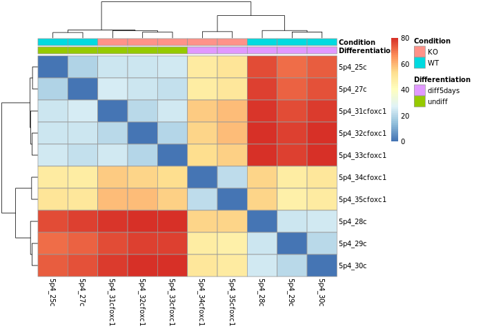 |

Are the samples clustering as expected?
Are they clustering better by differentiation or by condition?

#### Principal Component Analysis (PCA)

Reduction of dimensionality to be able to retrieve main differences / underlying variance between samples.
It is used to bring out strong patterns from complex biological datasets.

:::{seealso}
<https://www.youtube.com/watch?v=FgakZw6K1QQ>
:::

```r

png("PCA_star.png")
plotPCA(object = se_rlog,
  intgroup = c("Condition", "Differentiation"))
dev.off()

```

| |
|:---:|
| 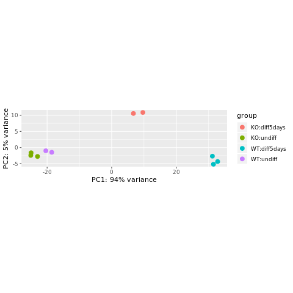 |

The horizontal axis (PC1 = Principal Component 1) represents the highest variation between the samples. Differences along PC1 are more important than differences along PC2.

For the PC1 axis, do samples separate by differentiation or by condition?

```{admonition} Interpreting the PCA plot
:class: note

At this stage, the PCA plot allows us to evaluate whether samples belonging to the same experimental condition cluster together. Ideally, biological replicates should appear close to each other in the plot, indicating similar global gene expression profiles. If a sample does not cluster with the other replicates of its condition, it may indicate a potential technical problem, such as low library complexity, RNA degradation, contamination, or a sample labeling error. In such cases, the sample should be carefully evaluated by reviewing quality control metrics before deciding whether it should be retained or excluded from further analysis.
```

#### Gene expression plots

We can also plot the **normalized counts** of a gene per sample / experimental group:

```r

# FOXC1 is ENSG00000054598

plotCounts(se_star2, gene="ENSG00000054598", intgroup="Condition")

```

| |
|:---:|
| 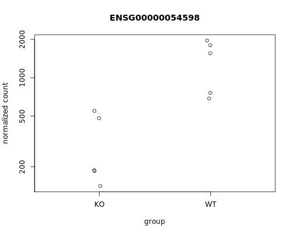 |

Let's produce a more comprehensive plot: we can **add the sample names and the differentiation status**.
To do so, we can use the **ggplot2** package.

```r

library(ggplot2)
library(reshape2)

# Retrieve the normalized counts per sample for FOXC1 / ENSG00000054598

tmp <- norm_counts[rownames(norm_counts)=="ENSG00000054598",]

# convert to "long" format

mygenelong <- melt(tmp)

# sample name

mygenelong$name <- rownames(mygenelong)

# sample Condition and Differentiation: merge with sample table

mygenelong <- merge(mygenelong, sampletable, by.x="name", by.y="SampleName", all=F)

# Dot plot

pdot <- ggplot(data=mygenelong, mapping=aes(x=Condition, y=value, col=Differentiation, shape=Condition, label=name)) + 
  geom_point() +
  geom_text_repel(nudge_x=0.2) +  
  xlab(label="Experimental group") +
  ylab(label="Normalized expression (log2)") +
  labs(title = "FOXC1") +
  theme_bw()

ggsave("counts_foxc1_nice.png", pdot)


```

| |
|:---:|
| 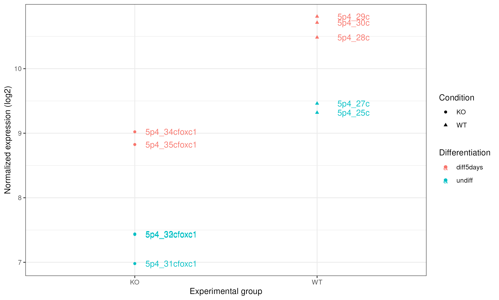 |

We can represent it as a boxplot:

```r

# Boxplot

pbox <- ggplot(data=mygenelong,
               mapping=aes(x=Condition, y=value, fill=Differentiation, label=name)) +
  geom_boxplot(alpha = 0.3) +
  geom_jitter(aes(color=Differentiation), width=0.2, size=2)+
  geom_text_repel() +
  xlab("Experimental group") +
  ylab("Normalized expression (log2)") +
  labs(title = "FOXC1") +
  theme_bw()

ggsave("counts_foxc1_nice_boxplot.png", pbox)


```

Here we can see clearly that in KO this gene was expressed 2^1.5 times higher in 5 days, and same for WT.

| |
|:---:|
| 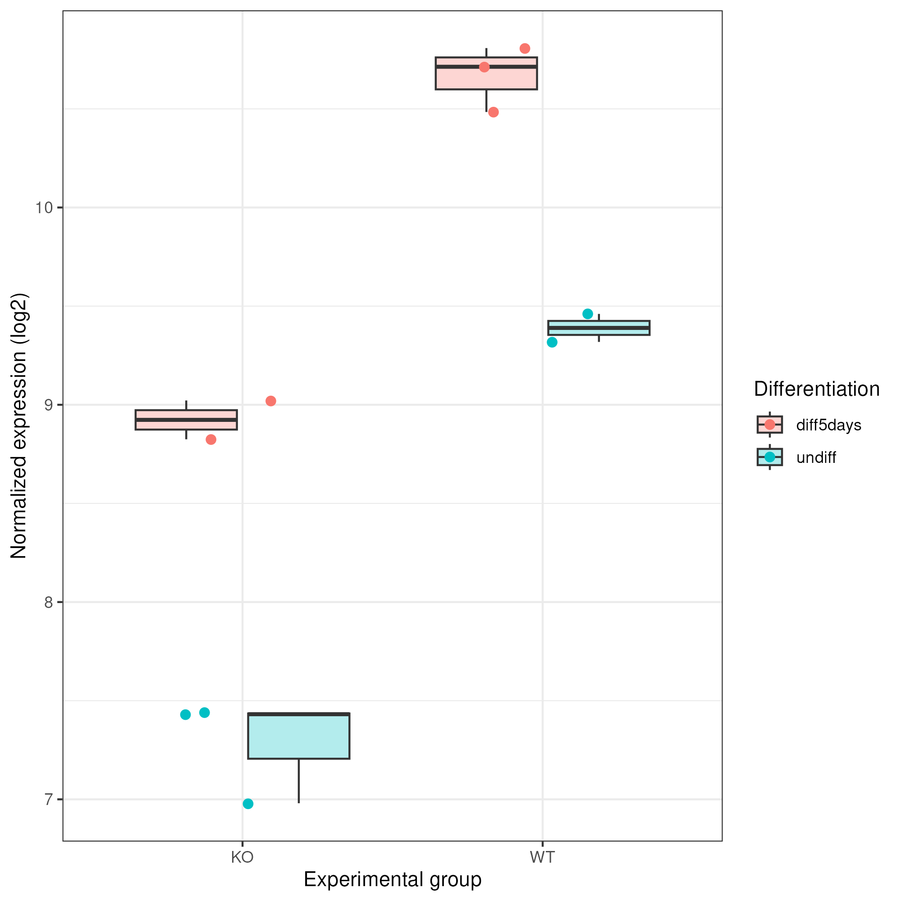 |

* **Comparing FOXC1 and GAPDH expression**

Also, we can compare the expression of our study gene with a control gene (GADPH).
GAPDH ensembl id ENSG00000111640

```r

# Retrieve the normalized counts per sample for FOXC1 and GAPDH genes

tmp<-norm_counts[c("ENSG00000054598","ENSG00000111640"),]

# convert to "long" format

mygenelong <- melt(tmp)
mygenelong

# sample name

colnames(mygenelong) <- c("gene","name","value")

# sample Condition and Differentiation: merge with sample table

mygenelong <- merge(mygenelong, sampletable, by.x="name", by.y="SampleName", all=F)
mygenelong

# Dot plot

pdot <- ggplot(data=mygenelong, mapping=aes(x=Condition, y=value, col=Differentiation, shape=Condition, label=name)) +
  geom_point() +
  geom_text(nudge_x=0.2) +  
  xlab(label="Experimental group") +
  ylab(label="Normalized expression (log2)") +
  facet_wrap(~ gene) +
  theme_bw()
```

| |
|:---:|
| 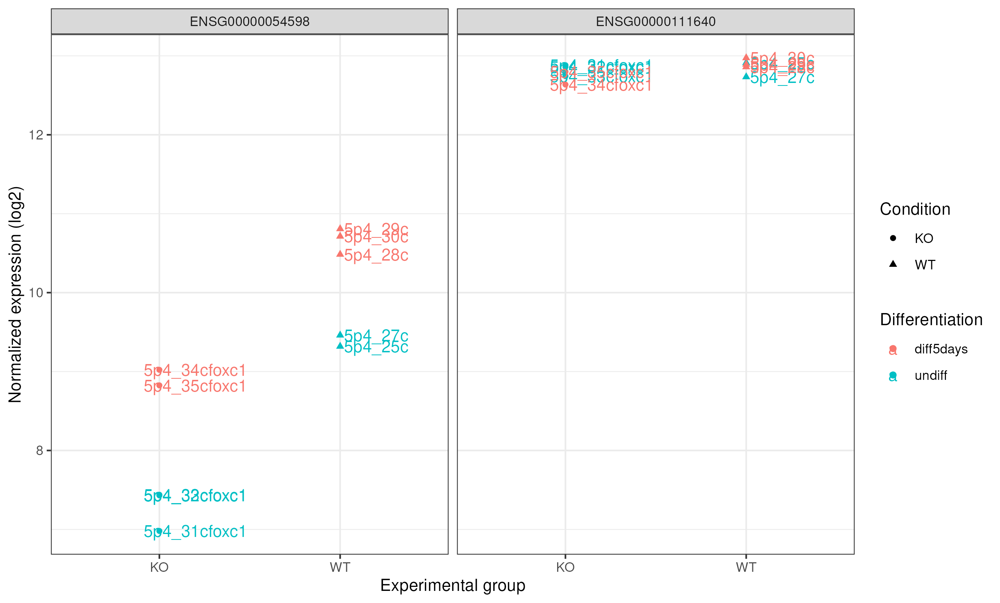 |

### Differential expression analysis

Now is the moment to retrieve the results of the differential expression analysis for the constrast we are interested in. In this case, it is the comparison between WT and KO.

From results we will obtain the following columns each one with a value for each gene:

  baseMean log2FoldChange     lfcSE       stat    pvalue      padj

```r
# check results names: depends on what was modeled. Here it was the "Condition"
resultsNames(se_star2)

# extract results for WT vs KO
 # contrast: the column from the metadata that is used for the grouping of the samples (Condition), then WT is compared to the KO -> results will be as "WT vs KO"
de <- results(object = se_star2, 
  name="Condition_WT_vs_KO")
# This is equivalent to:
de <- results(object = se_star2, contrast=c("Condition", "WT", "KO"))

# If you want the results to be expressed as "KO vs WT", you can run:
# de <- results(object = se_star2, contrast=c("Condition", "KO", "WT"))

# check first rows
head(de)

# add more annotation to "de"
de_symbols <- merge(data.frame(ID=rownames(de), de, check.names=FALSE), annot, by.x="ID", by.y="ensembl_gene_id", all=F)

# write differential expression analysis result to a text file
write.table(de_symbols, "deseq2_results.txt", quote=F, col.names=T, row.names=F, sep="\t")
```

#### DESeq2 output

* **log2 fold change:**
A positive fold change indicates an increase of expression while a negative fold change indicates a decrease in expression for a given comparison.
This value is reported in a **logarithmic scale (base 2)**: for example, a log2 fold change of 1.5 in the "WT vs KO comparison" means that the expression of that gene is increased, in the WT relative to the KO, by a multiplicative factor of 2^1.5 ≈ 2.82.
* **pvalue:**
Wald test p-value: Indicates whether the gene analysed is likely to be differentially expressed in that comparison. **The lower the more significant**.
* **padj:**
Bonferroni-Hochberg adjusted p-values (FDR): **the lower the more significant**. More robust than the regular p-value because it controls for the occurrence of **false positives**.
* **baseMean:**
Mean of normalized counts for all samples.
* **lfcSE:**
Standard error of the log2FoldChange.
* **stat:**
Wald statistic: the log2FoldChange divided by its standard error.

```{admonition} Note on p-values set to NA
:class: note

Some values in the results table can be set to NA for one of the following reasons (from [Analyzing RNA-seq data with DESeq2 by M. Love et al., 2017](https://bioconductor.statistik.tu-dortmund.de/packages/3.5/bioc/vignettes/DESeq2/inst/doc/DESeq2.html)):

* If within a row, all samples have zero counts, the baseMean column will be zero, and the log2 fold change estimates, p value and adjusted p value will all be set to NA.
* If a row contains a sample with an extreme count outlier then the p value and adjusted p value will be set to NA. These outlier counts are detected by Cook's distance. If there are very many outliers (e.g. many hundreds or thousands) reported by summary(res), one might consider further exploration to see if a single sample or a few samples should be removed due to low quality.
* If a row is filtered by automatic independent filtering, for having a low mean normalized count, then only the adjusted p value will be set to NA. This independent filtering can be customized or turned off in the DESeq2 function results(dds, independentFiltering=FALSE).
```

#### Volcano plot

A volcano plot combines **effect size** and **statistical significance** into a single view, making it one of the most widely used plots in differential expression analysis.

```r
## Let's select the columns with the gene.name, Log2 foldchange and padjusted value information. 
colnames(de_symbols)
res_for_volc <- de_symbols[, c("external_gene_name","log2FoldChange","padj")]

volcano_plot <- EnhancedVolcano(res_for_volc,
                         lab = res_for_volc$external_gene_name, #column with the gene names for the points out of the defined thresholds for Log2fc and pvalue
                         x = 'log2FoldChange',
                         pCutoff = 0.05, ## padjusted threshold 
                         FCcutoff = 2,   ## Log2 fold change threshold to select upregulated and downregulated genes. 
                         y = 'padj')

pdf("Volcano_plot_of_WT_vs_KO.pdf", width = 10, height = 8)
print(volcano_plot)
dev.off()
```

* **X-axis:** log2 fold change (log2FC) — how much a gene's expression changes between conditions. Positive values = higher in the first group; negative = lower.
* **Y-axis:** −log10(padj) — the adjusted p-value on a negative log scale. The **higher** a point is on the Y-axis, the **more statistically significant** the difference.

Each dot is a gene. The plot naturally splits into four regions:

| Region | Meaning |
|:---:|:---|
| Top-right | **Significantly upregulated** (high FC, low padj) |
| Top-left | **Significantly downregulated** (low FC, low padj) |
| Bottom-center | **Not significant** (low FC or high padj) |
| Top-center | Large statistical significance, but small fold change |

The name "volcano" comes from the shape: most genes cluster at the bottom (non-significant), with two "plumes" of significant genes rising on the left and right flanks.

```{admonition} How to read it
:class: tip

Focus on the **top corners** — genes that are both far from zero on the X-axis (large effect) and high on the Y-axis (highly significant). Those are the most biologically meaningful candidates.
```

| |
|:---:|
| 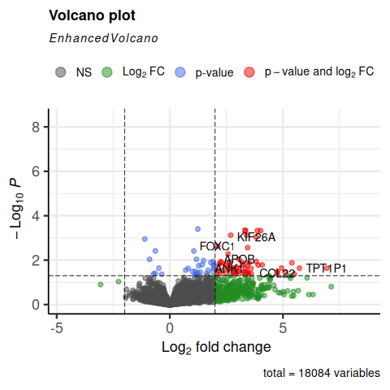 |

Do we see FOXC1 in the top corners?

#### Gene selection

* **padj** (p-value corrected for multiple testing)
* **log2FC** (log2 Fold Change)

The log2FoldChange gives a **quantitative** information about the expression changes, but does not give information on the **within-group variability**, hence the reliability of the information:

In the picture below, fold changes for gene A and for gene B between groups **t25** and **t0** (from another data set) are the same, however the variability between the replicated samples in gene B is higher, so the result for gene A will be more reliable (i.e. the p-value will be smaller).

| |
|:---:|
| 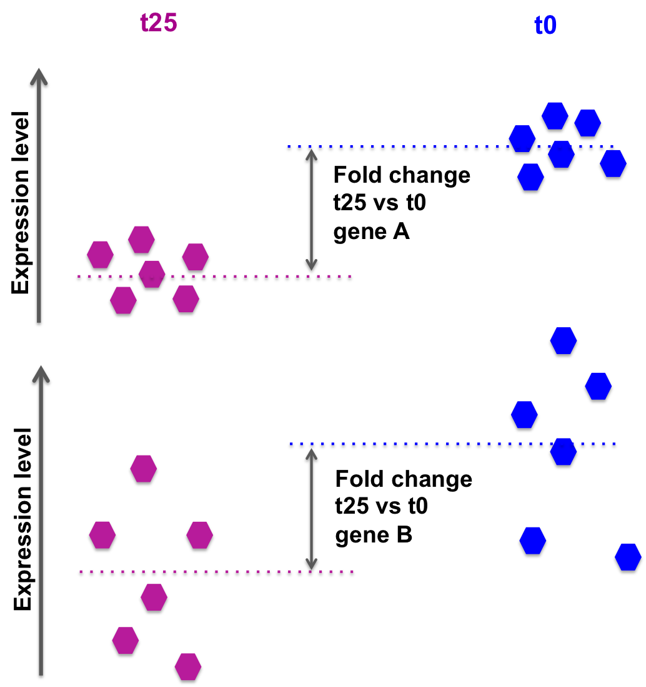 |

DESeq2 also takes into account the library size, sufficient coverage of a gene, ...

We need to take into account the p-value or, better **the adjusted p-value** (padj).

Setting a p-value threshold of 0.05 means that there is a **5% chance that the observed result is a false positive**.
For thousands of simultaneous tests (as in RNA-seq, there are thousands of genes tested at the same time), 5% can result in a large number of false positives.

The Benjamini-Hochberg procedure controls the False Discovery Rate (FDR) (it is one of many methods to adjust p-values for multiple testing).

A FDR adjusted p-value of 0.05 implies that 5% of **significant tests according to the "raw" p-value** will result in false positives.

* Selection of differentially expressed genes between WT and KO based on padj < 0.05.

```r
# how many genes are differentially expressed, taking into account "padj < 0.05"?
  # contains NAs... Filter them out
de_select <- de_symbols[de_symbols$padj < 0.05 & !is.na(de_symbols$padj),]
  # 85 genes

# save results in file for further usage
write.table(de_select, "deseq2_selection_padj005.txt", quote=F, col.names=T, row.names=F, sep="\t")
```

* Selection of differentially expressed genes between WT and KO based on padj < 0.05 **AND** log2FC > 0.5 or log2FC < -0.5 (However, note that *selecting by log2FoldChange is not required if the selection is done using the padj*).

```r
# how many genes are differentially expressed, taking into account "padj < 0.05" and log2FoldChange < -0.5 or > 0.5?
  # contains NAs... Filter them out
de_select <- de_symbols[de_symbols$padj < 0.05 & !is.na(de_symbols$padj) & abs(de_symbols$log2FoldChange) > 0.5,]
  # 83 genes
```

## Exercise 1

* Is **FOXC1** differentially expressed? What are the corresponding adjusted-value and log2FoldChanges?
* How many genes are found differentially expressed if you change the log2FoldChange threshold to 0.8 / -0.8 and the padj threshold to 0.01?

## Exercise 2

* Repeat the analysis comparing WT vs KO for the **undifferentiated samples** only!
* Steps are:
  * Modify the "sampletable" so that it contains only samples corresponding to "undiff" Differentiation state.

| SampleName   | FileName                    | Differentiation | Condition |
| :----------: | :-------------------------: | :-------------: | :-------: |
| 5p4_25c      | SRR3091420_1_counts.txt     | undiff          | WT        |
| 5p4_27c      | SRR3091421_1_counts.txt     | undiff          | WT        |
| 5p4_31cfoxc1 | SRR3091425_1_counts.txt     | undiff          | KO        |
| 5p4_32cfoxc1 | SRR3091426_1_counts.txt     | undiff          | KO        |
| 5p4_33cfoxc1 | SRR3091427_1_counts.txt     | undiff          | KO        |

* Read in data **DESeqDataSetFromHTSeqCount()**
* Filter out low counts (keep high counts)
* Fit statistical model **DESeq()**
* VST-transform counts **vst()**
  * Plot PCA and sample-to-sample distances heatmap
* Check differential expression **resultsNames()**
  * How many genes are differentially expressed, when considering padj < 0.05?

**DON'T FORGET TO WRITE FILES DOWN AT EACH STEP!!**

**STEP BY STEP CORRECTION**

```r
## DESeq2 analysis

library(DESeq2)

# Create sample sheet

sampletable <- data.frame(SampleName=c("5p4_25c", "5p4_27c", "5p4_28c", "5p4_29c", "5p4_30c", "5p4_31cfoxc1", "5p4_32cfoxc1", "5p4_33cfoxc1", "5p4_34cfoxc1", "5p4_35cfoxc1"),
                          FileName=c("SRR3091420_counts.txt", "SRR3091421_counts.txt", "SRR3091422_counts.txt", "SRR3091423_counts.txt", "SRR3091424_counts.txt", "SRR3091425_counts.txt", "SRR3091426_counts.txt", "SRR3091427_counts.txt", "SRR3091428_counts.txt", "SRR3091429_counts.txt"),
                          Differentiation=c(rep("undiff", 2), rep("diff5days", 3), rep("undiff", 3), rep("diff5days", 2)),
                          Condition=c(rep("WT", 5), rep("KO", 5)))
rownames(sampletable) <- gsub("_counts.txt", "", sampletable$FileName)
# Modify sample sheet to keep only "undiff" samples

sampletable2 <- sampletable[sampletable$Differentiation=="undiff",]

# Import STAR counts
se_star <- DESeqDataSetFromHTSeqCount(sampleTable = sampletable2,
                                      directory = "counts_STAR_selected",
                                      design = ~ Condition)

# Filter out lowly expressed genes 
 # i.e. (keep genes for which sums of raw counts across experimental samples is > 10)

se_star <- se_star[rowSums(counts(se_star)) > 10, ]

# Annotate
gene_ids <- rownames(se_star)

library(biomaRt)

mart <- useMart(biomart="ENSEMBL_MART_ENSEMBL", host="https://sep2025.archive.ensembl.org", path="/biomart/martservice", dataset="hsapiens_gene_ensembl")

annot <- getBM(attributes=c('ensembl_gene_id', 'chromosome_name', 'start_position', 'end_position', 'description', 'external_gene_name'), filters ='ensembl_gene_id', values = gene_ids, mart = mart)

# Fit statistical model

se_star2 <- DESeq(se_star)

# Compute normalized counts
norm_counts <- log2(counts(se_star2, normalized = TRUE)+1)

# add annotation to count table 
norm_counts_symbols <- merge(data.frame(ID=rownames(norm_counts), norm_counts, check.names=FALSE), annot, by.x="ID", by.y="ensembl_gene_id", all=F)

# write normalized counts to text file
write.table(norm_counts_symbols, "normalized_counts_log2_star_undiff.txt", quote=F, col.names=T, row.names=F, sep="\t")

# Transform counts for visualization
se_vst <- vst(se_star2)

# Build heatmap
# load libraries pheatmap to create the heatmap plot
library(pheatmap)

# calculate between-sample distance matrix
sampleDistMatrix <- as.matrix(dist(t(assay(se_vst))))

# prepare a "metadata" object to add a colored bar with the differentiation and condition information
metadata <- sampletable2[,c("Differentiation", "Condition")]
rownames(metadata) <- sampletable2$SampleName

# create figure in PNG format
png("sample_distance_heatmap_star_undiff.png")
pheatmap(sampleDistMatrix, annotation_col=metadata)
# close PNG file after writing figure in it
dev.off() 

# Principal component analysis
png("PCA_star_undiff.png")
plotPCA(object = se_rlog,
        intgroup = c("Condition", "Differentiation"))
dev.off()

# Differential expression analysis
de <- results(object = se_star2, 
              name="Condition_WT_vs_KO")
# add annotation
de_symbols <- merge(data.frame(ID=rownames(de), de, check.names=FALSE), annot, by.x="ID", by.y="ensembl_gene_id", all=F)

# write differential expression analysis result to a text file
write.table(de_symbols, "deseq2_results_undiff.txt", quote=F, col.names=T, row.names=F, sep="\t")

# Select genes for which padj < 0.05
de_select <- de_symbols[de_symbols$padj < 0.05 & !is.na(de_symbols$padj),]
nrow(de_select)

# save results in file for further usage
write.table(de_select, "deseq2_selection_padj005_undiff.txt", quote=F, col.names=T, row.names=F, sep="\t")
```

## Exercise 3

**Control for "Differentiation"**

While in Exercise 2 we tested **WT vs KO** on **undifferentiated** samples only, we can also use a more complex **design** formula. If we specify:

```r
~ Differentiation + Condition
```

it means that we want to test for the effect of the **FOXC1 knock out**, while *controlling for the effect of differentiation*.
In a way, we "discard" the expected changes due to differentiation to focus on the changes specifically driven by the KO.

* Repeat the first analysis, changing the design **~ Condition** to **~ Differentiation + Condition**.
* How many genes are now found differentially expressed, when filtering for padj < 0.05?

### Homework

Do the same using the **Salmon counts** (object *se_salmon*): how many genes are found differentially expressed when using the Salmon counts?
How do results overlap between STAR and Salmon?

```{note}

Remember to use the Gencode annotation file gencode.v49.annotation.gtf.gz preapred with the annotation columns you want to include in your normalized counts and differential expression tables.
```

## Other cases

### Batch effect in the data

Sometimes, we perform RNA-seq experiments one year, and then another year later with the same study, making us wonder if we can merge data from the previous year in order to have more replicates and a better statistical power.

Other times, some samples are processed at different time points, by different operators, or using slightly different protocols (e.g. different RNA extraction kits, different library preparation lots, or different sequencing runs).

In all these cases, unintended technical variation can be introduced into the data — something known as a **batch effect**.

:::{admonition} What is a batch effect?
    :class: note

    A **batch effect** is systematic, non-biological variation in gene expression data introduced by technical factors such as:

    * Different **sequencing runs** or **flow cells**
    * Samples processed on different **dates** or by different **operators**
    * Different **reagent lots** or **library prep kits**
    * Samples stored under different conditions before RNA extraction

    Batch effects can be just as large as (or larger than) the biological signal you are trying to detect, and will **confound** your differential expression results if not properly accounted for.
:::

#### Detect batch effects using PCA

The first step is always to **visualize** the data and check whether samples cluster by their **batch** rather than by their **biological condition** of interest.

On the following example, we have samples that were processed at different weeks but RNA extraction was performed on the same day for all samples. A batch column indicating if samples were processed on week 1 (values   = 1) or week 2 (values = 2) is included in the sample table.

Download batch raw counts and sample table  data:

```bash
mkdir ~/rnaseq_course/differential_expression/batch_example
cd ~/rnaseq_course/differential_expression/batch_example

wget https://github.com/fabian-andrade/RNAseq_coursesCRG_2026/raw/main/docs/data/differential_expression/batch_example/rnaseq_batch_example_raw_counts.txt
wget https://github.com/fabian-andrade/RNAseq_coursesCRG_2026/raw/main/docs/data/differential_expression/batch_example/rnaseq_batch_example_sample_table.txt
```

```r
setwd("~/rnaseq_course/differential_expression/batch_example")
# Batch Effect Correction

batch_counts <- read.csv("rnaseq_batch_example_raw_counts.txt",header = TRUE, sep="\t")
head(batch_counts) ## this are annotated raw counts.

## Let's set the gene_id as row names
rownames(batch_counts) <- batch_counts$gene_id
colnames(batch_counts)

## Let's prepare matrix with only raw counts for DESeq
matrix_counts <- batch_counts[,9:length((batch_counts))]
colnames(matrix_counts)

## Here we separate the annotation from the counts
annot <- batch_counts[,1:8]
colnames(annot)

## Let's read the sample table
sampletable <- read.csv("batch_sample_table.txt", sep="\t", header=TRUE)
head(sampletable)  

## Creating deseq object from counts matrix
se_matrix <- DESeqDataSetFromMatrix(countData = matrix_counts, colData = sampletable, design = ~treatment)
se_matrix

## Run DESeq
se_2 <- DESeq(se_matrix)

## VST, in this case we use variance stabilizing transformation to normalize the data because we have a small dataset. 
se_vst <- varianceStabilizingTransformation(se_2)

### Let's extract PCA data into a table to create a plot with sample labels and detect samples in one batch and another.

pcaData <- plotPCA(se_vst, intgroup="treatment", returnData=TRUE) ## ReturnData=TRUE  return the data in a dataframe 
percentVar <- round(100 * attr(pcaData, "percentVar")) ## Extracting explained variance (%) for PC1 and PC2

PCA_batch <- ggplot(pcaData, aes(PC1, PC2, color=treatment)) +
                geom_point(size=3) +
                geom_text_repel(aes(label=name), vjust=-1) +
                xlab(paste0("PC1: ", percentVar[1], "% variance")) +
                ylab(paste0("PC2: ", percentVar[2], "% variance")) 

ggsave("PCA_batch.png",PCA_batch,  width = 8, height = 6)

## Batch correction with Combatseq

BiocManager::install("sva")
library(sva)

rownames(sampletable) <- sampletable$sampleName
batch <- sampletable$batch


mat_corrected <- ComBat_seq(
  counts = counts(se_matrix),
  batch = batch)

mat_corrected
head(mat_corrected)

se_correc <- DESeqDataSetFromMatrix(countData = mat_corrected, colData = sampletable, design = ~treatment)
vst_correct <- varianceStabilizingTransformation(se_correc)

png("PCA_batch_corrected.png")
plotPCA(object = vst_correct,
        intgroup = c("treatment"))
dev.off()

library(ggrepel)

pcaData <- plotPCA(vst_correct, intgroup="treatment", returnData=TRUE)
percentVar <- round(100 * attr(pcaData, "percentVar"))

pca_batch_correc <- ggplot(pcaData, aes(PC1, PC2, color=treatment)) +
                      geom_point(size=3) +
                      geom_text_repel(aes(label=name), vjust=-1) +
                      xlab(paste0("PC1: ", percentVar[1], "% variance")) +
                      ylab(paste0("PC2: ", percentVar[2], "% variance")) 

ggsave("PCA_batch_corrected.png",pca_batch_correc,  width = 8, height = 6)

```

PCA before correction

| | |
|:---:|:---:|
| 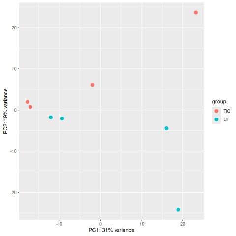 |

PCA after correction

| |
|:---:|
| 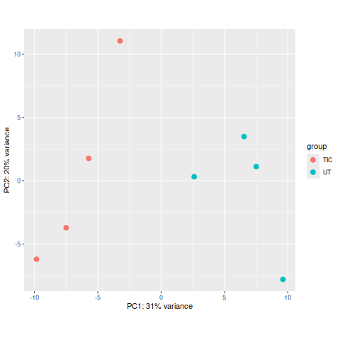 |

##### Homework

Another approach to take into account batch effect is to include the **Batch** variable in the DESeq2 design formula. This tells DESeq2 to model and account for the batch effect when estimating fold changes and p-values, without modifying the raw count data.

:::{note}

More information <https://www.biostars.org/p/403053/>
:::

Using the previous sample table and the matrix counts, create a DESeq2 object accounting for batch effect in the design formula.

```r
# Re-create the DESeq2 object with Batch in the design
se_correc <- DESeqDataSetFromMatrix(
  countData = matrix_counts, 
  colData = sampletable, 
  design = ~batch + treatment  # Batch is controlled and treatment is tested
  ) 
```

Create a vst object and visualize your data using PCA.
Does this approach corrects for batch effect?

### Outliers detection

In some cases we can find samples that are not clustered with the others. This could be due to several reasons, such as sample preparation errors, technical issues, or biological differences between samples. In this case, we need a review of the different sequencing Quality Control parameters we studied previously to identify possible sample degradation, contamination, or other technical issues. If we find such issues, we can remove the outlier samples from the dataset and re-run the analysis.

| | |
|:---:|:---:|
| 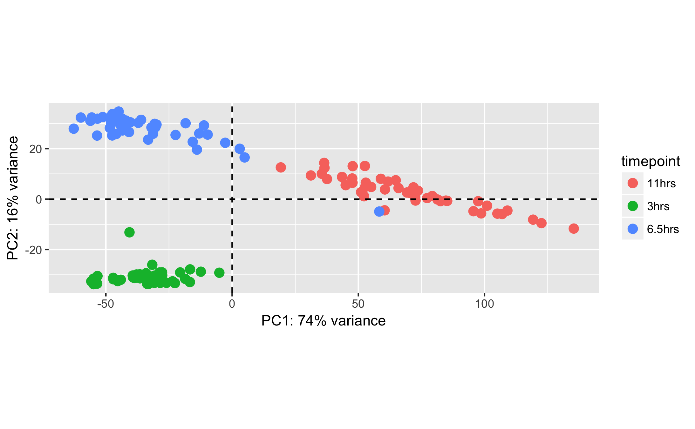 |

source: <https://www.biostars.org/p/249493/>

### Sample mislabeling

Sometimes during sample preparation or sample table creation, samples are mislabeled. This can be detected by visualizing the data and checking if samples cluster by their biological condition of interest.

| | |
|:---:|:---:|
| 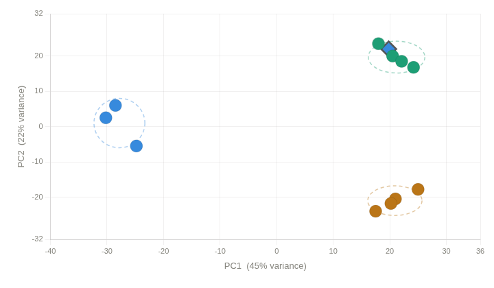 |

Source: Image generated by Anthropic Claude (4.6 Sonnet), 2026, <https://claud.ai/>

Using the following sample table and matrix counts:

```bash
cd ~/rnaseq_course/differential_expression/

wget https://github.com/biocorecrg/RNAseq_coursesCRG_2026/tree/master/docs/data/differential_expression/mislabeled_sample_example/

cd mislabeled_sample_example/

```

* Create a DESeq2 object using the condition column as the design formula.
* Generate vst normalized counts.
* Visualize it using PCA.

¿Do you find any sample that is not in the cluster is should be in?

```r
setwd("~/rnaseq_course/differential_expression/mislabeled_sample_example")

misl_counts <- read.csv("mislabeled_normalized_counts.txt",header = TRUE, sep="\t")
head(misl_counts) ## this are annotated raw counts.

## Let's prepare matrix with only raw counts for DESeq

rownames(misl_counts) <- misl_counts$gene_id
colnames(misl_counts)

matrix_counts <- misl_counts[,4:length((misl_counts))]
colnames(matrix_counts)
round(matrix_counts)

annot <- batch_counts[,1:3]
colnames(annot)

## Let's read the sample table

sampletable <- read.csv("Mislabeled_SampleTable.txt", sep="\t", header=TRUE)
head(sampletable)

rownames(sampletable) <- sampletable$SampleName

rownames(sampletable) %in% colnames(matrix_counts)

## Creating deseq object from counts matrix
se_matrix <- DESeqDataSetFromMatrix(countData = matrix_counts, colData = sampletable, design = ~Condition)
se_matrix

se_2 <- DESeq(se_matrix)

se_vst <- vst(se_2)

pcaData <- plotPCA(se_vst, intgroup="Condition", returnData=TRUE) ## ReturnData=TRUE  return the data in a dataframe 
percentVar <- round(100 * attr(pcaData, "percentVar")) ## Extracting explained variance (%) for PC1 and PC2

PCA_misl <- ggplot(pcaData, aes(PC1, PC2, color=Condition)) +
  geom_point(size=3) +
  geom_text_repel(aes(label=name), vjust=-1) +
  xlab(paste0("PC1: ", percentVar[1], "% variance")) +
  ylab(paste0("PC2: ", percentVar[2], "% variance")) 

ggsave("PCA_mislabeled.png",PCA_misl,  width = 12, height = 6)
```

| | |
|:---:|:---:|
| 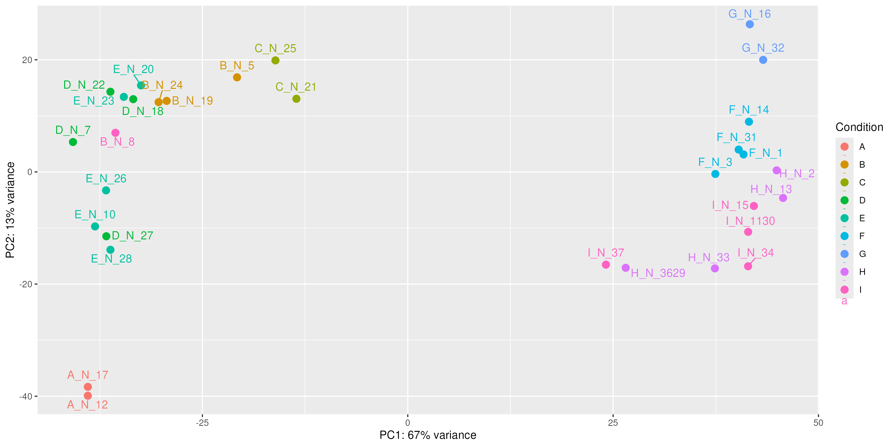 |

## Further reading materials

* [Analyzing RNA-seq data with DESeq2](https://bioconductor.org/packages/release/bioc/vignettes/DESeq2/inst/doc/DESeq2.html)
