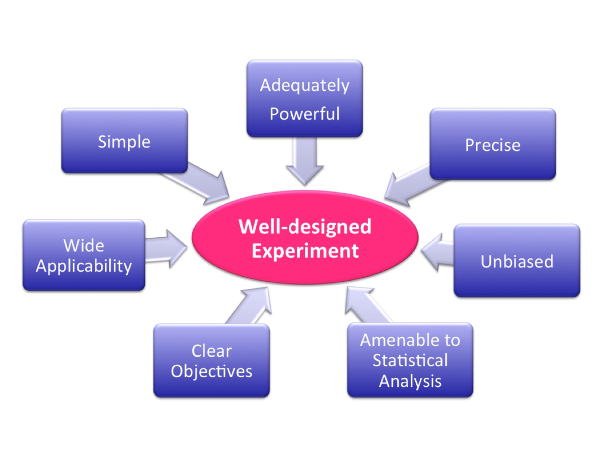
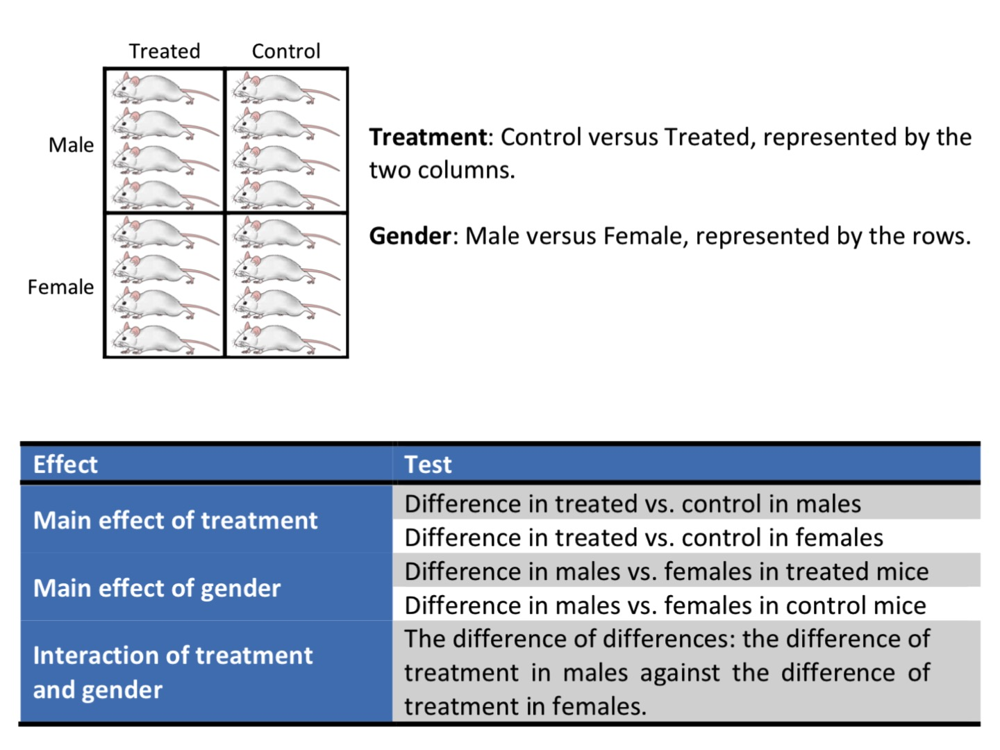
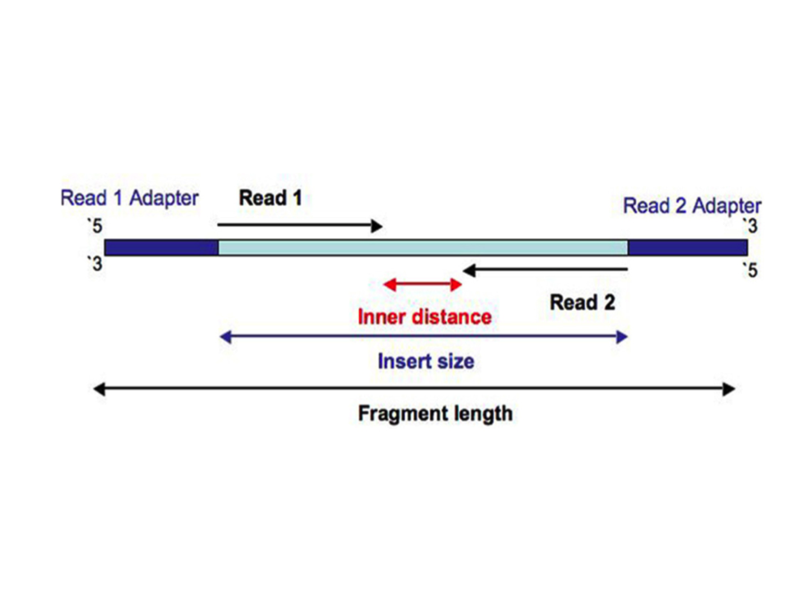
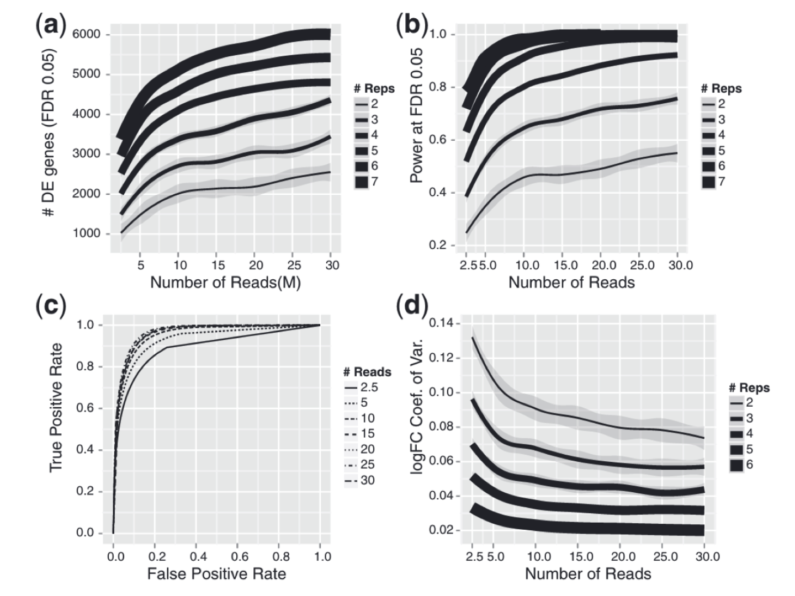

# Experimental design

## Well-designed experiment


||
|from [Cambridge University's Experimental Design Manual](https://rawgit.com/bioinformatics-core-shared-training/experimental-design/master/ExperimentalDesignManual.pdf)|

<br/>

## Factorial design to address wide range of the result applicability

||
|from [Cambridge University's Experimental Design Manual](https://rawgit.com/bioinformatics-core-shared-training/experimental-design/master/ExperimentalDesignManual.pdf)|

<br/>


## Power analysis & sample size

Sample size calculations, power calculations and power analysis (the terms are used interchangeably) are a way of determining the appropriate number of replicates (the sample size) for a study.

**Power** is the probability of **not accepting a false null hypothesis**, or the probability of detecting a specified difference, or **effect size**, given it exists, within the population *(e.g., a fold change in a microarray experiment or a change in the size of a tumour)*. 

The desired power of research experiment is usually above 80%; while for clinical studies, it might be required to be above 90%. 

**Power (aka, sensitivity of the statistical test) = 1 - (type II error)**,  *(type II error is an error of accepting a false null hypothesis)*

If all other parameters remain the same, a larger experiment will have more power than a smaller experiment. However, if an experiment is too large and a smaller experiment would have achieved the same statistical result, it is **overpowered experiment** and it has wasted subjects, money, time and effort, and is potentially unethical. On the other hand, if an experiment is too small, it may **lack power and miss important differences that do actually exist**. Therefore, an **underpowered study** also wastes resources and can be unethical. It is important to know what effect size is important to ensure that an experiment is sufficiently powered.

### Factors affecting a power calculation
* The precision and variance of measurements within any sample
* Magnitude of a significant difference (aka, effect size)
* Significance level (in biology, usually 0.05); that is, how certain we want to be to avoid type I error *(when the null hypothesis is incorrectly rejected)* 
* The type of statistical test performed

### Example 
We study the difference of some measurement in two populations (in which we assume this variable is normally distributed and variance of two populations are the same). 
<br/>

We draw two samples (n=2) from each population independently and randomly and get
```
x = c(9, 11)
y = c(17,19)
```


We run the *t-test on difference of means* and get **p-value=0.03** *( in R, use function t.test(x, y) )*.

<br/>

Since we know the variance for x and y, *var(x) = 2; var(y) = 2*, we can calculate the power of the t-test to detect the observed **effect size delta**  *( in R, use function power.t.test(n, delta, sd, sig.level = 0.05) )*
```
delta = (mean(y) - mean(x)) / sqrt(var) = 8 / sqrt(2)

> power.t.test(n = 2, delta = 8/sqrt(2), sd = sqrt(2))

     Two-sample t test power calculation

              n = 2
          delta = 5.656854
             sd = 1.414214
      sig.level = 0.05
          power = 0.5645141
    alternative = two.sided

NOTE: n is number in *each* group
```


The obtained **power = 0.56**. This means that **Type II error** (or the probability of accepting a false null hypothesis, that is, concluding that there is NO difference when in fact there is the difference) **= 1 - power = 44% !!!!** – in roughly 44% of tests conducted with **these parameters for n and sd**, the given effect size delta will be NOT seen as significant even when it is significant. 

It is a waist of resources to conduct such an **under-powered study**. 

If we want to detect this effect size (difference in means of 8) with higher power, we have to increase the number of samples (n).

<br/>

**But what difference in means can we detect with just 2 samples at a sufficient enough power?**


```
x = c(9, 11)
y = c(24, 26)
```
We run the t-test on difference of means and get **p-value=0.009**.


Since we know the variance for x and y, *var(x) = 2; var(y) = 2*, we can calculate the power of the t-test to detect the observed effect size:
```
delta = (mean(y) - mean(x)) / sqrt(sd) = 15 / sqrt(2)

> power.t.test(n = 2, delta = 15/sqrt(2), sd = sqrt(2))

     Two-sample t test power calculation

              n = 2
          delta = 10.6066
             sd = 1.414214
      sig.level = 0.05
          power = 0.9387922
    alternative = two.sided
```


The obtained **power = 0.94 !!!** 
This is an **adequtely powered experiment**. That is if the true difference of means of two populations is 15, we can detect it drawing only 2 random and independent samples from each population. And while conducting the t-test we will commit Type II error in only 6% of tests; that is, the given effect size will be NOT seen as significant (p-value will be above 0.05). 

If however the significance level alpha becomes more stringent, say 0.01, the power will decrease:
```
> power.t.test(n = 2, delta = 15/sqrt(2), sd = sqrt(2), sig.level = 0.01)

     Two-sample t test power calculation

              n = 2
          delta = 10.6066
             sd = 1.414214
      sig.level = 0.01
          power = 0.4343263
    alternative = two.sided
```

<br/>

We can calculate directly how many samples are needed to observe that effect size (difference in means =15) at power=0.9 and significance level=0.01:
```
> power.t.test(power = 0.9, delta = 15/sqrt(2), sd = sqrt(2), sig.level = 0.01)

     Two-sample t test power calculation

              n = 2.539062
          delta = 10.6066
             sd = 1.414214
      sig.level = 0.01
          power = 0.9
    alternative = two.sided

```


Or, for difference in means = 2 at power=0.8 and significance level=0.05:
```
> power.t.test(power = 0.8, delta = 2/sqrt(2), sd = sqrt(2), sig.level = 0.05)

     Two-sample t test power calculation

              n = 16.71477
          delta = 1.414214
             sd = 1.414214
      sig.level = 0.05
          power = 0.8
    alternative = two.sided

NOTE: n is number in *each* group
```

<br/>

Consider also examples on page 36 of the [Cambridge manual](https://rawgit.com/bioinformatics-core-shared-training/experimental-design/master/ExperimentalDesignManual.pdf)

<br/>

## Design of RNA-seq experiment

| Things to consider|
| :---:  |
||
|from [https://galaxyproject.org/tutorials/rb_rnaseq/](https://galaxyproject.org/tutorials/rb_rnaseq/)|

<br/>


## Technical vs. biological replicates

**Technical replicates can be defined as different library preparations from the same RNA sample.** They should account for batch effects from the library preparation such as reverse transcription and PCR amplification. To avoid possible lane effects (e.g., differences in the sample loading, cluster amplification, and efficiency of the sequencing reaction), it is good practice to multiplex the same sample over different lanes of the same flowcell. In most cases, technical variability introduced by the sequencing protocol is quite low and well controlled.

**Technical replicates** are samples in which the starting biological material is the same, but the replicates are processed separately: there, we test the technical variability. It can be done for example to assess the **variability in library preparation**, or in the **sequencing** part itself.

Technical variation of the sequencing protocols is very low: **hence technical replicates are nowadays considered unnecessary** (in the era of microarrays, it was more problematic).

<br/> 

**Biological replicates** are samples in which the starting biological material is different. It could include:
  * Different organisms
  * Different cell cultures
  * Different samplings of the same tumors

Why are **biological** replicates important?

They are crucial to assess the **variability within an experimental group**: the more the number of replicates, the better this assessment, and thus the more precise the differential expression measurement.

<br/> 

**Questions:** Are those samples technical or biological replicates?
* Three samples of blood were obtained from a healthy patient not under any treatment during three consecutive days at the same hour.
* Three samples of blood were obtained from a healthy patient not under any treatment during a day in the morning, after lunch and after dinner.
* Three samples of blood were obtained from three healthy patient not under any treatment.
* Bone marrow was obtained from 12 mice. Cells from 6 mice were pooled to form sample 1; and cells from another 6 mice, to make sample 2.  


<br/>

From [ENCODE Guidelines and Best Practices for RNA-Seq](https://www.encodeproject.org/documents/cede0cbe-d324-4ce7-ace4-f0c3eddf5972/@@download/attachment/ENCODE%20Best%20Practices%20for%20RNA_v2.pdf):
"In all cases, experiments should be performed with **two or more biological replicates**, unless there is a compelling reason why this is impractical or wasteful (e.g. overlapping time points with high temporal resolution). **A biological replicate is defined as an independent growth of cells/tissue** and subsequent analysis. **Technical replicates from the same RNA library are not required, except to evaluate cases where biological variability is abnormally high.** In such instances, separating technical and biological variation is critical. In general, detecting and quantifying low prevalence RNAs is inherently more variable than high abundance RNAs. As part of the ENCODE pipeline, annotated transcript and genes are quantified using RSEM and the values are made available for downstream correlation analysis. 
**Replicate concordance:** the gene level quantification should have a Spearman correlation of >0.9 between **isogenic replicates** *(Two replicates from biosamples derived from the same human donor or model organism strain. These biosamples have been treated separately; i.e. two growths, two separate knockdowns, or two different excisions)* and >0.8 between **anisogenic replicates** *(Two biological replicates from similar tissue biosamples derived from different human donors or model organism strains)*."

<br/>


## Number of replicates in RNA-seq experiment

From [Schurch, et al., RNA, 2016](https://www.ncbi.nlm.nih.gov/pmc/articles/PMC4878611/):
"RNA-seq is now the technology of choice for genome-wide differential gene expression experiments, but it is not clear how many biological replicates are needed to ensure valid biological interpretation of the results or which statistical tools are best for analyzing the data. An RNA-seq experiment with 48 biological replicates in each of two conditions was performed to answer these questions and provide guidelines for experimental design. **With three biological replicates, nine of the 11 tools evaluated found only 20%–40% of the significantly differentially expressed (SDE) genes identified with the full set of 42 clean replicates. This rises to >85% for the subset of SDE genes changing in expression by more than fourfold. To achieve >85% for all SDE genes regardless of fold change requires more than 20 biological replicates.**" 

| Recommendations for RNA-seq experiment design for identifying differentially expressed (DE) genes|
| :---:  |
||
| from [Schurch, et al., RNA, 2016; Fig 2.](https://www.ncbi.nlm.nih.gov/pmc/articles/PMC4878611/)|

Final recommendations from this paper:
* At least 6 replicates per condition for all experiments.
* At least 12 replicates per condition for experiments in which identifying of the majority of all DE genes is important.
* For experiments with <12 replicates per condition; use edgeR (exact) or DESeq2.
* For experiments with >12 replicates per condition; use DESeq.
* Apply a fold-change threshold (T) appropriate to the number of replicates per condition between 0.1 ≤ abs(T) ≤ 0.5.

<br/>


## RNA-Seq: Paired-end vs. single-end reads, read size and sequencing depth

| Paired-end read |
| :---:  |
||

<br/>
Sequencing depth refers to the number of reads covering each genomic position, on average.

It is calculated as **(total number of reads * average read length) / total length of genome**. However, since in RNA-seq experiments scientists are dealing with transcriptomes rather than genomes, it is conventinal to tak about **the number of reads**.


### General gene-level differential expression
* For large genomes (human/mouse), ENCODE suggests to have per sample 30 million single-end (mappable to the genome) reads of size 50 bp and more (and use stranded protocol with polyA selection).

### Gene-level differential expression with detection of low-expressed genes
* For large genomes, 30-60M single-end (aligned to the genome) reads of size 50 bp and more (stranded protocol with polyA selection).

### Differential expression of gene isoforms and detection of new isoforms
* 50-100M paired-end reads of size 100 bp or more

### *De novo* transcriptome assembly
* 100-200M paired-end reads of size 150 bp or more

<br/>

| Adding more sequencing depth after 10 M reads gives diminishing returns on power to detect DE genes, whereas adding biological replicates improves power significantly regardless of sequencing depth |
| :---:  |
||
| from [Liu et al., RNA-seq differential expression studies: more sequence or more replication? Bioinformatics, 2014](https://www.ncbi.nlm.nih.gov/pmc/articles/PMC3904521/)|


<br/>

## Resources
* [ENCODE Guidelines and Best Practices for RNA-Seq](https://www.encodeproject.org/documents/cede0cbe-d324-4ce7-ace4-f0c3eddf5972/@@download/attachment/ENCODE%20Best%20Practices%20for%20RNA_v2.pdf)
* [The Experimental Design Assistant from NC3RS, UK](https://eda.nc3rs.org.uk/experimental-design)
* [https://github.com/hbctraining/rnaseq_overview/blob/master/lessons/experimental_planning_considerations.md](https://github.com/hbctraining/rnaseq_overview/blob/master/lessons/experimental_planning_considerations.md)
* [Experimental design manual, Cambridge University, UK ](https://rawgit.com/bioinformatics-core-shared-training/experimental-design/master/ExperimentalDesignManual.pdf)
* [Paper on statistical power in biomedical science](https://www.ncbi.nlm.nih.gov/pmc/articles/PMC5367316/)
* [Paper "Statistical significance and statistical power in hypothesis testing"](http://muscle.ucsd.edu/More_HTML/papers/pdf/Lieber_JOR_1990.pdf)
* [Blog post "Underpowered statistics"](https://www.statisticsdonewrong.com/power.html)
* [Paper "An introduction to power and sample size estimation"](https://emj.bmj.com/content/20/5/453)
* [Paper "Mindless statistics"](http://library.mpib-berlin.mpg.de/ft/gg/GG_Mindless_2004.pdf)
* [http://chagall.med.cornell.edu/RNASEQcourse/Intro2RNAseq.pdf](http://chagall.med.cornell.edu/RNASEQcourse/Intro2RNAseq.pdf)
* [Paper "How many biological replicates are needed in an RNA-seq experiment and which differential expression tool should you use?" RNA, 2016](https://www.ncbi.nlm.nih.gov/pmc/articles/PMC4878611/)
* [Paper "RNA-seq differential expression studies: more sequence or more replication?" Bioinformatics, 2014](https://www.ncbi.nlm.nih.gov/pmc/articles/PMC3904521/)


