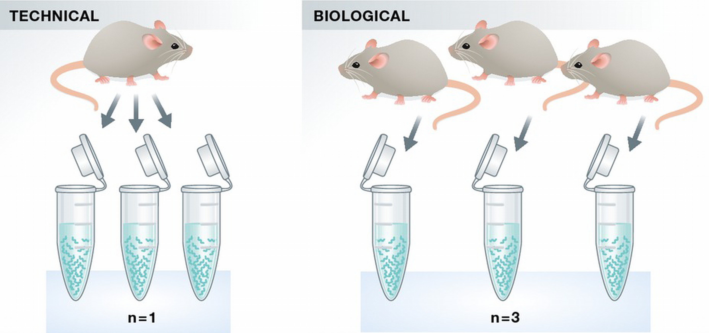
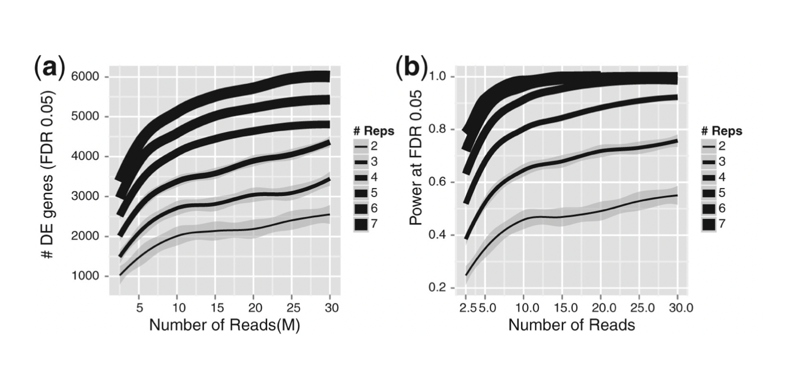
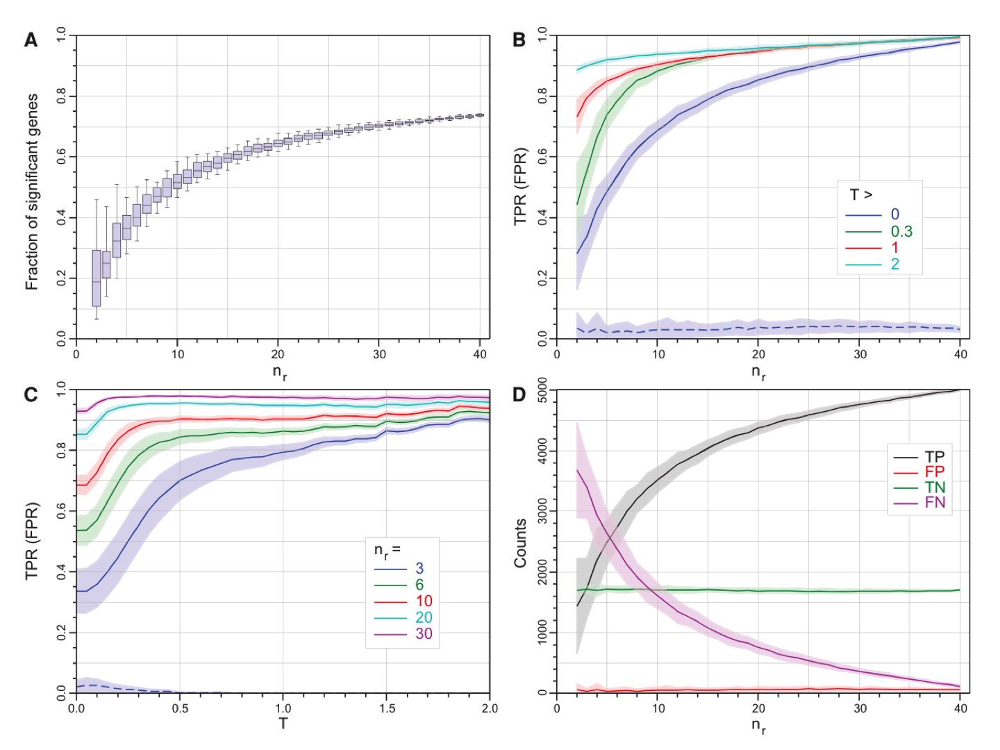
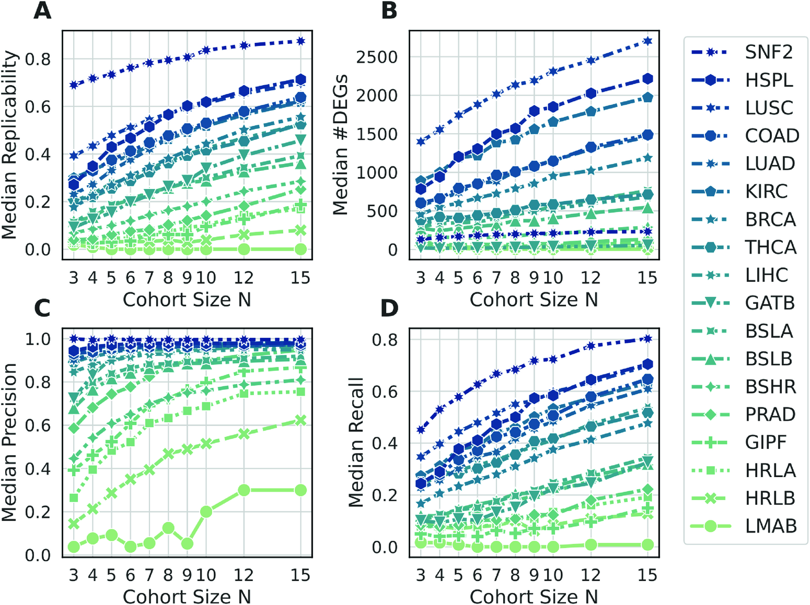
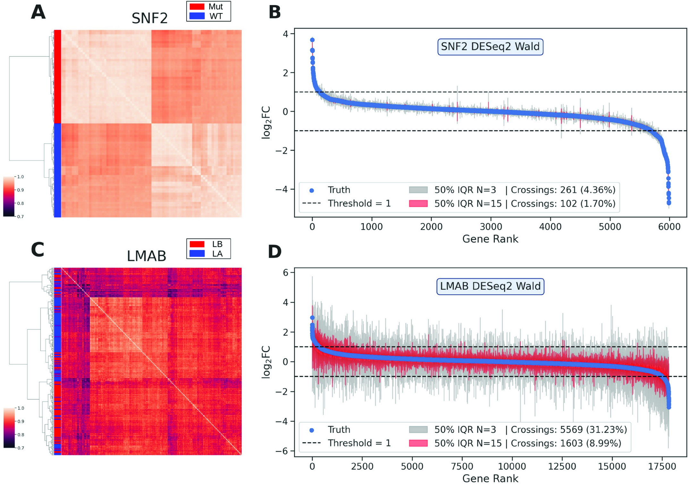

# Talk: Experimental design of RNA-seq experiment

:::{admonition} Side note: scope of this course
:class: note

This course focuses on bulk mRNA-seq experimental design and differential expression analysis. 
Many principles apply equally to total RNA-seq, small RNA-seq, scRNA-seq and long-read RNA-seq, 
but these technologies introduce additional considerations that are briefly noted throughout the material.

:::

---

## Reproducibility in RNA-seq

RNA-seq measures thousands of genes and relies on statistical models 
to detect differences between conditions.

Reproducibility is affected by:
- sample size,
- experimental variability,
- technical bias.

Careful experimental design is required to:
- reduce bias,
- control variation,
- estimate biological variability.

:::{admonition} Important
:class: important

Design determines whether RNA-seq results are interpretable.

:::

<br>

---

### Experimental design begins with the biological question

<div style="display:flex; justify-content:center;">

| |
|:---:|
|  |
| *Figure is from [https://galaxyproject.org/tutorials/rb_rnaseq/](https://galaxyproject.org/tutorials/rb_rnaseq/)* |

</div>


:::{admonition} Think
:class: hint

biological question  
→ experimental design  
→ sample preparation  
→ sequencing  
→ analysis

:::

:::{admonition} Important
:class: important

The biological question determines:
- what to measure,
- how to design the experiment,
- and how to analyze the data.

:::

Examples:

- Which genes change expression between treated and control samples?
- Do alternative isoforms differ between conditions?
- Which cell types respond to treatment?

---

### Core principles of RNA-seq experimental design

- **Replication** → estimate biological variability  
- **Randomization** → avoid systematic bias  
- **Blocking** → control known sources of variation

<br>
In RNA-seq experiments:

- replication → independent biological samples  
- randomization → distribute samples across batches and lanes  
- blocking → include batch in the model (*design = ~ batch + condition*)


---

## Replication or Why independent samples are required

Replication allows estimation of **biological variability**, 
which determines whether observed differences are real.

<br>

:::{admonition} Golden rule of replication
:class: important

Replicates must be **independent biological units**, 
not repeated measurements of the same sample.

:::

---

### Experimental unit

The **experimental unit** is the smallest entity that independently receives the treatment.

It defines what counts as a biological replicate.

| Term                  | Meaning                                          |
|----------------------|--------------------------------------------------|
| Experimental unit    | entity receiving the treatment                   |
| Sample               | material measured (e.g. RNA)                     |

<br>
Example:

- experimental unit = mouse  
- sample = RNA extracted from each mouse  
***→ each mouse = one biological replicate**

---

### Biological vs technical replicates

**Biological replicates** are samples derived from **independent biological sources**.  
They capture natural biological variability.

Examples:

- different individuals  
- independent cell cultures  
- independent tissue samples  

<br>

**Technical replicates** are repeated measurements of the **same biological sample**.

Examples:

- different library preparations from the same RNA sample  
- sequencing the same library in multiple lanes  
- repeated sequencing runs of the same library

  <br>

Simple rule:

- 3 different mice → biological replicates  
- 3 libraries from the same RNA → technical replicates  


<div style="display:flex; justify-content:center;">

| |
|:---:|
|  
| *adapted from [Bernd Klaus, EMBO 2015](https://link.springer.com/article/10.15252/embj.201592958)* |

</div>

<br>

:::{admonition} Side note: scRNA-seq
:class: note

In single-cell RNA-seq experiments, **the biological replicate is usually the sample or donor**, 
not the individual cell. Thousands of cells from the same sample do not replace biological replication. Treating cells as replicates leads to pseudoreplication. In differential expression analysis, cells are typically aggregated per sample (“pseudobulk”) to restore the correct unit of replication.

:::

---

### Pseudoreplication

Treating non-independent samples as replicates leads to **pseudoreplication**.

Example:

- one mouse → 3 libraries  
- treated as 3 samples → incorrect  

<br>

:::{admonition} Important
:class: important

The number of libraries does not determine replication.  
The number of independent experimental units does.

:::

<br>


**Questions:** 
**Are these samples technical replicates, biological replicates, or pseudoreplicates?**
1. Three samples from the same patient at different time points (treated as independent samples)
2. 1000 cells were isolated from a tumor sample.
The cells were divided into three batches, and three RNA-seq libraries were prepared, sequenced, and analyzed independently.
3. RNA was extracted from a single mouse liver sample.
Three independent RNA-seq libraries were prepared from this RNA extraction by 3 different people and sequenced separately.
4. Bone marrow pooled from 6 mice per group to form two samples. 

---

### Technical vs biological variability in RNA-seq

Modern RNA-seq protocols have **low technical variability** ([SEQC Consortium 2014](https://pmc.ncbi.nlm.nih.gov/articles/PMC4321899)).
<br>
In contrast, **biological variability is substantial** and differs between samples,
and the statistical power of reliable differential expression analysis strongly depends on the number of biological 
replicates ([RNA 2016](https://pubmed.ncbi.nlm.nih.gov/27022035/)).

<br>

:::{admonition} Important
:class: important

Biological variability is typically much larger than technical variability.

→ Biological replication is more important than technical replicates.

:::


:::{admonition} Side note: scRNA-seq
:class: note

In single-cell experiments, **technical variability can be large** due to capture efficiency, dropout events, and amplification bias. This is why scRNA-seq analysis typically includes additional steps such as cell filtering, normalization methods designed for sparse data, and sometimes pseudobulk aggregation.

:::


:::{admonition} Side note: total RNA-seq
:class: note

Total RNA-seq often relies on rRNA depletion rather than poly(A) selection. 
The efficiency of rRNA removal can vary between samples and may influence the proportion of informative reads.

:::

---

### Replication and statistical power

Statistical power is the probability of detecting a true difference 
in gene expression between conditions.

<br>

:::{note} 

- The desired power of the research experiment is usually above 80%. <br>
- In clinical studies, power might be required to be above 90%. 

:::

<br>

The statistical power of an RNA-seq experiment depends on:

- **number of biological replicates**: 2 replicates → typically insufficient, 
5-6 replicates → good power for many studies
- **effect size** (magnitude of expression change): log2fc=3 easy to detect, log2fc=0.5 needs more power
- **biological variability** within each condition: higher variability → lower power
- **sequencing depth**: more reads → lower-expressed genes are detected

<br>

:::{admonition} Important
:class: important

Increasing the number of biological replicates improves power 
more than increasing sequencing depth.

:::

<br>

<div style="display:flex; justify-content:center;">

| |
|:---:|
|  | 
| **(a) Increase in biological replication significantly increases the number of DE genes identified.** Numbers of sequencing reads have a diminishing return after 10 M reads. Line thickness indicates depth of replication, with 2 replicates the darkest and 7 replicates the lightest. The lines are smoothed averages for each replication level, with the shaded regions corresponding to the 95% confidence intervals. <br> **(b) Power of detecting DE genes increases with both sequencing depth and biological replication.** Similar to the trends in (a), increases in the power showed diminishing returns after 10 M reads. <br> *Figure is adapted from [Liu et al., 2014](https://academic.oup.com/bioinformatics/article/30/3/301/236651)* |

</div>

---
 
#### Overpowered vs underpowered experiment

If all other parameters remain the same, 
a larger experiment will have more power than a smaller experiment. 
<br><br>
However, if an experiment is too large and 
a smaller experiment would have achieved the same 
statistical result, the experiment is **overpowered**.
<br><br>
On the other hand, if an experiment is too small, it may be **underpowered**.

:::{warning} 

Both underpowered and overpowered experiments waste subjects, money, time and effort, and are potentially unethical.
:::

<br>


:::{admonition} Side note: scRNA-seq
:class: note

Increasing the number of cells per sample improves cell-type resolution but does not increase statistical power for detecting differential expression between conditions. Power depends primarily on the number of biological samples (donors or experimental units).

:::

<br>

:::{admonition} Side note: ONT RNA-seq
:class: note

For isoform-level analyses using long reads, statistical power depends strongly on read depth per transcript, because many isoforms are rare and require sufficient long-read coverage to be detected reliably.

:::

---

### Number of replicates in RNA-seq experiments

<div style="display:flex; justify-content:center;">

| |
|:---:|
|  | 
| **Statistical properties of edgeR (exact) as a function of log2FC threshold, T, and the number of replicates, nr. (A)** The fraction of all (7126) genes called as SDE as a function of the number of replicates nr. **(B)** Mean true positive rate (TPR) as a function of nr for four thresholds (solid curves). **(C)** Mean TPR as a function of T for nr (solid curves). **(D)** The number of genes called as TP, FP, TN, and FN as a function of nr. <br> *Figure is adapted from [Schurch, et al., RNA, 2016](https://www.ncbi.nlm.nih.gov/pmc/articles/PMC4878611/)* |

</div>


The study showed that:

- With **3 replicates**: many differentially expressed genes were missed (**Fig A - <30% SDEs identified**); 
especially many lower expressed genes were missed (**Fig B - TPR = 0.8 for log2FC > 1**).
- With **6 replicates**: most strong signals were detected (**Fig B - TPR = 0.87 for log2FC > 1; TPR = 0.8 for log2FC > 0.5**)
- **More than 10 replicates** might be required to detect small expression changes (**Fig. C - TPR = 0.9 for log2FC > 0.3, or FC = 1.24**)

<br>


:::{admonition} Side note: scRNA-seq
:class: note

In many scRNA-seq studies, only a few donors are sequenced but thousands of cells are obtained per donor. 
While this enables detailed cell-type characterization, 
**robust differential expression between biological conditions still requires multiple independent samples.**

:::

<br>

:::{admonition} Side note: ONT RNA-seq
:class: note

Long-read RNA sequencing experiments sometimes include fewer biological replicates due to cost and sequencing throughput. In such cases, results should often be interpreted as 
**exploratory, especially for differential expression analyses**.

:::

---

### When the number of replicates is limited

In practice, RNA-seq experiments often use a small number 
of biological replicates 
due to cost or sample availability.

A large-scale analysis ([Degen & Medo, 2025](https://journals.plos.org/ploscompbiol/article?id=10.1371/journal.pcbi.1011630)) showed that 
**small-cohort experiments frequently produce results that do not replicate well.**

<div style="display:flex; justify-content:center;">

| |
|:---:|
|  |
| **DEG performance metrics as a function of the cohort size.** Each symbol summarizes the median of 100 cohorts. All panels show results using the DESeq2 Wald test with abs(log2FC) above 1. <br> *Figure is adapted from [Degen & Medo, 2025](https://journals.plos.org/ploscompbiol/article?id=10.1371/journal.pcbi.1011630)* |

</div>

<br>

**Key observations:**

- Small cohorts (N ≤ 3) show **low replicability** (Fig A, except SNF2 dataset)
- Precision can be high even with a few samples (Fig C & D) 
- **Recall is low**, so many true differences are missed (for all data sets except SNF2, recall is below 0.5 for N<7)

→ Small experiments detect mainly **strong effects**

---

<div style="display:flex; justify-content:center;">

| |
|:---:|
|  | 
| **Heat maps and fold change estimates for SNF2 and LMAB data sets.** <br> Left column: Heat maps showing the logCPM correlation of samples for the SNF2 and LMAB data sets. Heat map rows and columns were ordered using hierarchical Ward clustering. <br> Right column: Fold change estimates of expressed genes in the SNF2 and LMAB data sets. **Blue dots represent the ground truth estimate from the full data set.** Gray (red) bars represent the interquartile range of estimates obtained from 100 subsampled cohorts of size N = 3 (N = 15). The horizontal dashed line shows the logFC threshold used to define DEGs. <br> *Figure is adapted from [Degen & Medo, 2025](https://journals.plos.org/ploscompbiol/article?id=10.1371/journal.pcbi.1011630)* |


</div>

A second analysis shows that **effect size estimates become unstable** when replication is low.


**Key observation:**

- In **heterogeneous** datasets, **fold-change estimates** vary widely 
*(LMAB dataset: samples were derived from heterogeneous tumor tissues)* 
→ estimates can be **inflated or underestimated**

- **Homogeneous** systems behave more consistently *(SNF2 data set: cell colonies)*
→ variability depends on the biological system


---

### Practical implications

When replication is limited:

- treat results as **hypothesis-generating**  
- interpret results cautiously (especially in heterogeneous samples)  
- focus on **genes with larger effect sizes**  
- validate key findings independently  

**What does it mean "focus on large effect size"?**
<br> That means that instead of testing the null hypothesis log2FC=0 
test for **abs(log2FC) > lfcThreshold** (e.g., =1). 
<br>

DESeq2 implementation:
```
results(dds, lfcThreshold = 1)
```

Thus, instead of asking
```
Is the gene differentially expressed?
```

you ask
```
Is the fold change larger than a biologically meaningful threshold?
```

:::{admonition} Rule of thumb for RNA-seq experiments
:class: important

- 2 replicates → insufficient  
- 3 replicates → minimum  
- 5–6 replicates → good / recommended
- 10+ replicates → robust  

Small experiments detect only large expression changes;  
subtle effects require more replication.

:::

<br>
:::{admonition} Warning on replicate correlation
:class: warning

**High replicate concordance (e.g. high correlation) does not replace biological replication.**  
Similarity reflects consistency, but not the variability required for statistical inference.

:::


### Recommended number of sequencing reads

For bulk RNA-seq differential expression (human/mouse):

- **~30 million mapped reads per sample** ([ENCODE guideline](https://www.encodeproject.org/data-standards/rna-seq/long-rnas/))  
→ typically **~35–40 million sequenced reads**


Typical recommendations:

| Application | Reads per sample |
|---|---|
| Gene-level differential expression | 35–40 million |
| Isoform / splicing analysis | 50–100 million |
| Low-abundance transcripts | >100 million |


Sequencing depth affects:

- detection of low-expressed genes  
- precision of expression estimates  
- isoform resolution  

<br>

:::{admonition} Important
:class: important

Increasing sequencing depth improves sensitivity,  
but does not replace biological replication.

**More reads help detect genes; 
more samples help detect differences.**

:::

:::{admonition} Side note: scRNA-seq
:class: note

Sequencing depth is typically expressed **per cell** rather than per sample. 
Typical recommendations for droplet-based scRNA-seq range from **20,000 to 50,000 reads per cell** for gene-level analysis, although deeper sequencing may be required for rare transcripts.

:::

---

## Randomization and batch effects

RNA-seq experiments include both:

- **biological factors** (e.g. treatment, sex, genotype)  
- **technical factors** (e.g. batch, sample processing order, library prep, sequencing lane, flowcell)

If technical factors are aligned with biological conditions,  
they become **confounded**, and biological effects cannot be separated from technical variation.


:::{admonition} "Confounding" definition
:class: note
- Confounding (Adjective): Used to describe something that causes confusion or bewilderment (e.g., "the confounding details") *(Merriam-Webster dictionary)*.
- In statistics, confounding means mixing two effects so they cannot be separated.

In RNA-seq:
if a technical factor (e.g. batch) is aligned with the biological condition,
you cannot tell which one caused the difference.
:::

---

### Example of confounding (bad design)

| Lane | Samples |
|---|---|
| Lane 1 | control, control, control |
| Lane 2 | treated, treated, treated |

→ lane effect = treatment effect  
→ impossible to distinguish

---

### Proper randomization (good design)

| Lane | Samples |
|---|---|
| Lane 1 | control, treated, control |
| Lane 2 | treated, control, treated |

→ technical variation is distributed across conditions  

---

:::{admonition} Important
:class: important

Randomize samples across all experimental steps:
- RNA extraction  
- library preparation  
- sequencing  

:::

---

### Batch effects in RNA-seq

A **batch** is a group of samples processed together under the same technical conditions during an experimental step.  


#### How to detect potential batches?

Ask whether technical conditions differed across samples:

- Were all RNA isolations performed on the same day?
- Were all library preparations performed on the same day?
- Did the same person perform the RNA isolation/library preparation for all samples?
- Did you use the same reagents for all samples?
- Did you perform the RNA isolation/library preparation in the same location?

If any answer is **“No”**, then **technical batches may exist**.

Having batches does **not automatically mean there is a batch effect problem**.  
<br>Batches are common and often unavoidable in real experiments.

---

#### Batches exist but are randomized (good design)

| Batch   | Samples                 |
|--------|--------------------------|
| Batch 1 | control, **treated** |
| Batch 2 | control, **treated** |
| Batch 3 | control, **treated** |
| Batch 4 | control, **treated** |

Here, batch and condition are independent.

Batch effects may exist but **can be separated from the biological effect**.

Solution: batch can be ignored if its effect is small or modeled *(in DESeq, design = ~ batch + condition)*

---

#### Batches exist and are partially correlated (risky design)

| Batch   | Samples                 |
|--------|--------------------------|
| Batch 1 | **treated**, **treated** |
| Batch 2 | control, **treated** |
| Batch 3 | control, **treated** |
| Batch 4 | control, control |

Here, batch and condition are **partially correlated**.

Batch effects can still be modeled statistically, 
but the design is **suboptimal** and 
may reduce statistical power.

Solution: batch can be modeled *(in DESeq, design = ~ batch + condition)*

---

#### Batch is fully confounded with condition (fatal design error):

| Batch   | Samples          |
| ------- | ---------------- |
| Batch 1 | **treated**, **treated** |
| Batch 2 | control, control |
| Batch 3 | **treated**, **treated** |
| Batch 4 | control, control |

treatment effect = batch effect

The biological condition is perfectly confounded with the batch variable.

**No statistical method can separate these effects.**

:::{admonition} **Batch effect rule**
:class: important

Batch effects are problematic only when they are **correlated with the biological condition**.

:::

---

## Blocking or How to control known variation


While randomization protects against factors that are not modeled or cannot be modeled,<br>
blocking is used when a known source of variation exists 
(for example, library preparation batches or patients).
<br>Blocking explicitly models batch as a variable.
<br> 


Even if batches contain the same number of samples per condition,
processing order can introduce bias 
(e.g., reagent degradation, operator fatigue - technical factors that cannot be modeled).

**Example: systematic bias caused by processing order**
<br>Batch 1

| Sample | treated | treated | treated | control | control | control |
|--------|---------|---------|---------|---------|---------|---------|
| Processing order | 1 | 2 | 3 | 4 | 5 | 6 |

<br>Batch 2

| Sample | control | control | control | treated | treated | treated |
|--------|---------|---------|---------|---------|---------|---------|
| Processing order | 1 | 2 | 3 | 4 | 5 | 6 |


Since the processing order can introduce unknown bias that cannot be modeled,
randomization has to be applied.

**Randomized processing order**
<br>Batch 1

| Sample | control | treated | control | treated | treated | control |
|--------|---------|---------|---------|---------|---------|---------|
| Processing order | 1 | 2 | 3 | 4 | 5 | 6 |

<br>Batch 2

| Sample | treated | control | treated | control | control | treated |
|--------|---------|---------|---------|---------|---------|---------|
| Processing order | 1 | 2 | 3 | 4 | 5 | 6 |

<br>Randomizing the processing order distributes potential technical variation (e.g. reagent degradation or operator effects) across biological conditions.


:::{admonition} **Key message**
:class: important

Randomize what you cannot control, 
<br>block what you can control (using batch in statistical model: *design = ~ batch + condition*).

:::

---

## Factorial designs and interactions

Many RNA-seq experiments involve more than one biological factor.

Example:
| Treatment | Sex |
|---|---|
| control | male |
| control | female |
| drug | male |
| drug | female |

Each factor has two levels, producing four experimental groups.
<br>This is a **2 × 2 factorial design**.

Such a design allows testing:

- **Main effect of treatment** - Does the treatment change gene expression?
- **Main effect of sex** - Do males and females differ in gene expression?
- **Interaction between treatment and sex** - Does the treatment affect males and females differently?

An **interaction** occurs when the effect of one factor depends on the level of another factor.

Interaction = difference of differences:
```
(treated_males − control_males) − (treated_females − control_females)
```

Example for a specific gene in an RNA-seq experiment:

| Sex | Control | Drug |
|---|---|---|
| Male | low expression | high expression |
| Female | low expression | unchanged |

→ treatment effect exists only in males  
→ suggests **treatment × sex interaction**

That is,
```
(treated_male − control_male) ≠ (treated_female − control_female)
```

In RNA-seq analysis, for each gene, a model such as
```
design = ~ sex + treatment + sex:treatment
```
tests three things:

| term          | interpretation                                 |
| ------------- | ---------------------------------------------- |
| sex           | baseline difference between males and females  |
| treatment     | treatment effect averaged across sexes         |
| sex:treatment | whether treatment effect differs between sexes |

The pattern suggests a potential **treatment × sex interaction**, 
because the treatment increases expression in males 
but not in females. 
However, whether this interaction is statistically significant 
depends on the variability between replicates and the number of samples.

---

### Practical implications

Factorial designs allow researchers to:
- test multiple biological hypotheses in a single experiment
- increase experimental efficiency
- avoid performing multiple separate experiments

However, factorial designs require 
**sufficient replication in each experimental group** 
to reliably estimate effects and interactions.

When multiple factors are studied, 
the number of experimental groups increases 
because each combination of factor levels must be measured.

If each group contains *N* biological replicates, the total number of samples becomes:
```
total samples = number of groups × N
```

For example, for a 2 × 2 factorial design (4 experimental groups):

| Replicates per group | Total samples |
|---|---|
| 3 | 12 |
| 5 | 20 |
| 8 | 32 |

In RNA-seq experiments, factorial designs are common 
when studying treatment effects across **sex, genotype, time points, or environmental conditions**.

:::{admonition} Practical rule of thumb for factorial design
:class: important

- 3 biological replicates per group → minimum (exploratory; sufficient mainly for homogeneous systems)
- 5–6 per group → reasonable for main effects and strong interactions
- 8+ per group → more reliable detection of moderate to small interactions

:::

---

## Key design rules for RNA-seq experiments

- Define the **experimental unit** correctly  
- Use sufficient **biological replication** (3 minimum, preferably 5–6)  
- **Randomize** samples across all experimental steps  
- Record and **model batch effects** when present  
- Ensure adequate **sequencing depth** (~30M mapped reads)  
- Use factorial designs when studying multiple factors  

<br>

:::{admonition} Important
:class: important

Replication determines power.  
Design determines whether results are interpretable.

:::

---

## References

### RNA-seq experimental design and replication

- **Schurch NJ. RNA. 2016.**  
  *How many biological replicates are needed in an RNA-seq experiment and which differential expression tool should you use?*  
  [https://www.ncbi.nlm.nih.gov/pmc/articles/PMC4878611/](https://www.ncbi.nlm.nih.gov/pmc/articles/PMC4878611/)

- **Liu Y. Bioinformatics. 2014.**  
  *RNA-seq differential expression studies: more sequence or more replication?*  
  [https://www.ncbi.nlm.nih.gov/pmc/articles/PMC3904521/](https://www.ncbi.nlm.nih.gov/pmc/articles/PMC3904521/)

- **Tarazona S. Genome Research. 2011.**  
  *Differential expression in RNA-seq: a matter of depth or replication?*  
  [https://genome.cshlp.org/content/21/12/2213](https://genome.cshlp.org/content/21/12/2213)

- **SEQC Consortium. Nature Biotechnology. 2014.**  
  *A comprehensive assessment of RNA-seq accuracy, reproducibility and information content by the Sequencing Quality Control Consortium.*  
  [https://pmc.ncbi.nlm.nih.gov/articles/PMC4321899](https://pmc.ncbi.nlm.nih.gov/articles/PMC4321899)

- **Degen R. PLOS Computational Biology. 2025.**  
  *Replicability of RNA-seq differential expression results with small sample sizes.*  
  [https://journals.plos.org/ploscompbiol/article?id=10.1371/journal.pcbi.1011630](https://journals.plos.org/ploscompbiol/article?id=10.1371/journal.pcbi.1011630)

- **Antoszewski M. Methods. 2025.**  
  *A practical guide to designing RNA-seq experiments.*  
  [https://www.sciencedirect.com/science/article/pii/S2001037025005525](https://www.sciencedirect.com/science/article/pii/S2001037025005525)


---

### Statistical power and experimental design

- **Lieber RL. Journal of Orthopaedic Research. 1990.**  
  *Statistical significance and statistical power in hypothesis testing.*  
  [http://muscle.ucsd.edu/More_HTML/papers/pdf/Lieber_JOR_1990.pdf](http://muscle.ucsd.edu/More_HTML/papers/pdf/Lieber_JOR_1990.pdf)

- **Biau DJ. Emergency Medicine Journal. 2003.**  
  *An introduction to power and sample size estimation.*  
  [https://emj.bmj.com/content/20/5/453](https://emj.bmj.com/content/20/5/453)

- **Button KS. Nature Reviews Neuroscience. 2013.**  
  *Power failure: why small sample size undermines the reliability of neuroscience.*  
  [https://www.ncbi.nlm.nih.gov/pmc/articles/PMC5367316/](https://www.ncbi.nlm.nih.gov/pmc/articles/PMC5367316/)

- **Gigerenzer G. Psychological Science. 2004.**  
  *Mindless statistics.*  
  [http://library.mpib-berlin.mpg.de/ft/gg/GG_Mindless_2004.pdf](http://library.mpib-berlin.mpg.de/ft/gg/GG_Mindless_2004.pdf)

---

### Guidelines and educational resources

- **ENCODE Consortium.**  
  *Guidelines and Best Practices for RNA-seq.*  
  [https://www.encodeproject.org/documents/cede0cbe-d324-4ce7-ace4-f0c3eddf5972/@@download/attachment/ENCODE%20Best%20Practices%20for%20RNA_v2.pdf](https://www.encodeproject.org/documents/cede0cbe-d324-4ce7-ace4-f0c3eddf5972/@@download/attachment/ENCODE%20Best%20Practices%20for%20RNA_v2.pdf)

- **Statistics Knowledge Portal – Design of Experiments.**  
  [https://www.jmp.com/en/statistics-knowledge-portal/design-of-experiments/key-design-of-experiments-concepts/key-principles-of-experimental-design](https://www.jmp.com/en/statistics-knowledge-portal/design-of-experiments/key-design-of-experiments-concepts/key-principles-of-experimental-design)

- **Experimental Design Assistant (NC3RS).**  
  [https://eda.nc3rs.org.uk/experimental-design](https://eda.nc3rs.org.uk/experimental-design)

- **Statistics Done Wrong – Underpowered statistics.**  
  [https://www.statisticsdonewrong.com/power.html](https://www.statisticsdonewrong.com/power.html)
  
    
