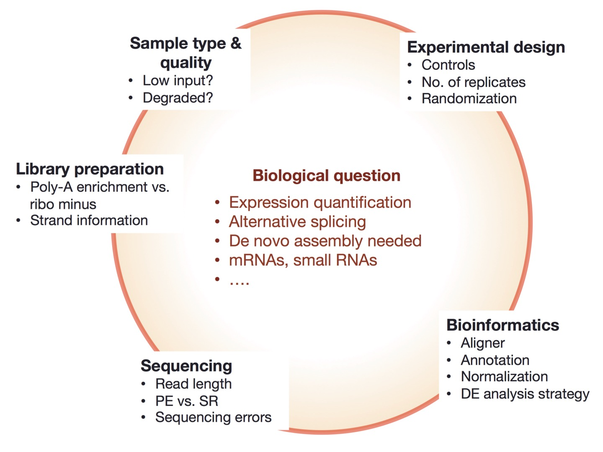

# Experimental design

| Things to consider|
| :---:  |
||
|from [https://galaxyproject.org/tutorials/rb_rnaseq/](https://galaxyproject.org/tutorials/rb_rnaseq/)|

 

A good experimental design is vital to answer a well addressed biological hypothesis.

We will go through some of the crucial aspects to consider.

## Replicates

### Technical versus biological replicates

**Technical replicates** are samples in which the starting biological material is the same, but the replicates are processed separately: there, we test the technical variability. It can be done for example to assess the **variability in library preparation**, or in the **sequencing** part itself.

**Biological replicates** are samples in which the starting biological material is different. It could include:
  * Different organisms
  * Different cell cultures
  * Different samplings of the same tumors

Why are **biological** replicates important?

Technical variation of the sequencing protocols is very low: **hence technical replicates are nowadays considered unnecessary** (in the era of microarrays, it was more problematic).

However, biological replicates are crucial to assess the **variability within an experimental group**: the more the number of replicates, the better this assessment, and the more precise the differential expression measurement.
  
Without biological replicates: how can you differentiate between the changes triggered by conditions being compared, and the **individual variability**?

## Sequencing depth

Sequencing depth refers to the number of reads covering each genomic position, in average.

It is calculated as: 
**(total number of reads * average read length) / total length of genome**

Sequencing depth is a very important consideration for **rare events discovery** (e.g. some splicing events) or **lowly-expressed gene assessment** (e.g. lncRNAs).

However, for regular mRNA gene expression, **biological replicates are of greater importance than sequencing depth**.

*Sources (and more):* 
* *[https://github.com/hbctraining/rnaseq_overview/blob/master/lessons/experimental_planning_considerations.md](https://github.com/hbctraining/rnaseq_overview/blob/master/lessons/experimental_planning_considerations.md)*
* *[https://rawgit.com/bioinformatics-core-shared-training/experimental-design/master/ExperimentalDesignManual.pdf](https://rawgit.com/bioinformatics-core-shared-training/experimental-design/master/ExperimentalDesignManual.pdf)*

