# Functional analysis

## Data bases

### Gene Ontology


The [Gene Ontology (GO)](http://geneontology.org/) describes our knowledge of the biological domain with respect to three aspects:

| GO domains / root terms | Description |
| :----: | :----: |
| Molecular Function | Molecular-level activities performed by gene products. e.g. **catalysis**, **binding**. |
| Biological Process | Larger processes accomplished by multiple molecular activities. e.g. **apoptosis**, **DNA repair**. |
| Cellular Component | The locations where a gene product performs a function. e.g. **cell membrane**, **ribosome**. |

Example of GO annotation: the gene product "cytochrome c" can be described by the **molecular function** *oxidoreductase activity*, the **biological process** *oxidative phosphorylation*, and the **cellular component** *mitochondrial matrix*.
<br><br>
The structure of GO can be described as a graph: each GO term is a **node**, each **edge** represents the relationships between the nodes. For example:

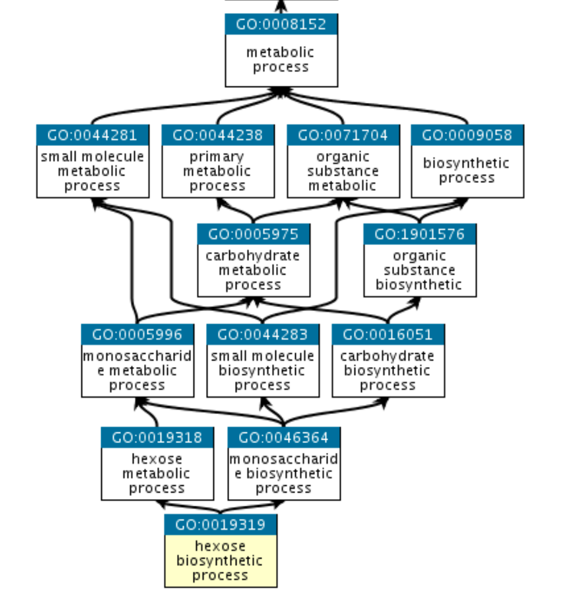

GO:0019319 (hexose biosynthetic process) is part of GO:0019318 (hexose metabolic process) and also part of  GO:0046364 (monosaccharide biosynthetic process). They all share common **parent nodes**, for example GO:0008152 (metabolic process), and eventually a **root node** that is here **biological process**.

### KEGG pathways

The [Kyoto Encyclopedia of Genes and Genomes (KEGG)](https://www.genome.jp/kegg/) is a database for understanding high-level functions and utilities of the biological system. <br>

It provides comprehensible manually-drawn pathways representing biological processes or disease-specific pathways.<br>
Example of the [*Homo sapiens* melanoma pathway](https://www.genome.jp/dbget-bin/www_bget?hsa05218):

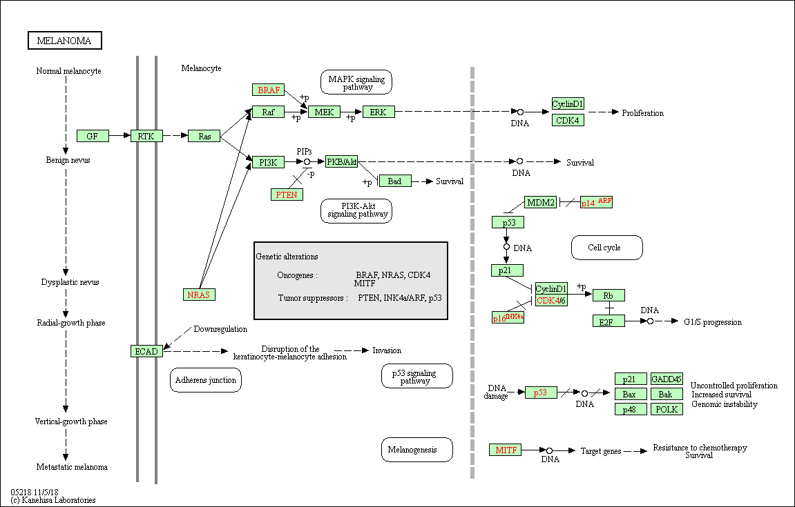


### Molecular Signatures Database (MSigDB)

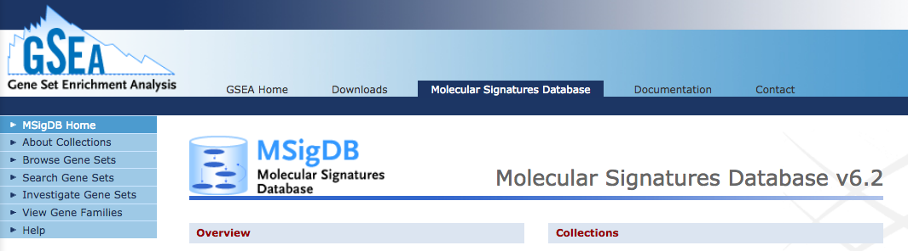

The [Molecular Signatures Database (MSigDB)](http://software.broadinstitute.org/gsea/msigdb/index.jsp) is a collection of 17810 annotated gene sets (as of May 2019) created to be used with the GSEA software (but not only). <br>

It is divided into [8 major collections](http://software.broadinstitute.org/gsea/msigdb/collections.jsp) (that include the previously described Gene Ontologies and KEGG pathways):

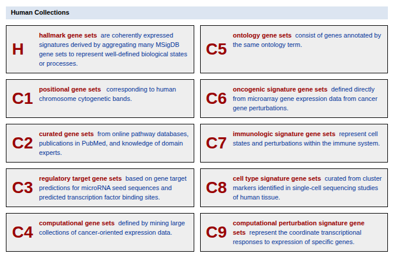


## Enrichment analysis based on gene selection

Tools based on a user-selection of genes usually require 2 inputs:

* Gene Universe: in our example: all genes used in our analysis (after filtering out low counts in our case).
* List of genes selected from the universe: our selection of genes, give the criteria we previously used: **padj < 0.05**, **&#124;log2FoldChange&#124; >= 0.5**.

They are often based on the **Hypergeometric test** or on the **Fisher's exact test**. You can have a look at this [page](http://pedagogix-tagc.univ-mrs.fr/courses/ASG1/practicals/go_statistics_td/go_statistics_td_2015.html) for some explanation of both tests.


### enrichR

[EnrichR](http://amp.pharm.mssm.edu/Enrichr/) is a gene-list enrichment tool developped at the Icahn Schoold of Medicine (Mount Sinai).

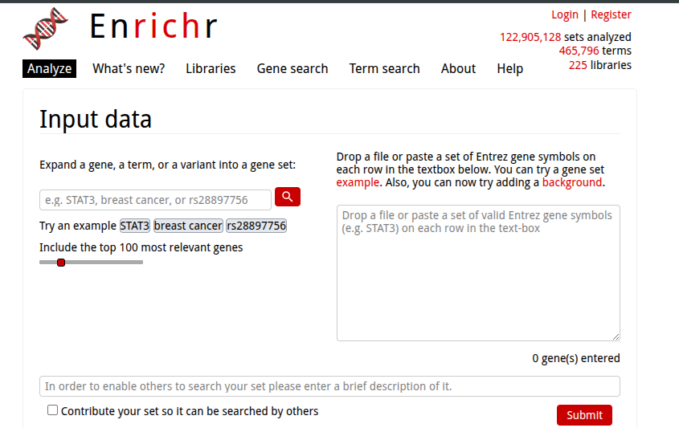

It does not require the input of a gene universe: only a selection of genes or a BED file.

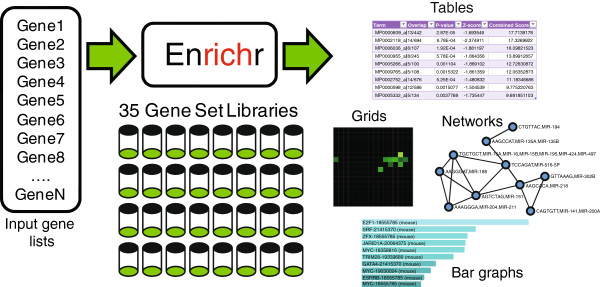

The default EnrichR interface works for *Homo sapiens* and *Mus musculus*.<br>
However, EnrichR also provides a [set of tools](https://amp.pharm.mssm.edu/modEnrichr/) for ortholog conversion and enrichment analysis of more organisms:

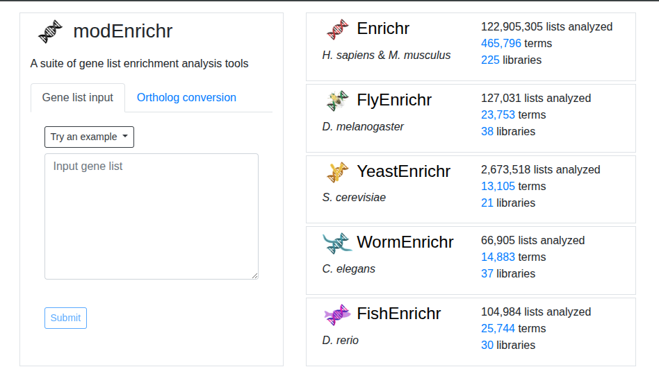

In the [main page](http://amp.pharm.mssm.edu/Enrichr/), paste our list of selected **gene symbols** (*deseq2_results_padj0.05_log2fc0.5_symbols.txt*) and **Submit** !

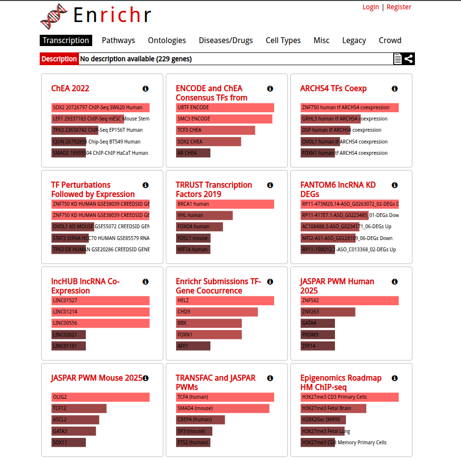

KEGG Human pathway **bar graph** vizualization:
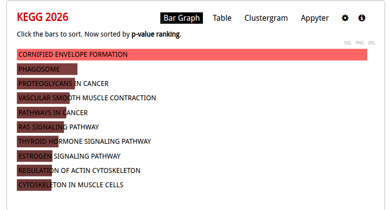

KEGG Human pathway **table** vizualization:
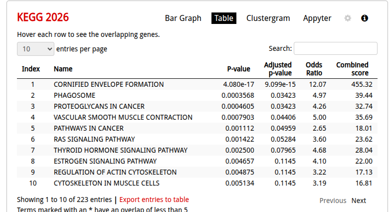

KEGG Human pathway **clustergram** vizualization:
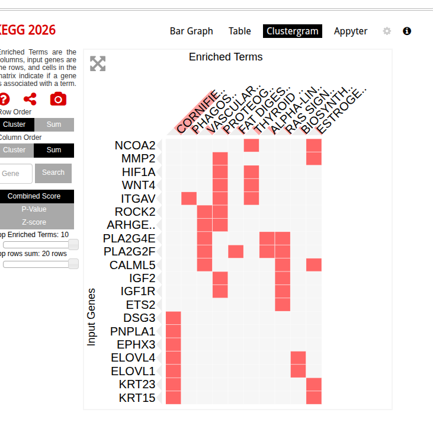

For **Cell Types**, you can also visualize networks, for example **Human gene Atlas**:
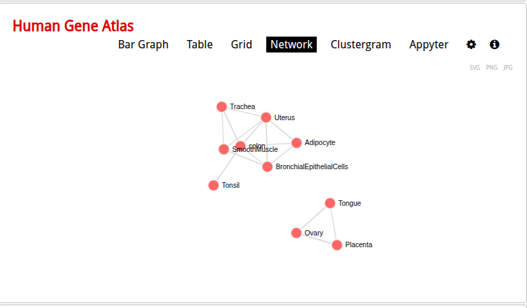

You can also export some graphs as PNG, JPEG or SVG.

### GO / Panther tool

The [main page of GO](http://geneontology.org/) provides a tool to test the enrichment of gene ontologies or Panther/Reactome pathways in pre-selected gene lists.
<br>
The tool needs a selection of differentially expressed genes (supported IDs are: gene symbols, ENSEMBL IDs, HUGO IDs, UniGene, ..) and a gene universe.
<br>

Prepare files using the ENSEMBL IDs:

```{bash}
# Extract all gene IDs used in our analysis and convert from Gencode (e.g ENSG00000057657.16) to ENSEMBL (e.g. ENSG00000057657) IDs
cut -f1 deseq2_results.txt | sed '1d' | sed 's/\..//g' > deseq2_universe_ensemblIDs.txt

# Convert from Gencode to ENSEMBL IDs from selected gene list
sed 's/\..//g' deseq2_results_padj0.05_log2fc0.5_IDs.txt > deseq2_results_padj0.05_log2fc0.5_ensemblIDs.txt
```
Paste our selection, and select **biological process** and **Homo sapiens**(file deseq2_results_padj0.05_log2fc0.5_IDs.txt):


**Launch** !

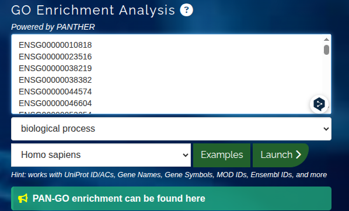

**Analyzed List** is what we just uploaded (*deseq2_results_padj0.05_log2fc0.5_ensemblIDs.txt*).
<br>
In **Reference List**, we need to upload a file containg the **universe** (*deseq2_universe_ensemblIDs.txt*):  *Change -> Browse -> (select deseq2_universe_ensemblIDs.txt) -> Upload list*
<br>

* Launch analysis
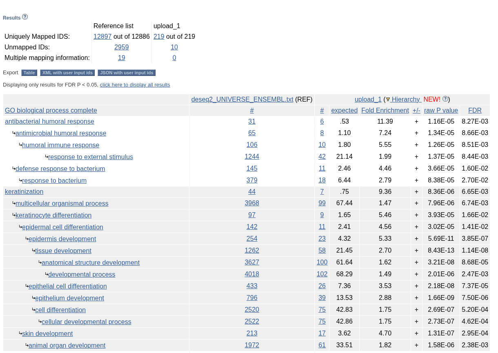
* Try the same analysis using the **gene symbols** instead of ENSEMBL IDs
```{bash}
# Get universe with gene symbols (we already have the gene selection in deseq2_results_padj0.05_log2fc0.5_symbols.txt)
cut -f2 deseq2_results.txt | sed '1d' > deseq2_universe_symbols.txt
```
* **Launch** !
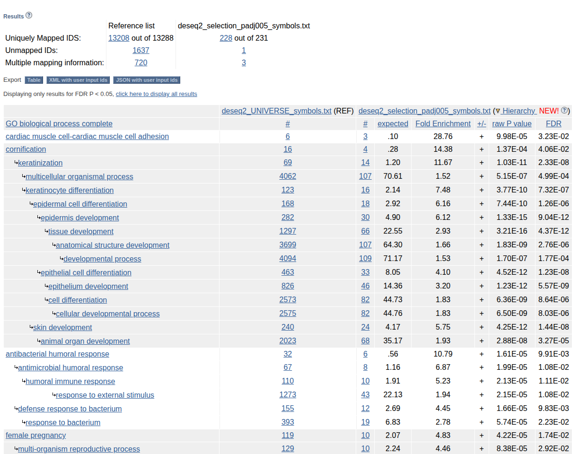

<br>

### with R: GOstats

Load the "GOstats" package

```{r}
library("GOstats")
```

Read in differentially expression data
```{r}
de_select <- read.table("deseq2_selection_diff_padj005.txt", header=T, as.is=T, sep="\t")
```

The gene universe can be the list of genes **after filtering for low counts**:

```{r}
norm <- read.table("normalized_counts_log2_star.txt", header=T, as.is=T, sep="\t")
```

GOstats works only with **Entrez IDs**: we can get them with the **biomaRt** package, as we did for the differential expression analysis.


```{r}
library(biomaRt)


# load database
mart <- useMart(biomart="ENSEMBL_MART_ENSEMBL", host="mar2017.archive.ensembl.org", path="/biomart/martservice", dataset="hsapiens_gene_ensembl")

# ENSEMBL IDs for differentially expressed genes
ids <- rownames(de_select)

# get Entrez IDs
entrez <- getBM(attributes=c('entrezgene', 'ensembl_gene_id'), filters ='ensembl_gene_id', values = ids, mart = mart)

# get Entrez IDs for the universe
ids_univ <- norm$ID
entrez_univ <- getBM(attributes=c('entrezgene', 'ensembl_gene_id'), filters ='ensembl_gene_id', values = ids_univ, mart = mart)
```

We can proceed with the **hypergeometric test** (enrichment) for the **Biological Process** ontologies:

```{r}
# Set p-value cutoff
hgCutoff <- 0.001

# Set parameters
params <- new("GOHyperGParams",
	geneIds=na.omit(unique(entrez)),
	universeGeneIds=na.omit(unique(entrez_univ)),
	ontology="BP",
	annotation="org.Hs.eg",
	pvalueCutoff=hgCutoff,
	conditional=FALSE,
	testDirection="over")

# Run enrichment test
hgOver <- hyperGTest(params)

# Get a summary table
df <- summary(hgOver)
```

|GOBPID|Pvalue|OddsRatio|ExpCounts|Counts|Size|Term|
|:---:|:---:|:---:|:---:|:---:|:---:|:---:|
|GO:0031424| 6.315336e-12|  9.896492|  3.128680|    20|   57|keratinization|
|GO:0008544| 1.838352e-10|  4.791667|  8.068702|    30| 147|epidermis development|
|GO:0043588| 6.001794e-10|  5.007273|  6.970920|    27|  127|skin development|
|GO:0009913| 3.565321e-09|  5.343814|  5.598691|    23|  102|epidermal cell differentiation|
|GO:0030855| 4.750102e-09|  3.530075| 12.514722|    36|  228|epithelial cell differentiation|
|GO:0030216| 7.362299e-09|  5.640151|  4.885133|    21|   89|keratinocyte differentiation|


**GOstats** also provides an **HTML report**:

```{r}
# Produce HTML report
htmlReport(hgOver, file="GOstats_BP.html")
```

We can open the report in a web browser.
<br>


### With R: KEGGprofile

Load **KEGGprofile** package:

```{r}
library(KEGGprofile)
```

KEGGprofile also works with **Entrez ID** (we got them for the GOstats analysis).

```{r}
# KEGG pathway enrichment
KEGGresult <- find_enriched_pathway(na.omit(unique(entrez$entrezgene)), returned_genenumber=10, species='hsa', download_latest = TRUE)

# Format file file
kegg_final <- data.frame(KEGGresult$stastic, genes_entrezid=unlist(lapply(KEGGresult$detail, function(x)paste(x, collapse=",")), use.names=F), stringsAsFactors=F)

# Write table to file
write.table(kegg_final, "KEGGprofile_results.txt", sep="\t", row.names=F, col.names=T, quote=F)
```

Results table:

|Pathway_Name|Gene_Found|Gene_Pathway|Percentage|pvalue|pvalueAdj|
|:---:|:---:|:---:|:---:|:---:|:---:|
|Metabolic pathways| 88|1489|0.06|4.644397e-08|1.565162e-05|
|Cytokine-cytokine receptor interaction|26|294|0.09|3.187192e-05|3.580279e-03|
|Viral protein interaction with cytokine and cytokine receptor|12|100|0.12|1.671507e-04|8.047114e-03|
|NF-kappa B signaling pathway|10|102|0.10|2.490180e-03|3.356763e-02|
|Mitophagy - animal|11|65|0.17|8.801457e-06|1.483046e-03|
|C-type lectin receptor signaling pathway|10|104|0.10|2.898658e-03|3.757106e-02|


<br>

## Enrichment based on ranked lists of genes using GSEA

### GSEA (Gene Set Enrichment Analysis)

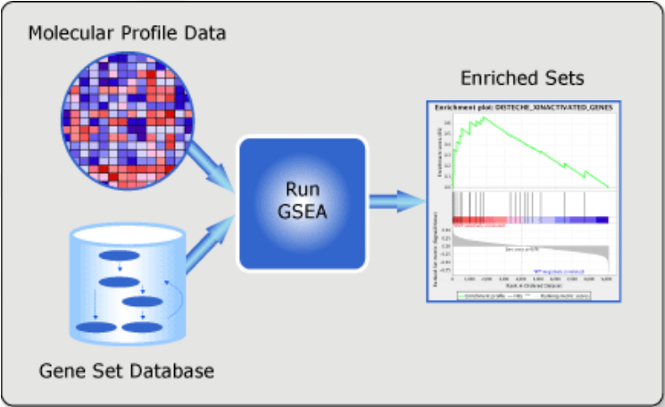

[GSEA](http://software.broadinstitute.org/gsea/) is available as a Java-based tool.

#### Algorithm

GSEA doesn't require a threshold: the whole set of genes is considered.

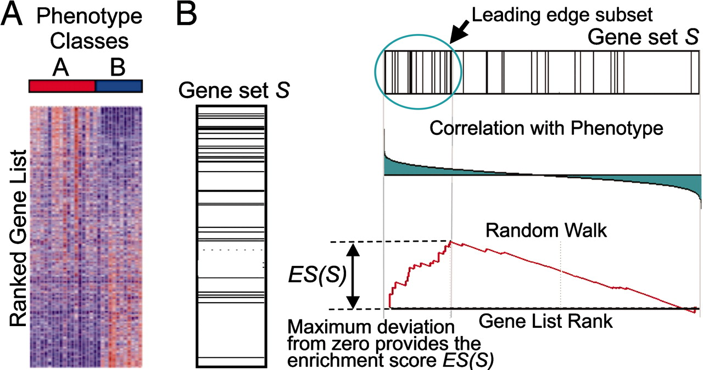

GSEA checks whether a particular gene set (for example, a gene ontology) is **randomly distributed** across a list of **ranked genes**.
<br>
The algorithm consists of 3 key elements:

1. **Calculation of the Enrichment Score**
The Enrichment Score (ES) reflects the degree to which a gene set is overrepresented at the extremes (top or bottom) of the entire ranked gene list.
2. **Estimation of Significance Level of ES** 
The statistical significant (nominal p-value) of the **Enrichment Score (ES)** is estimated by using an empirical phenotype-based permutation test procedure. The **Normalized Enrichment Score (NES)** is obtained by normalizing the ES for each gene set to account for the size of the set.
3. **Adjustment for Multiple Hypothesis Testing**
Calculation of the FDR ti control the proportion of falses positives.

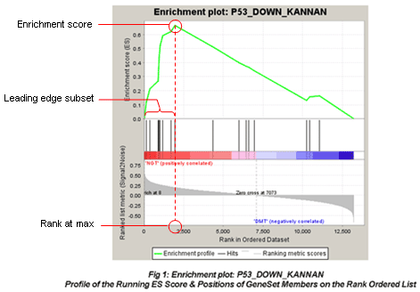

See the [GSEA Paper](https://www.ncbi.nlm.nih.gov/pubmed/16199517) for more details on the algorithm.

The main GSEA algorithm requires 3 inputs:
* Gene expression data
* Phenotype labels
* Gene sets

#### Gene expression data in TXT format

The input should be normalized read counts filtered out for low counts (-> we created it in the DESeq2 tutorial -> *normalized_counts.txt* !).
<br>
The first column contains the gene ID (HUGO symbols for *Homo sapiens*).<br>
The second column contains any description or symbol, and will be ignoreed by the algorithm.<br>
The remaining columns contains normalized expressions: one column per sample.

| NAME | DESCRIPTION | 5p4_25c | 5p4_27c | 5p4_28c | 5p4_29c | 5p4_30c | 5p4_31cfoxc1 | ... |
| DKK1 | NA| 0 | 0 | 0 | 0 | 0 | 0 | ... |
| HGT | NA | 0 | 0 | 0 | 0 | 0 | 0 | ... |

<b>Exercise</b>
<br>
Adjust the file **normalized_counts_log2_star.txt** so the first column is the gene symbol, the second is the gene ID (or anything else), and the remaining ones are the expression columns. You can save that new file as **gsea_normalized_counts.txt**.
<br>

```{bash}
awk 'BEGIN{OFS="\t"}{print $16,$1,$2,$3,$4,$5,$6,$7,$8,$9,$10,$11}' normalized_counts_log2_star.txt > gsea_normalized_counts.txt

```


#### Phenotype labels in CLS format

A phenotype label file defines phenotype labels (experimental groups) and assigns those labels to the samples in the corresponding expression data file.

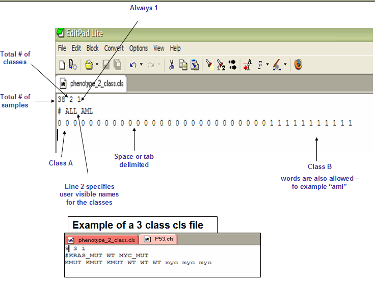

Let's create it for our experiment:

| 10 | 2 | 1 |  |  |  | | | | |
| # | WT | KO |  |  |  | | | | |
| WT | WT | WT | WT | WT | KO | KO | KO | KO | KO |


**NOTE**: the first label used is assigned to the first class named on the second line; the second unique label is assigned to the second class named; and so on. 
<br> 
So the phenotype file could also be:

| 10 | 2 | 1 |  |  |  | | | | |
| # | WT | KO |  |  |  | | | | |
| 0 | 0 | 0 | 0 | 0 | 1 | 1 | 1 | 1 | 1 |

The first label **WT** in the second line is associated to the first label **0** on the third line.

<b>Exercise</b>
<br>
Create the phenotype labels file and save it as **gsea_phenotypes.cls**.


#### Download and run GSEA

##### Download Java application:

Enter the [registration page](https://www.gsea-msigdb.org/gsea/register.jsp), enter your **email** and **organization**, then to [download page](http://software.broadinstitute.org/gsea/login.jsp), enter your Email and **login**:
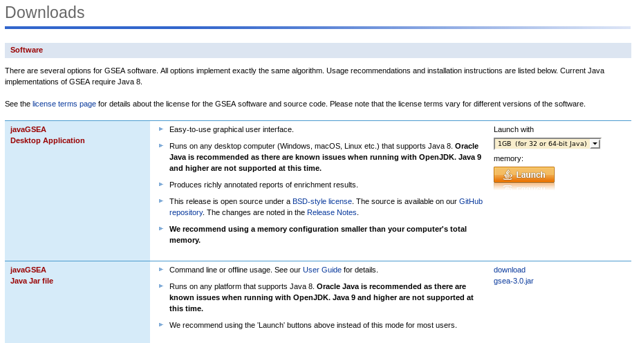
<br>
Click on **download gsea-3.0.jar** link and save file locally to your home directory.


##### Launch the GSEA application

GSEA is Java-based. Launch it from a terminal window:

```{bash}
$RUN java -Xmx1024m -jar gsea-3.0.jar
```

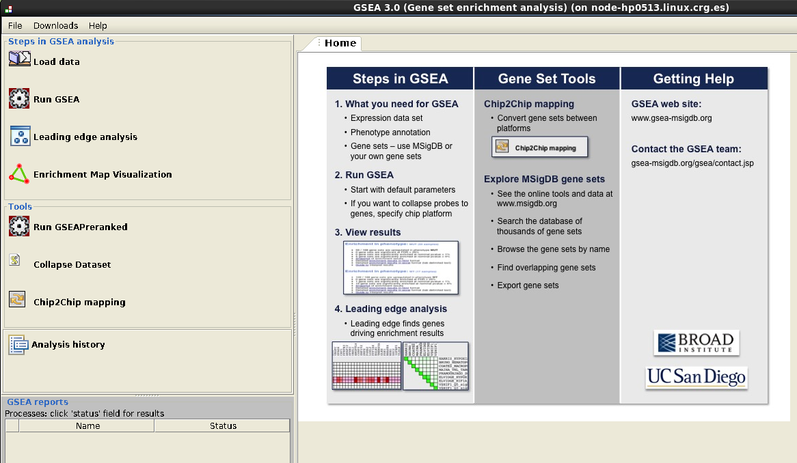

In *Steps in GSEA analysis* (upper left corner):

* Go to **Load data**: select **gsea_normalized_counts.txt** and **gsea_phenotypes.cls** and load.

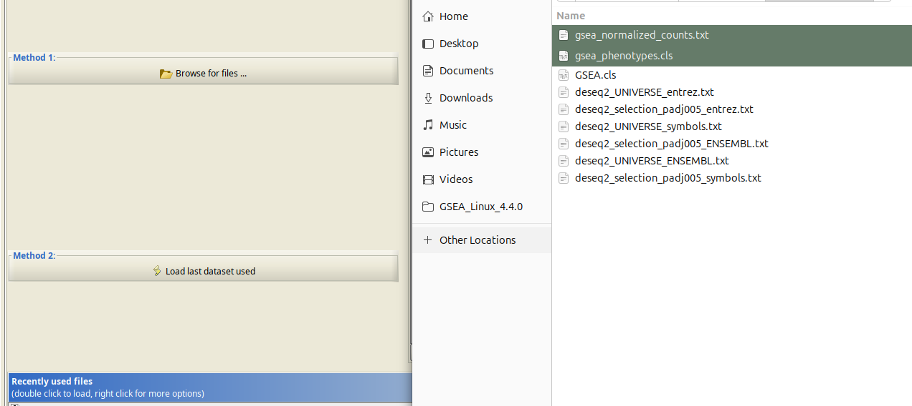

* Go to **Run GSEA**

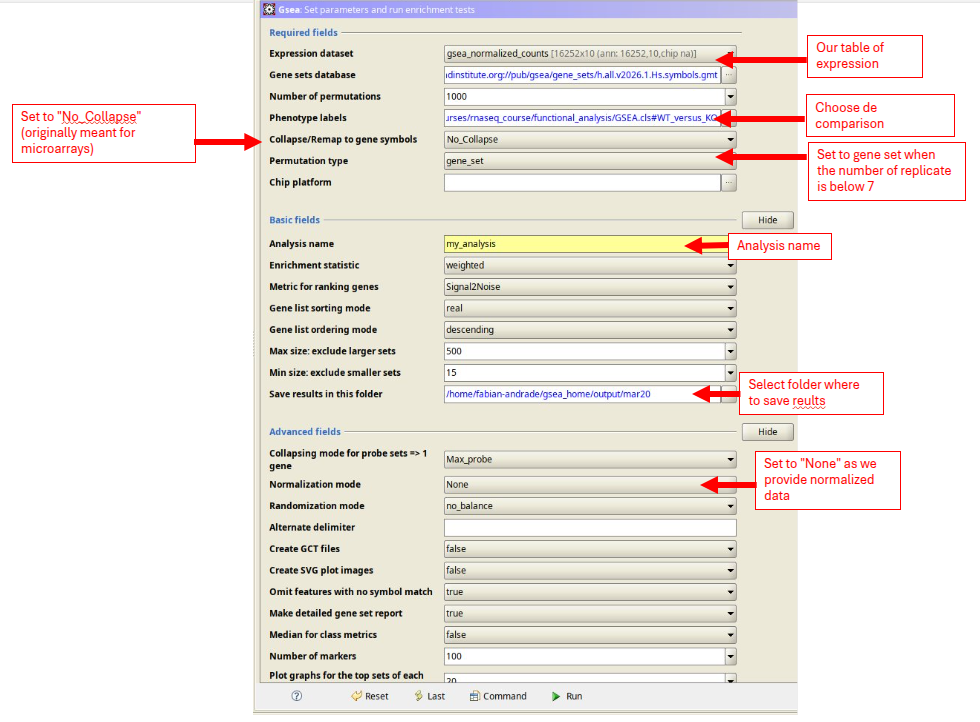

* Results: **index.html**

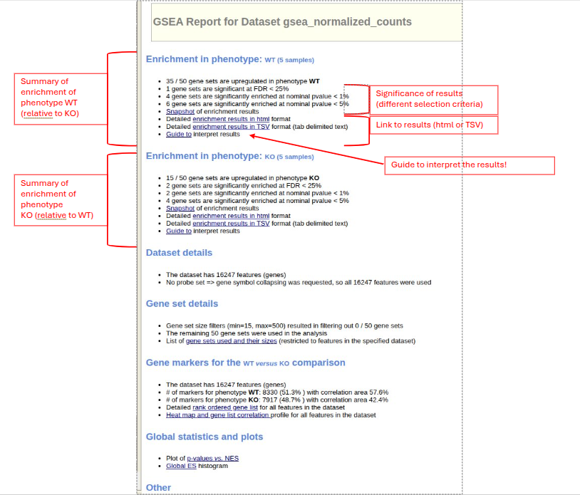

* **Enrichments results in html**

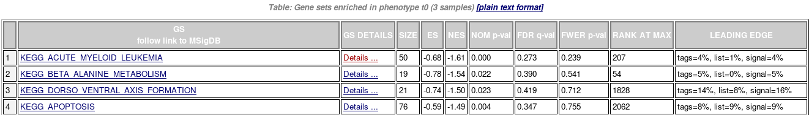

* Details for one gene set
  * Summary of enrichment: phenotype, stats (Nominal p-value, FDR q-value, FWER p-value), enrichment scores (ES and Normalized ES)
  * Enrichment plot
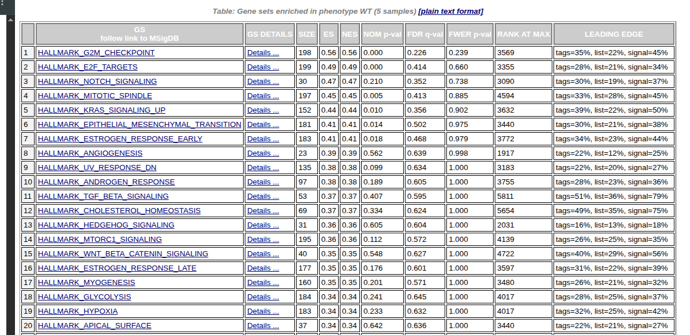

Table of genes: ranking, individual enrichment scores, core enrichment Yes/No.

> From GSEA documentation, regarding core enrichment genes: "*Genes with a Yes value in this column contribute to the leading-edge subset within the gene set. This is the subset of genes that contributes most to the enrichment result.*"

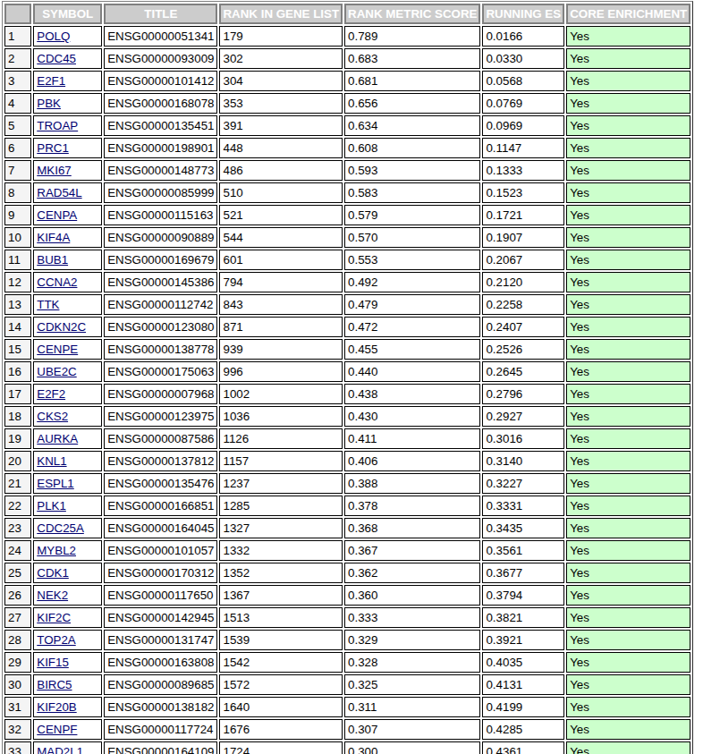

Heatmap of all genes from that gene set (ranked by GSEA) for each sample:

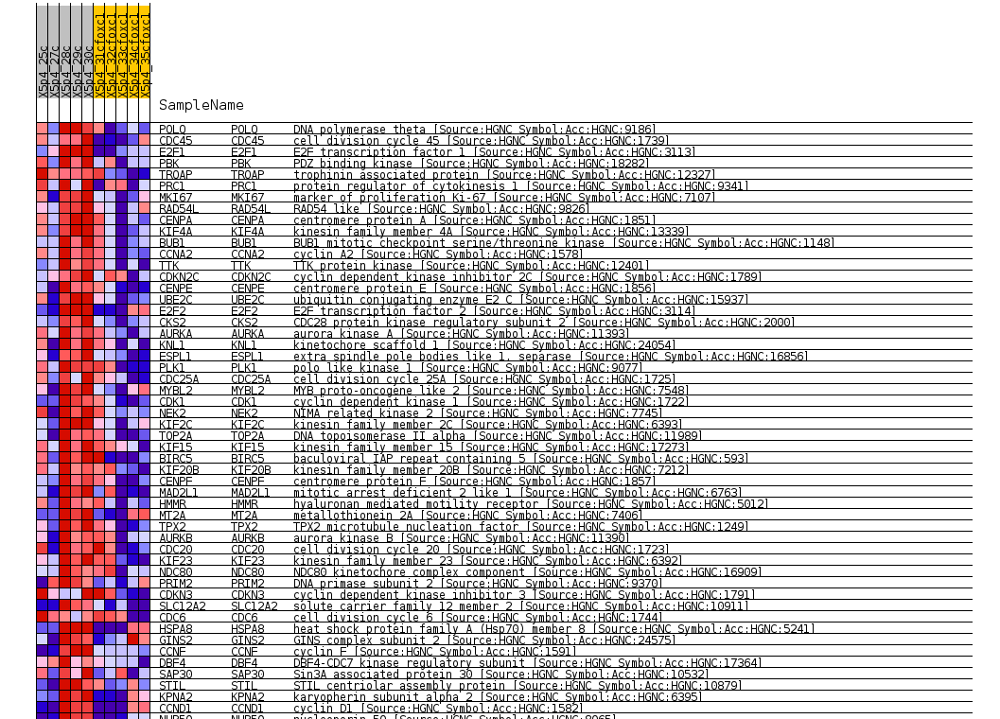

**Suggestions for GSEA:**
* Selection of pathways / gene sets: select the **lowest FDR** first. 
* If you are looking for genes to validate on certain pathways:
  * It is better if those genes belong to the **core enrichment**.
  * It is also good to go back to the **differential expression** analysis table and make sure that their **adjusted-value** is low.
* You can also upload **your own gene sets** (for example a gene signature taken from a specific paper) to test against your list of genes, using one of the [GSEA gene set database formats](http://software.broadinstitute.org/cancer/software/gsea/wiki/index.php/Data_formats#Gene_Set_Database_Formats).


------------

