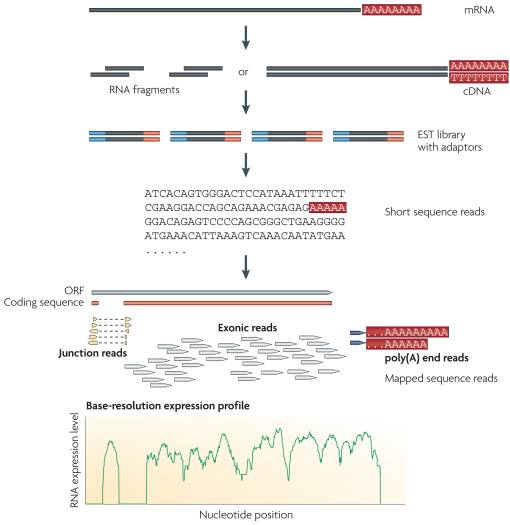

# Introduction: What is RNA-Seq? 

|RNA molecule|
| :---:  |
||
|from Wikipedia|

## Types of RNAs

In both prokaryotes and eukaryotes, there are 3 main types of RNA:
* Messenger RNA = mRNA:
  * ~ Represent ~ 1-5% of total RNA
  * Protein-coding
  * Mostly poly-adenylated
  * Very heterogeneous in terms of base sequence and size.
* Ribosomal RNA = rRNA:
  * ~ Represent ~ 80-90% of total RNA
* Transfer RNA = tRNA
  * Represent ~ 15% of total RNA
  * Small in size: ~ 75-95 nt
  
But there are many more types of RNAs:
* Micro RNA = miRNA
  * Regulatory RNAs
  * Small in size: ~ 20-25 nt
* Small nuclear RNA:  = snRNA
  * Several are related to splicing mechanisms
* And more: lncRNA, eRNA, scaRNA, gRNA, piRNA, etc.

## RNA-sequencing

RNA-sequencing, aka RNA-Seq, is a High-Throughput Sequencing technique for identifying and quantifying RNA molecules in biological samples. 

This technology is used to analyze RNA for assessing:
* RNA/gene/transcript expression;
* alternatively spliced transcripts;
* gene fusion and SNPs;
* post-translational modification.

Other technologies for assessing RNA expression are Northern Blot, real-time PCR and hybridization-based microarrays [3].

## Technologies and protocols

RNA-seq can target different RNA populations, using different protocols:
* Positive selection of mRNAs: **polyA selection**.
* Negative selection of non-polyA: **rRNA depletion**.
* Size selection: e.g. for **small RNA selection**.

 

Depending on the technology and the protocol, RNA-Seq can produce:
* single-end short reads (50-450 nt), which are useful for gene expression quantification (mainly **Illumina**, but also **Ion Torrent** and **BGISEQ**);
* paired-end reads (2 x 50-250 nt), which are useful for detecting splicing events and refinement of transcriptome annotation;
* single long reads (**PACBio** or **ONT**), which are used for the de novo identification of new transcripts and improving transcriptome assembly. 

 

## mRNA-Seq protocol (Illumina)

|mRNA-Seq protocol|
| :---:  |
||
|from Wang et al 2009|

 

