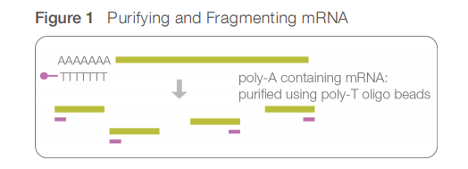
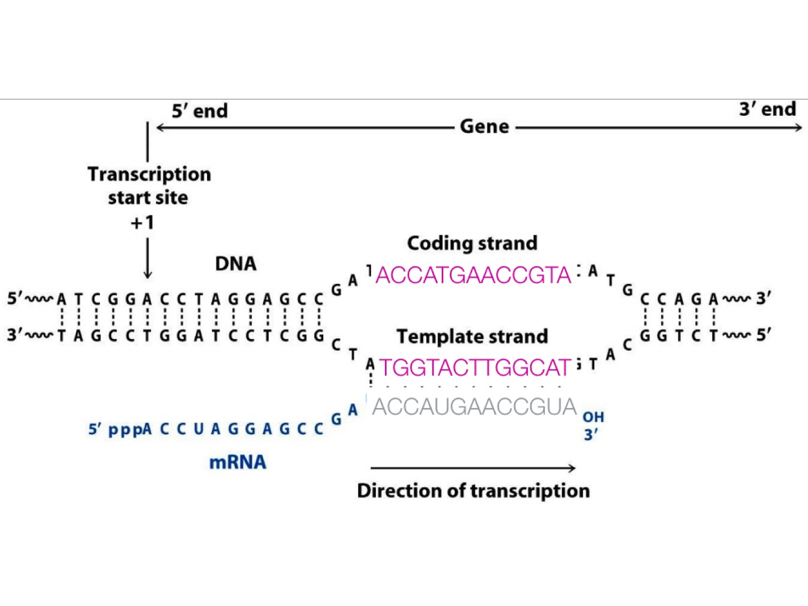
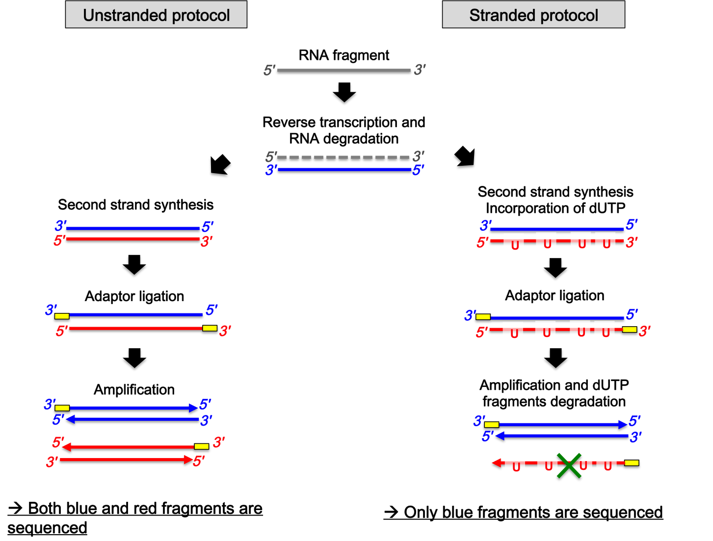
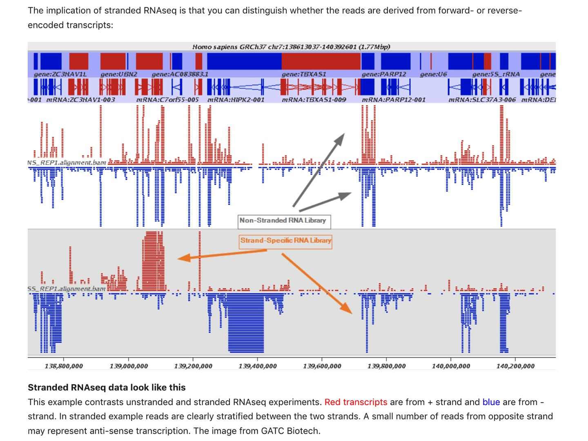
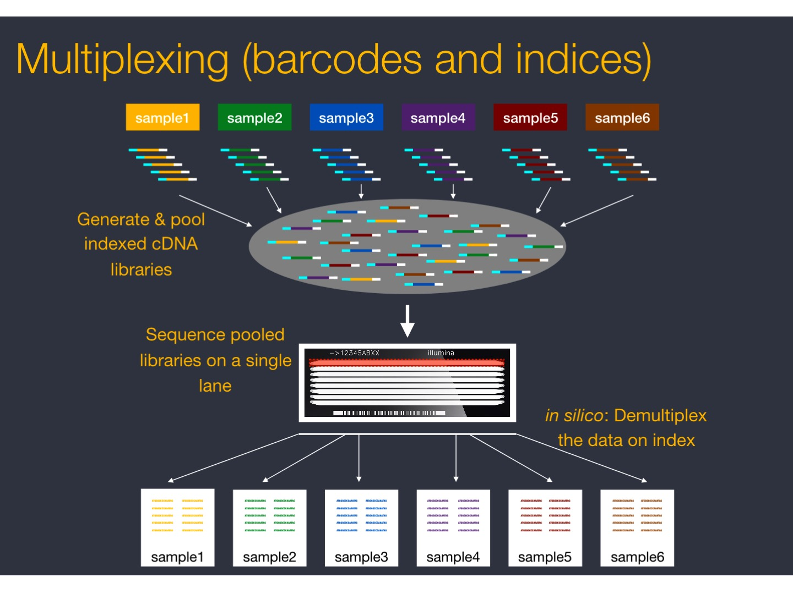
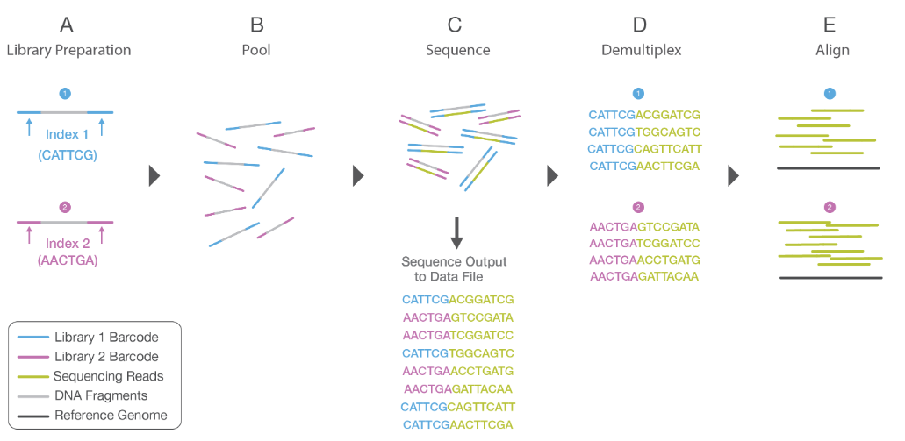

# Library preparation

## **mRNA purification**. 

The most typical library preparation protocol for **mRNA-sequencing** use the **polyA-selection strategy** for purifying RNA.

Essentially, mRNA is selected using a polyT adapter that binds to the **polyA tail** of mature RNAs. 
 
As a result, non poly-adenylated transcripts - rRNA, tRNA, lncRNAs, miRNA, histone mRNA, degraded RNA, bacterial transcripts, and many viral transcripts  - are excluded from the reaction (washed away).

## **RNA fragmentation**

Selected mRNAs are then fragmented and a **primer** is added at their 3' end.

## **Convertion to cDNA**

mRNA that is targeted in RNA-Seq experiments has a **5' to 3' polarity**. 
 
It can be transcribed from either DNA strand. However, for mRNA, it is always called **sense RNA**. 

## Stranded vs unstranded RNA-seq

mRNA is one-stranded: during a typical RNA-Seq experiment the information about DNA strands is lost after both strands of cDNA are synthesized.

Methods were designed to take into account the strand: resulting **stranded RNA-Seq libraries** preserve the RNA strand information and allow detection of genes transcribed in both 5' and 3' direction. 

 
**Illumina's TruSeq Stranded mRNA protocol** has become a standard method for mRNA-sequencing.

The protocol uses the **introduction of dUTP** instead of dTTP during the amplification. The incorporation of dUTP in the second strand synthesis quenches the second strand during amplification, because the polymerase used in the assay is not incorporated past this nucleotide.

In the result (in other protocols it can be different), **Read 1 (forward)** is mapped to the **antisense DNA strand** (this is also true for single-end reads), while **Read 2 (reverse)**, to the **sense DNA strand**.

Strand-specific protocols **enhance the value of a RNA-seq experiment**:
* No ambiguity and better estimation of gene expression level.
* Add information on the originating strand (inferred from the alignment)
* Can precisely delineate the bounderies of transcripts in regions with genes on opposite strands (better transcript model)

(For detail, see [https://galaxyproject.org/tutorials/rb_rnaseq/](https://galaxyproject.org/tutorials/rb_rnaseq/))

|Read mapping in a stranded vs. unstranded sequencing|
| :---:  |
||
|from [https://galaxyproject.org/tutorials/rb_rnaseq/](https://galaxyproject.org/tutorials/rb_rnaseq/)|

 

## **cDNA multiplexing** 

Fragmented cDNA is indexed with a hexamer or octamer barcode (so that cDNA from different samples can be pooled into a single lane for multiplexed sequencing).

|cDNA multiplexing|
| :---:  |
||
|from [https://github.com/hbctraining/rnaseq_overview](https://github.com/hbctraining/rnaseq_overview)|

from [https://www.illumina.com/documents/products/illumina_sequencing_introduction.pdf](https://www.illumina.com/documents/products/illumina_sequencing_introduction.pdf)

## **cDNA amplification**

 

* **cDNA library quality control and fragment selection** 

 

## **Sequencing**

 

The output of RNA-seq is then demultiplexed yielding either one fastq-file per sample (for single-end reads protocol) or two fastq-files per sample (for paired-end reads protocol).

 

