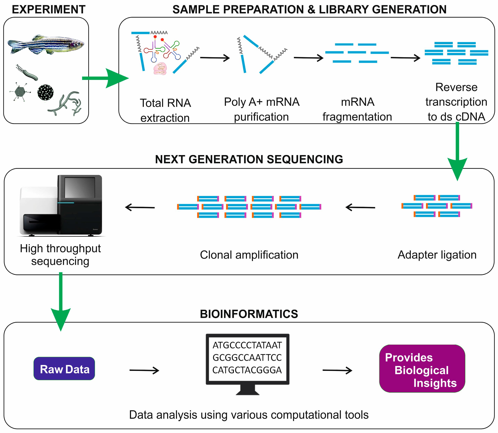
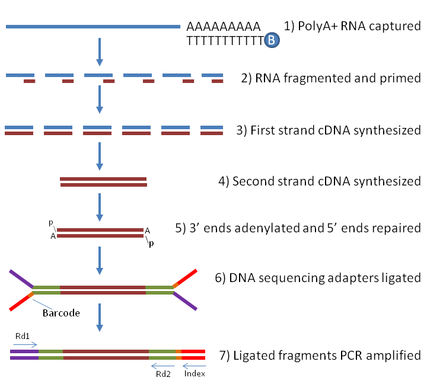

# mRNA sequencing

|Workflow of mRNA-seq|
| :---:  |
||
|from [Sudhagar et al., Int. J. Mol. Sci. 2018](https://www.mdpi.com/1422-0067/19/1/245/htm)|

mRNA sequencing conventional workflow consists of four major steps: 
* Experimental design.
* Sample preparation and library generation.
* Next-generation sequencing of the library.
* Bioinformatic analysis.

In this section, we will consider the procedure of the standard library preparation; in particular, **Illumina TruSeq stranded poly(A) library**. It includes the following steps: 
* RNA isolation/extraction.
* mRNA purification.
* mRNA fragmentation.
* Synthesis of the cDNA first strand.
* Synthesis of the cDNA second strand.
* Adenylation of 3' ends.
* Ligtion of adapters (cDNA multiplexing).
* cDNA amplification.
* cDNA library quality control.

|Illumina TruSeq stranded poly(A) library preparation steps|
| :---:  |
||
|from https://www.labome.com/method/RNA-seq.html(https://www.labome.com/method/RNA-seq.html)|

 

## RNA isolation

RNA is isolated from tissue and mixed with deoxyribonuclease (DNase), which reduces the amount of genomic DNA. 

 

## mRNA purification

For Illumina protocol, RNA input is 0.1-4 microgram.
The most typical library preparation protocol for **mRNA-sequencing** uses the **poly(A)-selection strategy** for purifying mRNA by filtering RNA with 3' polyadenylated (poly(A)) tails to include only mRNA. 

The poly(A) containing mRNA molecules are purified using poly(T) oligomer attached magnetic beads that bind to the **poly(A) tail** of mRNAs. 

As a result, non polyadenylated transcripts - rRNA, tRNA, lncRNAs, miRNA, histone mRNA, degraded RNA, bacterial transcripts, and many viral transcripts - are excluded from the reaction (washed away).

Further, the ribosomal depletion is conducted to remove rRNA as it represents over 90% of the RNA in a cell, which if kept would drown out other data in the transcriptome.

 

## mRNA fragmentation

Purified mRNA is then fragmented and a **primer for cDNA synthesis** is added at the 3' end.

 

## cDNA synthesis: Convertion of RNA to ds cDNA

RNA fragments are reverse transcribed to cDNA because DNA is more stable and allow for amplification (which uses DNA polymerases) and leverage more mature DNA sequencing technology.  
 
mRNA can be transcribed from either of two DNA strand. 

The **sense strand (coding strand)** is the strand of DNA that has the same sequence as the mRNA, which takes the **antisense strand (template strand)** as its template during transcription.

mRNA is one-stranded: during a typical RNA-seq experiment information about DNA strands is lost after both strands of cDNA are synthesized.

Special methods were designed to take into account the strand, resulting in **stranded RNA-Seq libraries** that preserve the RNA strand information and allow detection of genes transcribed in both 5' and 3' direction. 

 

**Illumina's TruSeq Stranded mRNA protocol** has become a standard stranded method for mRNA-sequencing.

First, the first strand of cDNA is synthesized by priming mRNA fragments with random hexamers and using reverse transcriptase.

Then, the second strand of cDNA is synthesized.
The protocol uses the **introduction of dUTP** instead of dTTP during amplification. The incorporation of dUTP in the second strand synthesis "kills" this second strand during amplification, because the polymerase used in the assay is not incorporated past this incorporated nucleotide.

 

 

In the result (in other protocols it can be different), **Read 1 (forward)** is mapped to the **antisense DNA strand** (this is also true for single-end reads), while **Read 2 (reverse)**, to the **sense DNA strand**.

| :---:  |
||
|from [https://seekdeep.brown.edu/illumina_paired_info.html](https://seekdeep.brown.edu/illumina_paired_info.html)|

 

Strand-specific protocols **enhance the value of a RNA-seq experiment**:
* No ambiguity and better estimation of gene expression level.
* Add information on the originating strand (inferred from the alignment)
* Can precisely delineate the bounderies of transcripts in regions with genes on opposite strands (better transcript model)

(For detail, see [https://galaxyproject.org/tutorials/rb_rnaseq/](https://galaxyproject.org/tutorials/rb_rnaseq/))

|Read mapping in a stranded vs. unstranded sequencing|
| :---:  |
||
|from [https://galaxyproject.org/tutorials/rb_rnaseq/](https://galaxyproject.org/tutorials/rb_rnaseq/)|

 

## Adenylation of 3' ends

A single "A" nucleotide is added to the 3' ends of cDNA fragments to prevent them from ligating to one another during the adapter ligation reaction (next step). A corresponding "T" nucleotide at the 3' end of the adapter provides a complementary overhang for ligating the adapter to the fragment. This strategy ensures a low rate of formation of concatenated chimera fragments.

 

## Adapter ligation, cDNA multiplexing and DNA amplification

The 5’ and 3’ ends of cDNA fragments are next prepared to allow efficient ligation of “Y” adapters containing unique barcodes and adapters for hybridization of cDNA fragments onto a flowcell. Hexamer or octamer barcodes allow to pool cDNA from different samples into a single lane for multiplexed sequencing.

|cDNA multiplexing|
| :---:  |
||
|from [https://github.com/hbctraining/rnaseq_overview](https://github.com/hbctraining/rnaseq_overview)|

from [https://www.illumina.com/documents/products/illumina_sequencing_introduction.pdf](https://www.illumina.com/documents/products/illumina_sequencing_introduction.pdf)

## cDNA library quality control 

This is done using DNA Bioanalyzer.
 

## Sequencing

 

The output of RNA-seq is first demultiplexed yielding either one fastq-file per sample (for single-end reads protocol) or two fastq-files per sample (for paired-end reads protocol).

 

