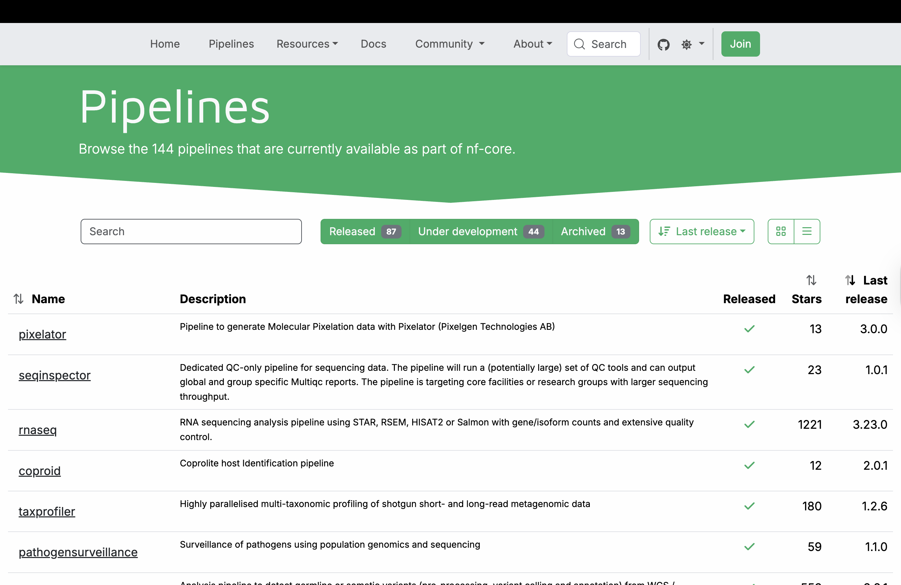
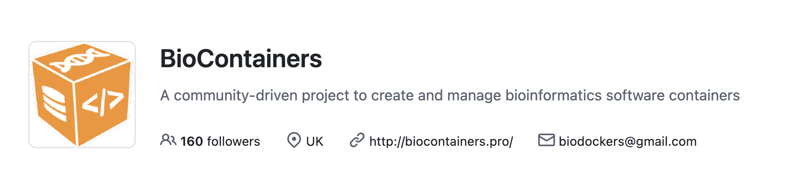

# Hands-on: Running the full analysis using the nf-core pipelines

All the previous steps can be chained together in what bioinformaticians call a pipeline.
Historically, each lab developed its own pipelines using custom code tailored to its specific IT infrastructure. 
In many cases, this code was so ad hoc that adapting it to other environments was nearly impossible. 
This was a major barrier to reproducibility and collaboration.
This challenge sparked some open-source projects, including one invented here at CRG: [Nextflow](https://www.nextflow.io/). 

<div align="center">

</div>

Nextflow is a domain-specific language built on Groovy that enables scalable, reproducible, and portable scientific workflows. 
It abstracts away infrastructure complexity, allowing the same pipeline to run on a laptop, HPC cluster, or cloud environment.
From the very beginning, a community of scientists adopted the tool and began building a curated collection of high-quality, peer-reviewed bioinformatics pipelines. 
This community, known as [nf-core](https://nf-co.re), now maintains over 100 pipelines covering diverse applications—from RNA-seq and variant calling to metagenomics and spatial transcriptomics. 
All nf-core pipelines follow strict guidelines for structure, documentation, and testing, ensuring consistency and reliability across the entire collection.

<div align="center">

</div>

</br>

These pipelines leverage containerization to ensure reproducibility and portability. Each bioinformatics tool runs inside a Linux container (such as Singularity/Apptainer or Docker), eliminating dependency conflicts and the "works (only :) ) on my machine" problem.
Most nf-core pipelines rely on container images from [Biocontainers](https://biocontainers.pro/), a community-driven project that automatically builds and hosts containers for thousands of bioinformatics tools. These pre-built images are publicly available at [quay.io](https://quay.io/), allowing pipelines to pull the exact software versions they need on-demand.

<div align="center">

</div>

## RNAseq nf-core pipeline 

For our data analysis, we will use the [nf-core RNAseq pipeline](https://nf-co.re/rnaseq/3.23.0/). The whole pipeline is described in this fancy diagram:

<div align="center">

</div>

As you can see, we have almost 40 tools that are chained and available. This level of complexity was nearly impossible in the past without the use of an orchestrator.

We can identify 5 macro areas:
- Preprocessing: merge different sequencing runs, infer strandness, QC, UMI extraction, adapter trimming and contaminants, and rRNA removal.  
- Genome alignment using either Star, Hisat2 or bowtie2. Quantification with Rsem or Salmon. (Hisat2 has no quantification method)
- Transcriptome pseudo-alignment with either Salmon or Kallisto.
- Post-processing after genome alignment: sorting, umi and read deduplication, transcriptome assembly, and quantification. Generation of read coverage files (bigWig) for displaying in genome browsers.
- Quality control and reporting after post-processing: QC on alignment, such as RSeQC, qualimap, etc. Detection of contamination and final reporting with MultiQC 

We can use the nf-core tools by installing them using **pip**.  

```{note}
You might also think of getting it from Biocontainers, but this won't work when executing the pipeline with other containers!
```

```bash
# -r indicates the exact version to fetch
nf-core pipelines download  nf-core/rnaseq -r dev


                                          ,--./,-.
          ___     __   __   __   ___     /,-._.--~\ 
    |\ | |__  __ /  ` /  \ |__) |__         }  {
    | \| |       \__, \__/ |  \ |___     \`-._,-`-,
                                          `._,._,'

    nf-core/tools version 3.5.2 - https://nf-co.re


WARNING  Could not find GitHub authentication token. Some API requests may fail.                                                                                    

In addition to the pipeline code, this tool can download software containers.
? Download software container images: (Use arrow keys)
 » none
   singularity
   docker
```

In this way, you can also pre-download the containers. This can be useful if your HPC has no internet connection and needs to run the pipeline offline.

```bash
In addition to the pipeline code, this tool can download software containers.
? Download software container images: none

If transferring the downloaded files to another system, it can be convenient to have everything compressed in a single file.
? Choose compression type: (Use arrow keys)
 » none
   tar.gz
   tar.bz2
   zip
```

After that, a new folder named **nf-core-rnaseq_dev** appears with the whole pipeline. You can navigate inside and see all the files:

```bash
ls nf-core-rnaseq_dev/dev/

tests
subworkflows
ro-crate-metadata.json
nf-test.config
nextflow_schema.json
nextflow.config
modules
modules.json
main.nf
docs
conf
bin
assets
README.md
LICENSE
CODE_OF_CONDUCT.md
CITATIONS.md
CHANGELOG.md

```

You don't need to change anything except the file **base.config** inside **conf** folder. Inside are described the resources needed for the different processes, and some of them can be really too generous.

```{code-block} groovy

/*
~~~~~~~~~~~~~~~~~~~~~~~~~~~~~~~~~~~~~~~~~~~~~~~~~~~~~~~~~~~~~~~~~~~~~~~~~~~~~~~~~~~~~~~~
    nf-core/rnaseq Nextflow base config file
~~~~~~~~~~~~~~~~~~~~~~~~~~~~~~~~~~~~~~~~~~~~~~~~~~~~~~~~~~~~~~~~~~~~~~~~~~~~~~~~~~~~~~~~
    A 'blank slate' config file, appropriate for general use on most high performance
    compute environments. Assumes that all software is installed and available on
    the PATH. Runs in `local` mode - all jobs will be run on the logged in environment.
----------------------------------------------------------------------------------------
*/

process {

    // TODO nf-core: Check the defaults for all processes
    cpus   = { 1      * task.attempt }
    memory = { 6.GB   * task.attempt }
    time   = { 4.h    * task.attempt }

    errorStrategy = { task.exitStatus in ((130..145) + 104 + 175) ? 'retry' : 'finish' }
    maxRetries    = 1
    maxErrors     = '-1'

    // Process-specific resource requirements
    // NOTE - Please try and reuse the labels below as much as possible.
    //        These labels are used and recognised by default in DSL2 files hosted on nf-core/modules.
    //        If possible, it would be nice to keep the same label naming convention when
    //        adding in your local modules too.
    // See https://www.nextflow.io/docs/latest/config.html#config-process-selectors
    withLabel:process_single {
        cpus   = { 1                   }
        memory = { 6.GB * task.attempt }
        time   = { 4.h  * task.attempt }
    }
    withLabel:process_low {
        cpus   = { 2     * task.attempt }
        memory = { 12.GB * task.attempt }
        time   = { 4.h   * task.attempt }
    }
    withLabel:process_medium {
        cpus   = { 6     * task.attempt }
        memory = { 36.GB * task.attempt }
        time   = { 8.h   * task.attempt }
    }
    withLabel:process_high {
        cpus   = { 12    * task.attempt }
        memory = { 72.GB * task.attempt }
        time   = { 16.h  * task.attempt }
    }
    withLabel:process_long {
        time   = { 20.h  * task.attempt }
    }
    withLabel:process_high_memory {
        memory = { 200.GB * task.attempt }
    }
    withLabel:error_ignore {
        errorStrategy = 'ignore'
    }
    withLabel:error_retry {
        errorStrategy = 'retry'
        maxRetries    = 2
    }
    withLabel: process_gpu {
        accelerator      = 1
        containerOptions = { params.gpu_container_options ?: (workflow.containerEngine in ['singularity', 'apptainer'] ? '--nv' : '--gpus all') }
    }
}
```

You can either manually change them or make a new profile and override some of them. Let's modify the processes with too much RAM or cpus.

```{code-block} groovy
:emphasize-lines: 30,34,35,42

process {

    // TODO nf-core: Check the defaults for all processes
    cpus   = { 1      * task.attempt }
    memory = { 6.GB   * task.attempt }
    time   = { 4.h    * task.attempt }

    errorStrategy = { task.exitStatus in ((130..145) + 104 + 175) ? 'retry' : 'finish' }
    maxRetries    = 1
    maxErrors     = '-1'

    // Process-specific resource requirements
    // NOTE - Please try and reuse the labels below as much as possible.
    //        These labels are used and recognised by default in DSL2 files hosted on nf-core/modules.
    //        If possible, it would be nice to keep the same label naming convention when
    //        adding in your local modules too.
    // See https://www.nextflow.io/docs/latest/config.html#config-process-selectors
    withLabel:process_single {
        cpus   = { 1                   }
        memory = { 6.GB * task.attempt }
        time   = { 4.h  * task.attempt }
    }
    withLabel:process_low {
        cpus   = { 2     * task.attempt }
        memory = { 12.GB * task.attempt }
        time   = { 4.h   * task.attempt }
    }
    withLabel:process_medium {
        cpus   = { 6     * task.attempt }
        memory = { 24.GB * task.attempt }
        time   = { 8.h   * task.attempt }
    }
    withLabel:process_high {
        cpus   = { 8    * task.attempt }
        memory = { 48.GB * task.attempt }
        time   = { 16.h  * task.attempt }
    }
    withLabel:process_long {
        time   = { 20.h  * task.attempt }
    }
    withLabel:process_high_memory {
        memory = { 96.GB * task.attempt }
    }
    withLabel:error_ignore {
        errorStrategy = 'ignore'
    }
    withLabel:error_retry {
        errorStrategy = 'retry'
        maxRetries    = 2
    }
    withLabel: process_gpu {
        accelerator      = 1
        containerOptions = { params.gpu_container_options ?: (workflow.containerEngine in ['singularity', 'apptainer'] ? '--nv' : '--gpus all') }
    }
}
```

We need to define the input files inside a sample sheet.  

```
vi sample_sheet.csv 

sample,fastq_1,fastq_2,strandedness
SRR3091423,./reads/SRR3091423_1_chr6.fastq.gz,,reverse
SRR3091427,./reads/SRR3091427_1_chr6.fastq.gz,,reverse
SRR3091420,./reads/SRR3091420_1_chr6.fastq.gz,,reverse
SRR3091424,./reads/SRR3091424_1_chr6.fastq.gz,,reverse
SRR3091428,./reads/SRR3091428_1_chr6.fastq.gz,,reverse
SRR3091421,./reads/SRR3091421_1_chr6.fastq.gz,,reverse
SRR3091425,./reads/SRR3091425_1_chr6.fastq.gz,,reverse
SRR3091429,./reads/SRR3091429_1_chr6.fastq.gz,,reverse
SRR3091422,./reads/SRR3091422_1_chr6.fastq.gz,,reverse
SRR3091426,./reads/SRR3091426_1_chr6.fastq.gz,,reverse
```

Now we can run the wizard:

```bash
nf-core pipelines launch nf-core-rnaseq_dev/dev/


                                          ,--./,-.
          ___     __   __   __   ___     /,-._.--~\ 
    |\ | |__  __ /  ` /  \ |__) |__         }  {
    | \| |       \__, \__/ |  \ |___     \`-._,-`-,
                                          `._,._,'

    nf-core/tools version 3.5.2 - https://nf-co.re


INFO     NOTE: This tool ignores any pipeline parameter defaults overwritten by Nextflow config files or profiles                                                   
                                                                                                                                                                    
INFO     [✓] Default parameters match schema validation                                                                                                             
INFO     [✓] Pipeline schema looks valid (found 129 params)                                                                                                         
INFO     Would you like to enter pipeline parameters using a web-based interface or a command-line wizard?                                                          
? Choose launch method (Use arrow keys)
   Web based
 » Command line

```
We choose the command line, we choose **-profile  [singularity]**, as input **sample_sheet.csv**, **outfolder** as output. We provide the fasta file as **--fasta** and the gtf as **--gtf**.


```bash

 Continue >>
INFO     [✓] Input parameters look valid                                                                                                                            
fatal: not a git repository (or any parent up to mount point /)
Stopping at filesystem boundary (GIT_DISCOVERY_ACROSS_FILESYSTEM not set).
INFO     Nextflow command:                                                                                                                                          
         nextflow run /users/bi/lcozzuto/rnaseq_course/test_nf-core/nf-core-rnaseq_dev/dev -profile "singularity" -params-file                                      
         "/users/bi/lcozzuto/rnaseq_course/test_nf-core/nf-params.json"                                                                                             
                                                                                                                                                          
                                                                                                                                                                    
Do you want to run this command now?  [y/n] (y): y
INFO     Launching workflow! 🚀                                                                                                                                     
Nextflow 26.02.0-edge is available - Please consider updating your version to it

 N E X T F L O W   ~  version 25.11.0-edge

Launching `/users/bi/lcozzuto/rnaseq_course/test_nf-core/nf-core-rnaseq_dev/dev/main.nf` [special_lamarck] DSL2 - revision: ff377cb1d2
```

After some minute we got:

```bash
[fd/068789] NFCORE_RNASEQ:RNASEQ:BAM_RSEQC:RSEQC_INFEREXPERIMENT (SRR3091426)                                                  [100%] 10 of 10 ✔
[d3/c4cf70] NFCORE_RNASEQ:RNASEQ:BAM_RSEQC:RSEQC_JUNCTIONANNOTATION (SRR3091426)                                               [100%] 10 of 10 ✔
[90/34d2d5] NFCORE_RNASEQ:RNASEQ:BAM_RSEQC:RSEQC_JUNCTIONSATURATION (SRR3091426)                                               [100%] 10 of 10 ✔
[b1/4ebfc3] NFCORE_RNASEQ:RNASEQ:BAM_RSEQC:RSEQC_READDISTRIBUTION (SRR3091426)                                                 [100%] 10 of 10 ✔
[0d/599b93] NFCORE_RNASEQ:RNASEQ:BAM_RSEQC:RSEQC_READDUPLICATION (SRR3091426)                                                  [100%] 10 of 10 ✔
[f1/c62ae3] NFCORE_RNASEQ:RNASEQ:MULTIQC (1)                                                                                   [100%] 1 of 1 ✔
-[nf-core/rnaseq] Pipeline completed successfully -
-[nf-core/rnaseq] Please check MultiQC report: 10/10 samples failed strandedness check.-
Completed at: 09-Mar-2026 17:24:00
Duration    : 16m 21s
CPU hours   : 1.7
Succeeded   : 363
```

Let's inspect the output.

- fastqc (QC)
  - raw
  - trim
- fq_lint (validator)
- multiqc (reporting)
- pipeline_info 
- star_salmon: output of several tools:
  - bam files
  - salmon quantification on star aligned results
  - qualimap QC
  - ...   
- trimgalore (report of trimgalore execution)

The final report can be seen [here](https://biocorecrg.github.io/RNAseq_coursesCRG_2026/latest/data/nf-core/multiqc_report.html)
