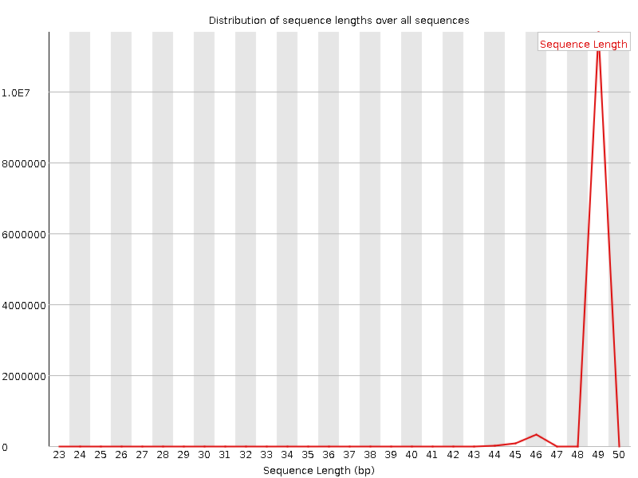
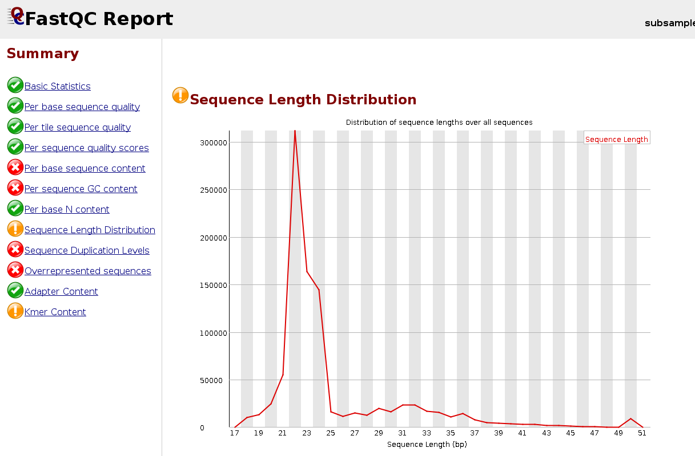

# Pre-processing of sequencing reads


The raw data obtained from the sequencing machine need to be **pre-processed**. 
<br>
Pre-processing can include the quality control of initial reads and read trimming that includes removing adapter sequences, filtering out low quality reads and trimming reads off low quality base pairs.

<br/>

## Quality control of sequencing reads

### FastQC

To assess the quality of sequencing data, we will use the programs [**FastQC**](https://www.bioinformatics.babraham.ac.uk/projects/fastqc/) and [**Fastq Screen**](https://www.bioinformatics.babraham.ac.uk/projects/fastq_screen/). 

FastQC calculates statistics about the composition and quality of raw sequences, while Fastq Screen looks for possible contaminations. 

```{bash}
# Go to the "quality_control" folder
cd ~/rnaseq_course/quality_control

# Run FastQC for one sample
$RUN fastqc ~/rnaseq_course/raw_data/SRR3091420_1.fastq.gz -o .

# Run for all samples
$RUN fastqc ~/rnaseq_course/raw_data/*fastq.gz -o .
```

The output files are a **.zip** archive and an **.html** file


We can display the results (.html file) with an Internet browser; e.g. Firefox:
```{bash}
firefox SRR3091420_1_fastqc.html &
```


<br/>

Below is an example of a poor quality dataset. As you can see, the average quality drops dramatically towards the 3'-end.


You can extract the files from the .zip archive:

```{bash}
# extract
unzip SRR3091420_1_fastqc.zip

# remove remaining .zip file
rm SRR3091420_1_fastqc.zip

# display content of directory
ls SRR3091420_1_fastqc
```

File **fastqc_data.txt** contains the results in text format, for easier parsing of the results:

```{bash}
less SRR3091420_1_fastqc/fastqc_data.txt
```


### FastQ Screen

[**FastQ Screen**](https://www.bioinformatics.babraham.ac.uk/projects/fastq_screen/) is a tool that allows to screen libraries for **potential contaminations**.
<br>
It requires to download genome indices (data bases) from a variety of organisms, a lot of which can be downloaded by default.
<br>
*Note that fastq_screen can be found in the singularity image, but not the data bases!*
<br>

**WARNING**: do not run the following command in class: it will take too much time and resources!

```{bash}
# Download default data bases
$RUN fastq_screen --get_genomes
``` 

The latter commands download 14 indexes from [**Bowtie2**](http://bowtie-bio.sourceforge.net/bowtie2/index.shtml) mapper (from model organisms or known contaminants):
* *Arabidopsis thaliana*
* *Drosophila melanogaster*
* *Escherichia coli*
* *Homo sapiens*
* *Mus musculus*
* *Rattus norvegicus*
* *Caenorhabditis elegans*
* *Saccharomyces cerevisiae*
* Lambda
* Mitochondria
* PhiX
* Adapters
* Vectors
* rRNA

Upon download, the **FastQ_Screen_Genomes** folder is created, containing all indexes.
<br>
The file **fastq_screen.conf** will be also downloaded in this folder: in order to use the tool, you will have to modify the fastq_screen.conf by providing the full path to the Bowtie2 executable (**/usr/local/bin/bowtie2** if you use our singularity image) and full paths to the downloaded folders with genome index files. <br>
Here we show where to change the executables:

```
# This is a configuration file for fastq_screen

###########
## Bowtie #
###########
## If the bowtie binary is not in your PATH then you can 
## set this value to tell the program where to find it.
## Uncomment the line below and set the appropriate location
##

#BOWTIE /usr/local/bin/bowtie/bowtie
BOWTIE2 /usr/local/bin/bowtie2

...

```

FastQ Screen runs checks on a **random subset of 100,000 reads** (that can be changed using option --subset).
<br>
You can execute FastQ Screen this way:

```{bash}
$RUN fastq_screen --conf FastQ_Screen_Genomes/fastq_screen.conf \
           ~/rnaseq_course/raw_data/SRR3091420_1.fastq.gz \
           --outdir ~/rnaseq_course/quality_control/
```

Below is an example of the FastQ Screen results for **SRR3091420_1.fastq.gz**.

```{bash}
cd ~/rnaseq_course/quality_control/

# get files from fastq_screen run
wget https://public-docs.crg.es/biocore/projects/training/PHINDaccess2020/SRR3091420_1_fastq_screen.tar.gz

# extract
tar -zvxf SRR3091420_1_fastq_screen.tar.gz

firefox SRR3091420_1_screen.html
```


<br/>


## Initial processing of sequencing reads

Before mapping reads to the genome/transcriptome or performing a *de novo* assembly, the reads have to be pre-processed, if needed, as follows: 
* **Demultiplex** by index or barcode (usually done in the sequencing facility)
* Remove/Trim **adapter sequences**
* Trim reads by **quality**
* Discard reads by **quality/ambiguity**
* Filter reads by k-mer coverage (recommended for the *de novo* assembly)
* Normalize k-mer coverage (recommended for the *de novo* assembly)

As shown before, both the presence of low quality reads and adapters are reported in the **fastqc** output. 

Adapters are usually expected in small RNA-Seq because the molecules are typically shorter than the reads, and that makes an adapter to be present at 3'-end.
<br>
Below is an example of the FastQC report for a **small RNA-seq** sample:


<br/>

## Trimming

There are many tools for trimming reads and removing adapters, such as [**Trim Galore!**](https://www.bioinformatics.babraham.ac.uk/projects/trim_galore/), [**Trimmomatic**](http://www.usadellab.org/cms/?page=trimmomatic), [**Cutadapt**](https://github.com/relipmoc/skewer), [**skewer**](https://github.com/relipmoc/skewer), [**AlienTrimmer**](https://bio.tools/alientrimmer), [**BBDuk**](https://jgi.doe.gov/data-and-tools/bbtools/bb-tools-user-guide/bbduk-guide/), and the most recent [**SOAPnuke**](https://github.com/BGI-flexlab/SOAPnuke) and [**fastp**](https://www.ncbi.nlm.nih.gov/pubmed/30423086). 

Let's use **skewer** to trim the Illumina 3' adapter.  

```{bash}
cd ~/rnaseq_course/trimming

$RUN skewer ~/rnaseq_course/raw_data/SRR3091420_1.fastq.gz \
		-x TGGAATTCTCGGGTGCCAAGG \
		-o SRR3091420_1
```

```
.--. .-.
: .--': :.-.
`. `. : `'.' .--. .-..-..-. .--. .--.
_`, :: . `.' '_.': `; `; :' '_.': ..'
`.__.':_;:_;`.__.'`.__.__.'`.__.':_;
skewer v0.2.2 [April 4, 2016]
Parameters used:
-- 3' end adapter sequence (-x):        TGGAATTCTCGGGTGCCAAGG
-- maximum error ratio allowed (-r):    0.100
-- maximum indel error ratio allowed (-d):      0.030
-- minimum read length allowed after trimming (-l):     18
-- file format (-f):            Solexa/Illumina 1.3+/Illumina 1.5+ FASTQ (auto detected)
-- minimum overlap length for adapter detection (-k):   3
Tue Feb  4 11:00:56 2020 >> started
|=================================================>| (100.00%)
Tue Feb  4 11:01:40 2020 >> done (43.669s)
12157169 reads processed; of these:
       0 ( 0.00%) short reads filtered out after trimming by size control
       0 ( 0.00%) empty reads filtered out after trimming by size control
12157169 (100.00%) reads available; of these:
  480367 ( 3.95%) trimmed reads available after processing
11676802 (96.05%) untrimmed reads available after processing
log has been saved to "SRR3091420_1-trimmed.log".
```

We can look at the read distribution after the trimming of the adapter by inspecting the log-file or **re-launching FastQC**.

```{bash}
cd ~/rnaseq_course/quality_control/
$RUN fastqc ~/rnaseq_course/trimming/SRR3091420_1-trimmed.fastq -o .
```



Example of a FastQC report for a trimmed **small-RNA** sample:




## EXERCISE

Let's explore the tool **skewer** in more detail: use "skewer --help" for a description of the parameters.
* Which parameter indicates the **minimum read length** allowed after trimming? What is its **default value**?
* Which parameter indicates the threshold on the **average read quality** to be filtered out?
* Using skewer, filter out reads in "SRR3091420_1-trimmed.fastq" that have average quality **below 30** and trim them on **3'-end** until the base quality has reached 30. How many reads were filtered out and how many remain?

<br/>

