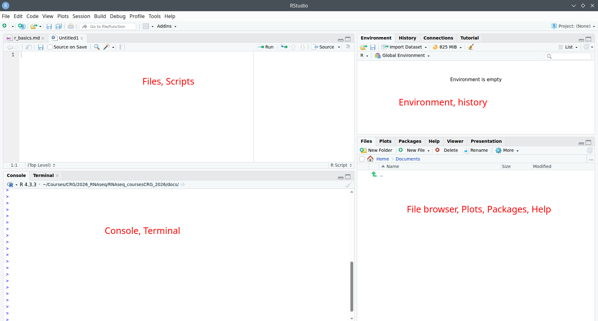
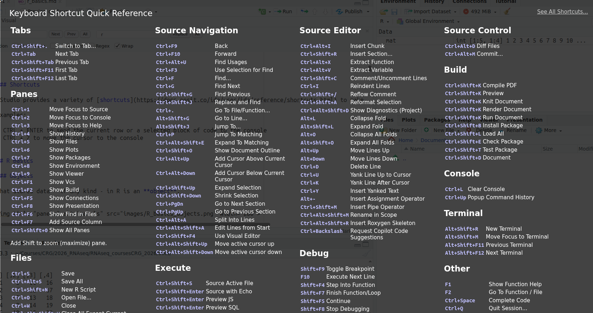

# Hands-on: Reviewing some R basics

In this section, we will review:

* RStudio/POSIT software usage
* R basics.


## RStudio

What is RStudio?

* Free and open source IDE (Integrated Development Environment) for R, Python
* Available for Windows, Mac OS and LINUX


We will use a local RStudio server running a singularity container. It uses [Tidyverse Rocker image](https://hub.docker.com/r/rocker/tidyverse).

```bash
# Download the bash script that installs the singularity container and run it in the localserver
wget https://raw.githubusercontent.com/biocorecrg/RNAseq_coursesCRG_2026/refs/heads/master/run_rstudio.sh
bash run_rstudio.sh
```

In your browser, type the following url: <http://localhost:8787/>

### Panels

When you open RStudio, you will see 3-4 panels:

* top-left: scripts and files
* bottom-left: R console Linux-line terminal / command-line
* top-right: environment, history, connections, tutorial
* bottom-right: tree of folders and files, plots/graphs window, packages, help window, viewer, presentation




### Shortcuts

RStudio provides a variety of [shortcuts](https://docs.posit.co/ide/user/ide/reference/shortcuts.html) to make user interaction smoother.

Click {kbd}`Alt` + {kbd}`Shift` + {kbd}`K` to display all available shortcuts.




Examples:

* {kbd}`CTRL` + {kbd}`ENTER` to send the current row or a selected block of code to the console
* {kbd}`CTRL` + {kbd}`2` to move the cursor to the console

https://docs.posit.co/ide/user/ide/guide/code/projects.html

```{tip}
If you start using RStudio IDE for your work, please refer to the (great) official documentation, for example:

* [RStudio IDE User Guide](https://docs.posit.co/ide/user/)
* [RStudio Projects](https://docs.posit.co/ide/user/ide/guide/code/projects.html)
```


## R Basics

### Objects

What stores data - of any kind - in R is an **object**.


Assignment operators (how to assign data to the object):

*  **<-** or **=**
* Mostly the same but, to avoid confusions:
    + Use **<-** for assignments
    +  Keep **=** for functions arguments

Assigning a value to the object **B**: 

```r
B <- 10
```


```r
B + 10
```

<span style="color:red">**B unchanged !!**</span><br>

**Reassigning**: modifying the content of an object:

```r
B <- B + 10
```

<span style="color:red">**B changed !!**</span><br>

You can see the objects you created in the **environment** panel (upper right).


```{note}
Naming an object in R is flexible. You should nevertheless follow a few base rules:

* You can use:
  + Letters (note that object names case sensitive: A and a are NOT the same)
  + Numbers (exception: the object name cannot start with a number)
  + Underscores _
* You cannot use:
  + Spaces
  + Most special characters
```

### Data types and data structures

#### Data types

Each object has a data type:
* Numeric (number - integer or double)
* Character (text)
* Logical (TRUE / FALSE)
* Factors (categorical variables)

**Numeric**: numbers, floats

```r
number_object <- 10
mode(number_object)
typeof(number_object)
str(number_object)
```

**Character**: text, strings of characters

```r
text_object <- "word"
mode(text_object)
typeof(text_object)
str(text_object)
```

**Logical**: boolean values (TRUE or FALSE)


```r
logical_object <- TRUE
mode(logical_object)
typeof(logical_object)
str(logical_object)
```

**Factor**: used to work with categorical variables. For example, in statistical modeling or graphing.

Creating a factor starts by creating an object, that is then converted to a factor.

```r
factor_object <- factor(text_object)
mode(factor_object)
typeof(factor_object)
str(factor_object)
```


#### Data structures

The main data structures in R are:

* Vector
* Matrix
* Data frame
* List

##### Vectors

Vectors are one-dimensional and contain a single data type.

Create a numeric vector:

```r
a <- c(1, 2, 3, 4, 5, 6)

# same as:
a <- 1:6
```

```{note}
shorta <- 1

# same as:
shorta <- c(1)
```

`shorta` is a **vector of 1-element**.

Check the length of (i.e. number of elements) a vector:

```r
length(a)
```

You can extract elements of a vector using the slicing operator (the square bracket) **[ ]**:

Extract 1st and 3rd elements of **a**:

```r
a[c(1,3)]
```

Extract all but the first element:

```r
a[-1]
```


Create a second numeric vector, and check which elements of that second vector are also present in **a** using operator **%in%**:

```r
b <- 3:8

b[b %in% a]
```

```{tip}

Table of comparison and logical operators that can be used for data selection and filtering:

| Operator    | Description |
| -------- | ------- |
| <  | less than |
| <= | less than or equal to |
| > | greater than |
| >= | greater than or equal to |
| == | exactly equal to |
| != | not equal to  |
| !x | not x |
| x\|y | x OR y |
| x&y | x AND y |
| %in% | checks if an element belongs to a vector |

```

You can replace one element of a vector by pointing to its position, e.g.:

```r
b[2] <- 10
```


##### Matrices

Matrices are two-dimensional and can only contain **one** data type.

Create a numeric matrix:

```r
# define number of rows
mat <- matrix(1:100, nrow=4)

# define number of columns
mat <- matrix(1:100, ncol=4)

```

Check dimensions (i.e. number of rows and number of columns) of a matrix:

```r
# Number of rows
nrow(mat)

# Number of columns
ncol(mat)

# Dimensions (first element is the number of rows, second element is the number of columns)
dim(mat)
```

Display the first or last rows with `head` or `tail`:

```r
# first 6 rows (default)
head(mat)

# first 10 rows
head(mat, n=10)

# last 6 rows
tail(mat)
```

You can extract rows and columns of a matrix using the slicing operator (square bracket **[ ]** and their position/index:

```r
# first row
mat[1,]

# row 1 and 3
mat[c(1,3),]

# first column
mat[,1]

# column 2 and 3
mat[,c(2, 3)]

# or mat[,2:3]
```

```{note}
The left item of the square bracket always corresponds to the row, while the right item always corresponds to the column:

**mat[row_index, colum_index]**
```

##### Data frames

Data frames are two-dimensional and can contain several data types (column-wise: one column will have a single data type).

Create a three-column data frame :

* `Name`: character column
* `Age`: numeric column
* `Vegetarian`: logical column

```r
# create data frame
df <- data.frame(c("Maria", "Juan", "Alba", "Xavier", "Lara", "Max"), 
        c(23, 25, 31, 28, 36, 34),
        c(TRUE, TRUE, FALSE, FALSE, TRUE, FALSE))
        
# add column names
colnames(df) <- c("Name", "Age", "Vegetarian")

# do both steps at once
df <- data.frame(Name=c("Maria", "Juan", "Alba", "Xavier", "Lara", "Max"), 
        Age=c(23, 25, 31, 28, 36, 34),
        Vegetarian=c(TRUE, TRUE, FALSE, FALSE, TRUE, FALSE))
```

Check dimensions (i.e. number of rows and number of columns) of a dataframe:

```r
# Number of rows
nrow(df)

# Number of columns
ncol(df)

# Dimensions (first element is the number of rows, second element is the number of columns)
dim(df)
```

Check column names or row names:

```r
colnames(df)

rownames(df)
```

You can extract rows - as with matrices - using the slicing operator: the square bracket **[ ]** df[1,]

You can extract columns of a data frame with:

* Slicing operator **[]**
  * Access using the column name: `df[,"Age"]`
  * Access using the column index (i.e. position): `df[,2]`
* Dollar sign **$**: `df$Age`

Select rows of the data frame **if the Age column is greater than 24**:

```r
df[df$Age > 24,]
```

Select rows of the data frame based on multiple conditions, for example, **if the Age column is greater than 24 AND if Vegetarian is TRUE** :

```r
df[df$Age > 24 & df$Vegetarian == TRUE,]
```

Finally, select only columns of interest for your selection: in the following example, we extract the name of vegetarian people older than 24:

```r
df[df$Age > 24 & df$Vegetarian == TRUE, "Name"]
```

##### Lists

Lists are one-dimensional: each element of a list can contain a different data structure!

```r
mylist <- list(my_df=df,
              my_vector=b,
              my_matrix=mat)
```

The `length` of a list gives you the number of elements.

```r
length(mylist)
```

You can extract elements of a list (and apply functions on them) using the double square brackets **[[ ]]**.

```r
# extract third element of the list with the index...
mylist[[3]]
# or the name
mylist[["my_matrix"]]
mylist$my_matrix

# check dimensions of the third element
dim(mylist[[3]])
```


## Paths and directories

Get/show the path of the current directory (i.e. working directory) with `getwd` (get working directory):

```r      
getwd()
```

Change working directory with `setwd` (set working directory).

Go to a directory giving the *absolute* path:

```r
setwd("~")
# the home directory is likely different for each of you, but it could be like /users/username
```

```{note}
**~** is a shortcut to your home directory
```

Now that you are in your home directory, you can create an `rnaseq_course` directory (if you have not created a folder for the course yet) and an `r_basics` directory:

```r
dir.create("rnaseq_course/r_basics",  recursive=TRUE)
```

Go to the newly created directory using the *relative* path:

```r
setwd("./rnaseq_course/r_basics")

# which is equivalent to
setwd("~/rnaseq_course/r_basics")
```

You are now in: "~/rnaseq_course/r_basics"

Move one directory "up" the tree:

```r 
setwd("..")

# and move back to r_basics
setwd("r_basics")
```

You are now back to: "~/rnaseq_course/r_basics"


## Missing values

**NA** (Not Available) is a recognized element in R.

Finding missing values in a vector:

```r
# Create vector with a missing value
x <- c(4, 2, 7, NA)

# Find missing values in vector:
is.na(x)

# Remove missing values
na.omit(x)
x[ !is.na(x) ]
```

Some functions can deal with NAs, either by default, or with specific parameters:

```r
x <- c(4, 2, 7, NA)

# default arguments: what happens?
mean(x)

# set na.rm=TRUE for the mean function to handle (in this case, ignore) missing values
mean(x, na.rm=TRUE)
```

In a matrix or a data frame, you can keep only rows where there are no NA values with:

```r
# Create matrix with some NA values
mydata <- matrix(c(1:10, NA, 12:2, NA, 15:20, NA), ncol=3)

# Keep only rows without NAs
mydata[complete.cases(mydata), ]
# or
na.omit(mydata)
```

For additional information, you can check this [R blogger post on missing/null values](https://www.r-bloggers.com/r-null-values-null-na-nan-inf/)


## Read in, write out

### On vectors

Write the content of a vector in a file with `write`:

```r
# create a vector
mygenes <- c("SMAD4", "DKK1", "ASXL3", "ERG", "CKLF", "TIAM1", "VHL", "BTD", "EMP1", "MALL", "PAX3")

# write to a file
write(x=mygenes, 
        file="gene_list.txt")
```

You can specify a full or relative path where to write down a file:

```r
# Write to home directory
write(x=mygenes,
        file="~/rnaseq_course/r_basics/gene_list.txt")
        
# Write to one directory up
write(x=mygenes,
        file="../gene_list.txt")
```


Read in a file into a vector object using `scan`:

```r
# Read in file
scan(file="gene_list.txt")

# Save scanned data into an object k
k <- scan(file="gene_list.txt")
```

By default, the function scans for "double" (numeric) elements: it fails if the input contains characters.

If reading non-numeric data, you need to specify the type of data contained in the file: 

```r
# specify the type of data to scan
scan(file="gene_list.txt", 
        what="character")
```

If the file is not in the current directory, you can provide a full or relative path. 

For example, if the file is located in the home directory, read it as:

```r
scan(file="~/gene_list.txt", 
        what="character")
        
# here, we can read it as:

scan(file="~/rnaseq_course/r_basics/gene_list.txt", what="character")
```


### Data frames or matrices

Read in a file as a data frame with **read.table**:

```r
a <- read.table(file="file.txt")
```

You can convert it as a matrix, if needed, with:

```r
a <- as.matrix(read.table(file="file.txt"))
```

Write a data frame or matrix to a file with **write.table**:

```r
write.table(x=a,
        file="file.txt")
```

Useful arguments:


Note that **sep="\t"** stands for tab-delimitation; if reading a **.csv** file, you can change to **sep=","** (or use the dedicated write.scv function!).


## Install packages

### R base

A set a standard packages which are supplied with R by default.<br>
Example: package base (write, table, rownames functions), package utils (read.table, str functions), package stats (var, na.omit, median functions).

### R contrib

All other packages:

* [CRAN](https://cran.r-project.org): Comprehensive R Archive Network
  + 23422\* packages available
  + find packages in https://cran.r-project.org/web/packages/
  + 
* [Bioconductor](https://www.bioconductor.org/):
  + 2361\* packages available
  + find packages in https://bioconductor.org/packages
  + 

\* As of March 2026


Install a CRAN package using `install.packages`:

```r
install.packages('BiocManager', repos = 'http://cran.us.r-project.org', dependencies = TRUE)
```

Install a Bioconductor package using **BiocManager::install**:

```r
library('BiocManager')
BiocManager::install('GOstats')
```

## Exercises

### Exercise 1

* Create a numeric vector **y** containing numbers from 2 to 11 (both included). 
* How many elements are in y?
* Show the 3rd and the 6th elements of y.
* Show all elements of y that have a value inferior to 7.

:::{admonition} Click to show correction
:class: dropdown note

* Create a numeric vector **y** containing numbers from 2 to 11 (both included). 

`y <- 2:11`

or 

`y <- c(2, 3, 4, 5, 6, 7, 8, 9, 10, 11)`

* How many elements are in y?

`length(y)`

* Show the 3rd and the 6th elements of y.

`y[c(3,6)]`

* Show all elements of y that have a value inferior to 7.

`y[y < 7]`

:::

### Exercise 2

* Create the vector **x** of 1000 random numbers from the normal distribution (see **rnorm** function).
* What are the mean, median, minimum and maximum values of x?

:::{admonition} Click to show correction
:class: dropdown note

* Create the vector **x** of 1000 random numbers from the normal distribution (see **rnorm** function).

`x <- rnorm(1000)`

* What are the mean, median, minimum and maximum values of x?

`mean(x); median(x); min(x); max(x)`

or the more straightforward:

`summary(x)`

:::


### Exercise 3

* Create vector **y2** as: y2 <- c(1, 11, 5, 62,  NA, 18, 2, 8, NA)
* What is the sum of all elements in y2 ?
* Which elements of y2 are also present in y?
* Remove NA values from y2.

:::{admonition} Click to show correction
:class: dropdown note

* Create vector **y2** as: 

`y2 <- c(1, 11, 5, 62,  NA, 18, 2, 8, NA)`

* What is the sum of all elements in y2 ?
	
`sum(y2, na.rm = TRUE)`

* Which elements of y2 are also present in y?

`y2[y2 %in% y]`

* Remove NA values from y2.

`y2 <- na.omit(y2)`

:::

### Exercise 4

* Create the following data frame:

|    | | |
| -------- | ------- | -------- |
| 43 | 181 | M |
| 34 | 172 | F |
| 22 | 189 | M |
| 27 | 167 | F |

with :

* row names: **John, Jessica, Steve, Rachel**
* column names: **Age, Height, Sex**.

Then:

* Check the structure of df with str().
* Calculate the average age and height in df.
* Change the row names of df so the data becomes anonymous
  + Use for example Patient1, Patient2, etc.
* Write **df** to the file **mydf.txt** with **write.table()**. 
  + Explore parameters **sep**, **row.names**, **col.names**, **quote**.

:::{admonition} Click to show correction
:class: dropdown note

* Create the following data frame wih 
  + row names: **John, Jessica, Steve, Rachel**
  + column names: **Age, Height, Sex**.
  
df <- data.frame(Age=c(43, 34, 22, 27),
                 Height=c(181, 172, 189, 167),
                 Sex=c("M", "F", "M", "F"),
                 row.names = c("John", "Jessica", "Steve", "Rachel"))

* Check the structure of df with str().

`str(df)`

* Calculate the average age and height in df.

`mean(df$Age)`

same as `mean(df[,"Age"])`

`mean(df$Height)`

same as `mean(df[,"Height"])`


* Change the row names of df so the data becomes anonymous
  + Use for example Patient1, Patient2, etc.

`rownames(df) <- c("Patient1", "Patient2", "Patient3", "Patient4")`

* Write **df** to the file **mydf.txt** with **write.table()**. 
  + Explore parameters **sep**, **row.names**, **col.names**, **quote**.

write.table(df,
            "mydf.txt",
            sep="\t",
            row.names = TRUE,
            col.names = NA,
            quote = FALSE)

:::

### Exercise 5

* Create a matrix called `grades` representing 4 students (rows) and 3 subjects (columns: Math, Science, English) with the following values:
  * Student 1: 85, 92, 78
  * Student 2: 70, 88, 95
  * Student 3: 99, 91, 89
  * Student 4: 60, 72, 68
    
* Extract the Science grade for Student 3

* Calculate the average score for Math across all 4 students

:::{admonition} Click to show correction
:class: dropdown note

* Create a matrix called `grades` representing 4 students (rows) and 3 subjects (columns: Math, Science, English) with the following values:
  * Student1: 85, 92, 78
  * Student2: 70, 88, 95
  * Student3: 99, 91, 89
  * Student4: 60, 72, 68

```r
grades <- matrix(c(85, 92, 78, 79, 88, 95, 99, 91, 89, 60, 72, 68),
                nrow=4,
                byrow=TRUE,
                dimnames=list(c("Student1", "Student2", "Student3", "Student4"), c("Math", "Science", "English"))
                )
```

* Extract the Science grade for Student 3

`grades["Student3", "Science"]`

* Calculate the average score for Math across all 4 students

`mean(grades[,"Math"])`

:::
    
