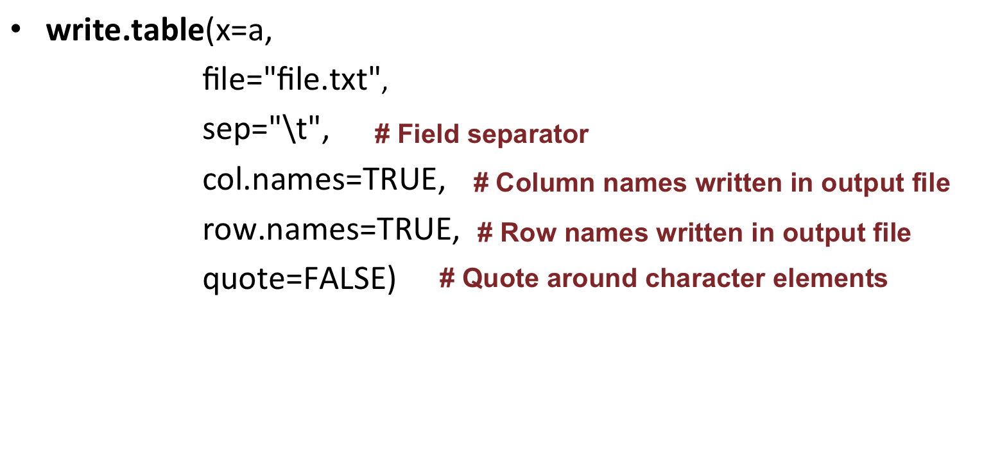
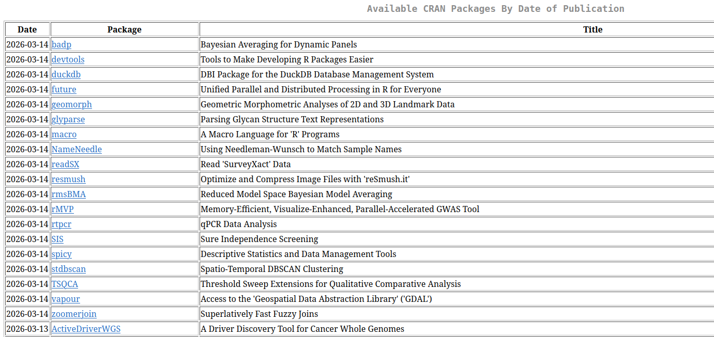
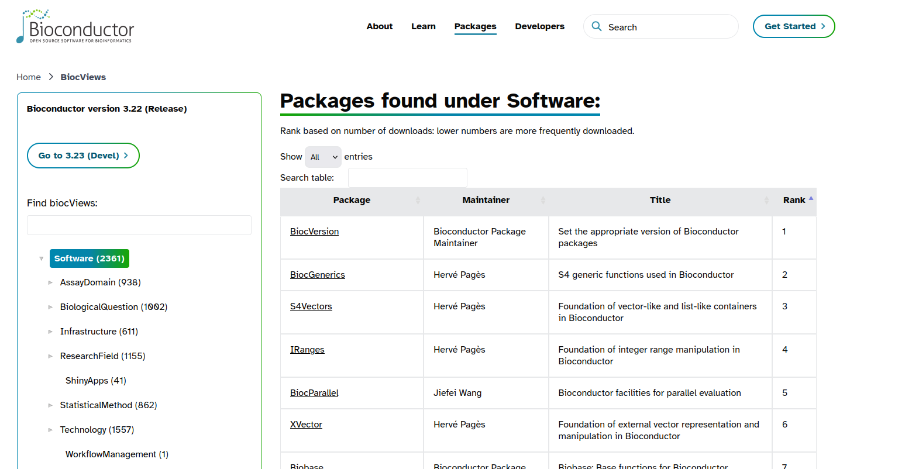

# Reviewing some R basics

Open the **RStudio** software.

## Basics

### Objects

Everything that stores any kind of data in R is an **object**.

* Assignment operators
	+ **<-** or **=**
	+ Essentially the same but, to avoid confusions:
  		+ Use **<-** for assignments
  	+ Keep **=** for functions arguments
* Assigning a value to the object **B**: 
```{r}
B <- 10
```
* Reassigning: modifying the content of an object:
```{r}
B + 10
```

<span style="color:red">**B unchanged !!**</span><br>
```{r}
B <- B + 10
```

<span style="color:red">**B changed !!**</span><br>

* You can see the objects you created in the upper right panel in RStudio: the environment.


### Data types and data structures

Each object has a data type:
* Numeric (number - integer or double)
* Character (text)
* Logical (TRUE / FALSE)

Number:
```{r}
a <- 10
mode(a)
typeof(a)
str(a)
```

Text:
```{r}
b <- "word"
mode(b)
typeof(b)
str(b)
```

The main data structures in R are:

* Vector
* Factor
* Matrix
* Data frame

Create a vector:

```{r}
a <- 1:5
```

Create a second vector, and check with elements of that second vector are also present in **a** with **%in%**:

```{r}
b <- 3:8

b[b %in% a]
```
 
Check the length of (=number of elements in) a vector:

```{r}
length(b)
```

Create a data frame:

```{r}
# stringsAsFactors: ensures that characters are treated as characters and not as factors
d <- data.frame(Name=c("Maria", "Juan", "Alba"), 
        Age=c(23, 25, 31),
        Vegetarian=c(TRUE, TRUE, FALSE),
        stringsAsFactors = FALSE)
```

Check dimensions of a dataframe:

```{r}
# Number of rows
nrow(d)

# Number of columns
ncol(d)

# Dimensions (first element is the number of rows, second element is the number of columns)
dim(d)
```

Select rows of the data frame **if the Age column is superior to 24**:

```{r}
d[d$Age > 24,]
```

Select rows of the data frame **if the Age column is superior to 24 AND if Vegetarian is TRUE** :

```{r}
d[d$Age > 24 & d$Vegetarian == TRUE,]
```


## Paths and directories

* Get the path of the current directory (know where you are working at the moment) with <b>getwd</b> (get working directory):
```{r}      
getwd()
```

* Change working directory with **setwd** (set working directory)<br>
Go to a directory giving the absolute path: 
```{r}
setwd("~/rnaseq_course")
```
Go to a directory giving the relative path:
```{r}
setwd("differential_expression")
```
You are now in: "~/rnaseq_course/differential_expression"
<br>
Move one directory "up" the tree:
```{r} 
setwd("..")
```
You are now in: "~/rnaseq_course"


## Missing values

**NA** (Not Available) is a recognized element in R.

* Finding missing values in a vector

```{r}
# Create vector
x <- c(4, 2, 7, NA)

# Find missing values in vector:
is.na(x)

# Remove missing values
na.omit(x)
x[ !is.na(x) ]
```

* Some functions can deal with NAs, either by default, or with specific arguments:

```{r}
x <- c(4, 2, 7, NA)

# default arguments
mean(x)

# set na.rm=TRUE
mean(x, na.rm=TRUE)
```

* In a matrix or a data frame, keep only rows where there are no NA values:

```{r}
# Create matrix with some NA values
mydata <- matrix(c(1:10, NA, 12:2, NA, 15:20, NA), ncol=3)

# Keep only rows without NAs
mydata[complete.cases(mydata), ]
# or
na.omit(mydata)
```

<br>
Check this [R blogger post on missing/null values](https://www.r-bloggers.com/r-null-values-null-na-nan-inf/)


## Read in, write out

### On vectors

* Read a file as a vector with the **scan** function

```{r}
# Read in file
scan(file="file.txt")
# Save in  object
k <- scan(file="file.txt")
```

By default, scans "double" (numeric) elements: it fails if the input contains characters.<br>
If non-numeric, you need to specify the type of data contained in the file: 

```{r}
# specify the type of data to scan
scan(file="file.txt", 
        what="character")
scan(file="~/file.txt", 
        what="character")
```

Regarding paths of files:<br>
If the file is not in the current directory, you can provide a full or relative path. For example, if located in the home directory, read it as:

```{r}
scan(file="~/file.txt", 
        what="character")
```

* Write the content of a vector in a file:

```{r}
# create a vector
mygenes <- c("SMAD4", "DKK1", "ASXL3", "ERG", "CKLF", "TIAM1", "VHL", "BTD", "EMP1", "MALL", "PAX3")
# write in a file
write(x=mygenes, 
        file="gene_list.txt")
```

Regarding paths of files:<br>
When you write a file, you can also specify a full or relative path:

```{r}
# Write to home directory
write(x=mygenes,
        file="~/gene_list.txt")
# Write to one directory up
write(x=mygenes,
        file="../gene_list.txt")
```

### On data frames or matrices

* Read in a file into a data frame with the **read.table** function:

```{r}
a <- read.table(file="file.txt")
```

You can convert it as a matrix, if needed, with:

```{r}
a <- as.matrix(read.table(file="file.txt"))
```

* Write a data frame or matrix to a file:

```{r}
write.table(x=a,
        file="file.txt")
```

Useful arguments:

<a href="https://biocorecrg.github.io/CRG_RIntroduction/images/readtable.png"></a>

* Note that "\t" stands for tab-delimitation


## Install packages

### R base

A set a standard packages which are supplied with R by default.<br>
Example: package base (write, table, rownames functions), package utils (read.table, str functions), package stats (var, na.omit, median functions).

### R contrib

All other packages:

* [CRAN](https://cran.r-project.org): Comprehensive R Archive Network
        + 15356<sup>*</sup> packages available
        + find packages in https://cran.r-project.org/web/packages/
        
* [Bioconductor](https://www.bioconductor.org/):
        + 1823<sup>*</sup> packages available
        + find packages in https://bioconductor.org/packages
        

*<sup>*</sup>As of February 2020*

Install a CRAN package using **install.packages**:

```{r}
install.packages('BiocManager', repos = 'http://cran.us.r-project.org', dependencies = TRUE)
```

Install a Bioconductor package using **BiocManager::install**:

```{r}
library('BiocManager')
BiocManager::install('GOstats')
```

## Exercise: warming up !

* Ex1.
	* Create a numeric vector y which contains the numbers from 2 to 11, both included. 
	* How many elements are in y? I.e what is the length of vector y ?
	* Show the 3rd and the 6th elements of y.
	* Show all elements of y that have a value inferior to 7.

* Ex2.
	* Create the vector x of 1000 random numbers from the normal distribution (with rnorm).
	* What are the mean, median, minimum and maximum values of x?

* Ex3.
	* Create vector y2 as: y2 <- c(1, 11, 5, 62,  NA, 18, 2, 8, NA)
	* What is the sum of all elements in y2 ?
	* Which elements of y2 are also present in y?
	* Remove NA values from y2.

* Ex4. 
	* Create the following data frame:

|43|181|M|
|34|172|F|
|22|189|M|
|27|167|F|

with row names: **John, Jessica, Steve, Rachel** and column names: **Age, Height, Sex**.
	* Check the structure of df with str().
	* Calculate the average age and height in df.
	* Change the row names of df so the data becomes anonymous (use for example Patient1, Patient2, etc.)
	* Write **df** to the file **mydf.txt** with **write.table()**. Explore parameters **sep**, **row.names**, **col.names**, **quote**.

