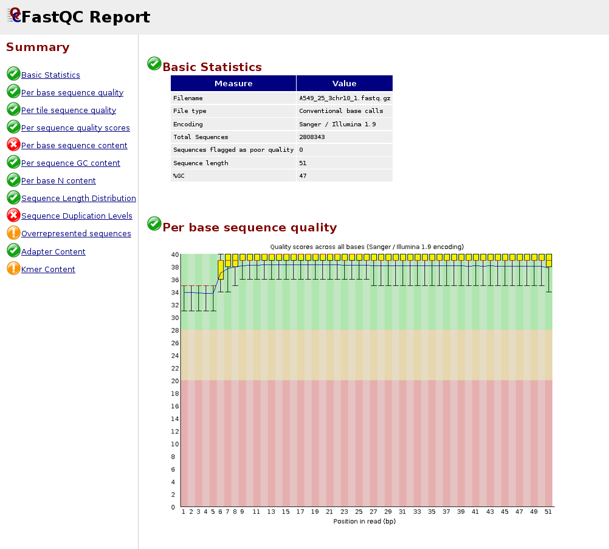
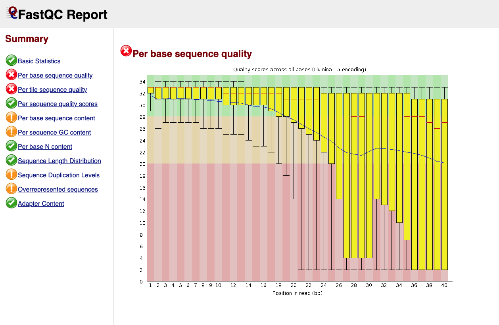
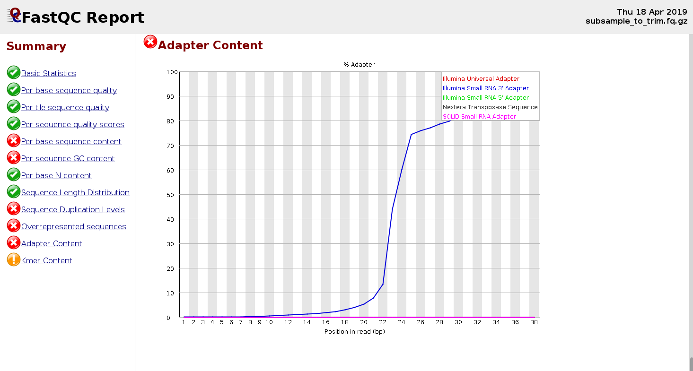
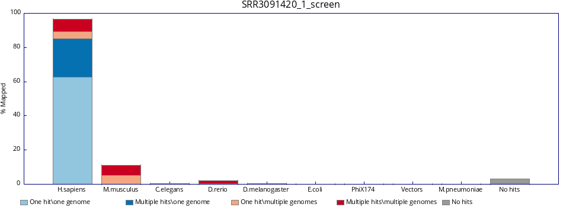
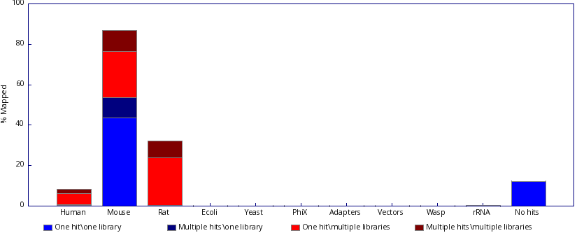
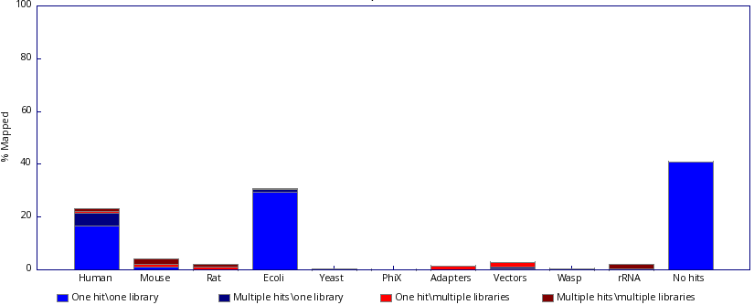
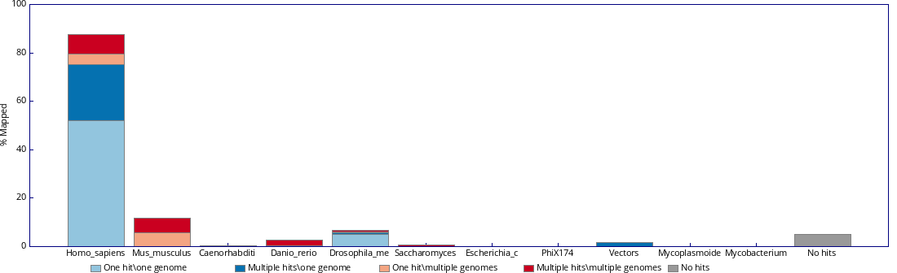
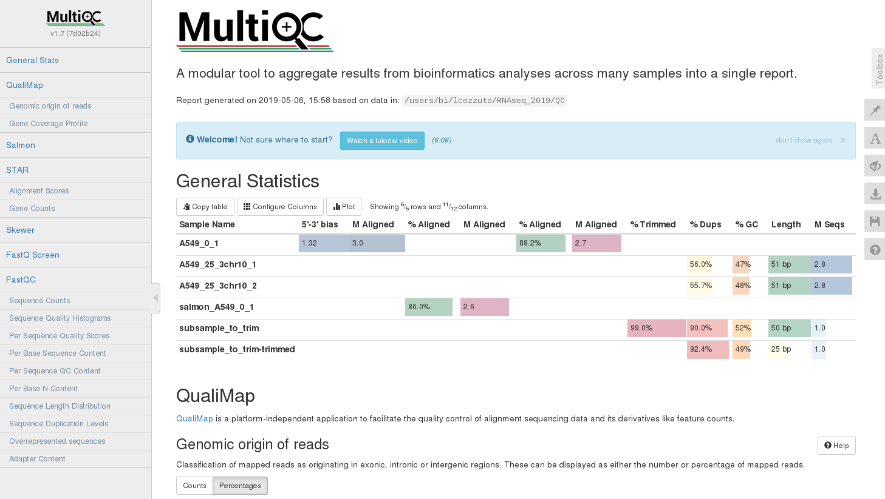

# Hands-on: Pre-processing and Quality Control of Raw Sequencing Data

## Data for this course and SRA download

The **Sequence Read Archive (SRA)** at NCBI is a public repository of raw sequencing data. It is the primary source for publicly available datasets to use for practice, benchmarking, or reproduction of published results.

**SRA Accession Types:**

| Prefix | Level | Example |
|--------|-------|---------|
| `PRJNA` | BioProject — the overall study | PRJNA257197 |
| `SAMN` / `SRS` | BioSample — a biological specimen | SAMN03254300 |
| `SRX` | Experiment — library preparation metadata | SRX123456 |
| `SRR` / `ERR` | Run — the actual sequencing reads | SRR1553607 |

The **SRR Run accession** is what you need to download reads. A single experiment (SRX) may have multiple runs (SRR). The data that will be using for the hands-on exercises is from GEO data set **GSE76647**. Specifically, it contains *Homo sapiens* samples from differentiated (5-day differentiation) and undifferentiated primary keratinocytes. Additionally, some samples underwent a knock-down of the **FOXC1** gene. 

We could try to download these datasets from SRA directly but due to time constrains, we have already prepared fastq files that correspond to **chromosome 6 only**. You will find them in the data directory (* ~/RNAseq_coursesCRG_2026/docs/data/reads/*) within the repository of the course. 

## Raw Data QC

Before any downstream analysis (alignment, read count, differential expression, functional enrichment), it is critical to assess the **quality of raw sequencing reads** and pre-process them accordingly. Poor-quality data can introduce errors that propagate through the entire pipeline.

Pre-processing includes:
- Raw data QC:
    - Quality control of initial reads
    - Contamination checks

- Read pre-processing:
    - Adapter trimming
    - Filtering out low-quality reads/base positions
    - rRNA removal (where applicable)


**Tools Overview**

| Tool | Purpose |
|:----:|:-------:|
| **FastQC** | Per-read quality metrics |
| **FastQ Screen** | Contamination screening against reference genomes |
| **Kraken2** | Taxonomic classification to detect biological contamination |
| **MultiQC** | Aggregates reports from all tools into one summary |


## FastQC

[**FastQC**](https://www.bioinformatics.babraham.ac.uk/projects/fastqc/) is the standard first-pass QC tool for sequencing reads. It reads FASTQ files (also in gzipped format) and produces an **HTML report** with multiple modules, each assessing a different aspect of read quality.

**Key metrics assessed:**
- Per-base sequence quality (Phred scores)
- Per-sequence quality scores
- Per-base sequence content (A/T/G/C composition)
- Per-sequence GC content
- Per-base N content
- Sequence length distribution
- Sequence duplication levels
- Overrepresented sequences
- Adapter content

:::{admonition} **Reminder — Phred quality scores**
:class: tip

Phred scores (Q scores) encode the probability of a base-calling error:

| Phred Score | Error Probability | Accuracy |
|-------------|-------------------|----------|
| Q10 | 1 in 10 | 90% |
| Q20 | 1 in 100 | 99% |
| Q30 | 1 in 1,000 | 99.9% |
| Q40 | 1 in 10,000 | 99.99% |

Reads are generally considered good quality if the median Phred score is **≥ Q30** across most bases.

:::

### Running FastQC

```bash
# Run FastQC on a single file
fastqc sample.fastq.gz

# Run on multiple files
fastqc sample1.fastq.gz sample2.fastq.gz

# Specify output directory
fastqc -o ./fastqc_results/ sample.fastq.gz

# Use multiple threads (faster for large files)
fastqc -t 4 -o ./fastqc_results/ *.fastq.gz
```

### Output files
For each sample, two files are excepted:
```
sample_fastqc.html     # Visual HTML report with bar charts
sample_fastqc.zip      # Zip file with graphs and results in txt
```

### Hands-on
```bash
# Go to the "quality_control" folder
mkdir ~/RNAseq_coursesCRG_2026/raw_qc
cd ~/RNAseq_coursesCRG_2026/raw_qc

# Run FastQC for one sample
$RUN fastqc ~/RNAseq_coursesCRG_2026/docs/data/reads/SRR3091420_1_chr6.fastq.gz -o .

# Run for all samples
$RUN fastqc ~/RNAseq_coursesCRG_2026/docs/data/reads/*.fastq.gz -o .

# Check output
ls .
```

Display the results in a browser:

```bash
firefox SRR3091420_1_chr6_fastqc.html &
```

You can also extract the zip archive to access results in text format:

```bash
# Extract
unzip SRR3091420_1_chr6_fastqc.zip

# Remove remaining .zip file
rm SRR3091420_1_chr6_fastqc.zip

# Display content of directory
ls SRR3091420_1_chr6_fastqc

# File fastqc_data.txt contains the results in text format
less SRR3091420_1_chr6_fastqc/fastqc_data.txt
```

### Interpreting Key Plots

**1. Per Base Sequence Quality**

- **Good:** Box plots remain in the **green zone** (Q > 28)
- **Warning:** Boxes drop into yellow (Q 20–28)
- **Fail:** Boxes drop into red (Q < 20)
- Common pattern: quality drops at the 3' end — this is normal for Illumina data

Below is an example of a good quality dataset (top) and a poor quality dataset (bottom). In the latter, the average quality drops dramatically towards the 3'-end.

<div style="display:flex; justify-content:center;">

| |
|:---:|
|  |
| *Figure 1: Good quality per base sequence* | 
|  |
| *Figure 2: Bad quality per base sequence* | 
</div>

**2. Per Sequence GC Content**

- Should follow a **normal bell-shaped curve**
- A shifted peak may indicate contamination or adapter dimers
- Bimodal distribution = likely contamination from another organism

**3. Adapter Content**

- Should be near **0%** in well-prepared libraries
- High adapter content indicates insufficient insert size or failed library prep
- Adapters **must be trimmed** before alignment

This problem arises when the sequenced DNA fragment is **shorter than the read length** — the sequencer runs out of insert and reads into the adapter:

```
Ideal case (insert > read length):
  5'──────────────── INSERT ────────────────3'
  |←────── Read (150 bp) ──────→|

Problem case (insert < read length):
  5'──── INSERT ────3'
  |←──── Read ─────────────── ADAPTER →|
                   ↑
         Adapter sequence contaminates the read
```

**4. Overrepresented Sequences**

- FastQC will BLAST-match overrepresented sequences
- Common hits: TruSeq adapters, polyA tails, rRNA
- Any unknown overrepresented sequence warrants investigation

:::{admonition} **Important — General rules do not apply to all applications**

:class: important

The guides above apply to regular RNA-seq datasets. In other applications, these rules do not hold:
- **Small RNA-seq libraries:** insert size is smaller and adapter content is expected to be higher (see example below).
- **Single-cell experiments:** read 1 contains the cell barcode and UMI, so its GC content profile may be altered.

<div style="display:flex; justify-content:center;">

| |
|:---:|
| |
| *Figure 3: FastQC report for a small RNA-seq sample showing elevated adapter content* | 

</div>

:::

## Exercises I

The first part of this exercise is to download publicly available data from SRA, using the **SRA toolkit**. Below you can find the basic commands to use this tool:

```bash
# Download a single run (compressed .sra format)
prefetch SRR1234567

# Convert to FASTQ (single-end)
fasterq-dump SRR1234567 --outdir ./fastq/

# For paired-end data, split into R1 and R2
fasterq-dump SRR1234567 --split-files --outdir ./fastq/

# Compress the output (fasterq-dump does not gzip by default)
gzip ./fastq/SRR1234567.fastq
```

Now, download the data (**accession number SRR36179215**) using the **SRA toolkit**, run FastQC, and answer the questions below.

```bash
# Download from SRA:
fasterq-dump SRR36179215 --outdir ./exercise1/
gzip ./exercise1/SRR36179215.fastq

# Run FastQC
fastqc ./exercise1/SRR36179215.fastq.gz -o ./ex1_fastqc_results/
firefox ./ex1_fastqc_results/SRR36179215_fastqc.html &
```
**Discussion questions:**
1. Is this adapter content a sign of a failed experiment? Why or why not? Which type of dataset this might be?
2. Would you apply the same quality interpretation to a standard mRNA-seq dataset with this level of adapter content?


## FastQ Screen

[**FastQ Screen**](https://www.bioinformatics.babraham.ac.uk/projects/fastq_screen/) screens reads to detect **cross-species contamination** or unexpected biological sequences. It is particularly useful for:

- Detecting **human contamination** in non-human samples (and vice versa)
- Identifying **mycoplasma**, **PhiX**, or **E. coli** contamination
- Verifying the **species of origin** of a sample

The tool works by:
1. Taking a subsample (~100,000 reads by default, adjustable with `--subset`)
2. Aligning reads to each reference genome using **Bowtie2**
3. Reporting the **percentage of reads** mapping to each reference
4. Generating a stacked bar chart showing mapping distribution

### Setting Up Databases

:::{admonition} Warning
:class: warning

Do not run the following command in class — it will take too much time and resources.

:::

```bash
# Download default databases
$RUN fastq_screen --get_genomes
```

This downloads 14 Bowtie2 indexes (model organisms and known contaminants):
- *Arabidopsis thaliana*, *Drosophila melanogaster*, *Escherichia coli*
- *Homo sapiens*, *Mus musculus*, *Rattus norvegicus*
- *Caenorhabditis elegans*, *Saccharomyces cerevisiae*
- Lambda, Mitochondria, PhiX, Adapters, Vectors, rRNA

Upon download, the **FastQ_Screen_Genomes** folder is created. You must provide a **fastq_screen.conf** configuration file with paths to the Bowtie2 binary and genome indices:

```
# This is a configuration file for fastq_screen

BOWTIE2 /usr/local/bin/bowtie2

## Human
DATABASE Human /path/to/FastQ_Screen_Genomes/Human/Homo_sapiens.GRCh38

## Mouse
DATABASE Mouse /path/to/FastQ_Screen_Genomes/Mouse/Mus_musculus.GRCm38

## E. coli
DATABASE Ecoli /path/to/FastQ_Screen_Genomes/E_coli/Ecoli

## PhiX
DATABASE PhiX /path/to/FastQ_Screen_Genomes/PhiX/phi_plus_SNPs

## Adapters
DATABASE Adapters /path/to/FastQ_Screen_Genomes/Adapters/contaminants
```

### Running FastQ Screen

```bash
$RUN fastq_screen --conf FastQ_Screen_Genomes/fastq_screen.conf \
           ~/RNAseq_coursesCRG_2026/docs/data/reads/SRR3091420_1_chr6.fastq.gz \
           --outdir ~/RNAseq_coursesCRG_2026/raw_qc/
```

To view example results for SRR3091420_1_chr6.fastq.gz:



### Output Files

```
sample_screen.html     # Visual HTML report with bar charts
sample_screen.txt      # Tab-delimited mapping statistics
```

Example `_screen.txt` output:

```
#Fastq_screen version: 0.15.3
Genome    #Reads_processed  #Unmapped  %Unmapped  #One_hit_one_genome  %One_hit  #Multiple_hits  %Multiple
Human     100000            95020      95.02      4830                 4.83      150             0.15
Mouse     100000            99780      99.78      180                  0.18      40              0.04
Ecoli     100000            99950      99.95      45                   0.05      5               0.00
PhiX      100000            100000     100.00     0                    0.00      0               0.00
```

### Interpreting Results

FastQ Screen results require careful interpretation — context matters depending on which databases are in your config.

| Column | Meaning |
|---|---|
| One hit, one genome | Read maps uniquely to **this** genome only |
| Multiple hits, one genome | Read maps to **this** genome in multiple locations, but nowhere else |
| One hit, multiple genomes | Read maps uniquely within this genome, but also maps to **other** genomes |
| Multiple hits, multiple genomes | Read maps to multiple locations in this genome **and** in other genomes |

### Exercises II

1. Check both fastq_screen outputs below. Inspect them carefully and justify which one reflects a contamination and which one is expected. 

<div style="display:flex; justify-content:center;">

| |
|:---:|
|  |
| *Figure 3: Fastq screen output 1. Image taken from [web.](https://www.bioinformatics.babraham.ac.uk/projects/fastq_screen/)* | 
|  |
| *Figure 4: Fastq screen output 2. Image taken from [web.](https://www.bioinformatics.babraham.ac.uk/projects/fastq_screen/)* | 
</div>

2. Inspect the fastq_screen output. What do you think is happening to the sample? Would you need to ask more information about it before reaching any conclusion?

<div style="display:flex; justify-content:center;">

| |
|:---:|
|  |
| *Figure 5: Fastq screen output 3.* | 

</div>

## Kraken2

[**Kraken2**](https://github.com/DerrickWood/kraken2) performs **k-mer based taxonomic classification** of sequencing reads. Unlike FastQ Screen — which aligns to specific genomes — Kraken2 classifies reads against a **broad taxonomic database**, enabling detection of unexpected organisms at genus/species level.

**Use cases:**
- Detecting **microbial contamination** in eukaryotic samples
- **Metagenomics** community profiling
- Validating **microbial sequencing** samples
- Identifying **viral contamination**

### How Kraken2 Works

1. Breaks each read into **k-mers** (default k=35)
2. Looks up each k-mer in a pre-built hash table of taxonomic assignments
3. Uses a **lowest common ancestor (LCA)** algorithm to assign a taxonomy
4. Reports classification at each taxonomic level (phylum → species)

### Basic Usage

```bash
# Classify single-end reads
kraken2 \
    --db kraken2_db/ \
    --threads 8 \
    --report sample_kraken2_report.txt \
    --output sample_kraken2_output.txt \
    sample.fastq.gz

# Classify paired-end reads
kraken2 \
    --db kraken2_db/ \
    --threads 8 \
    --paired \
    --report sample_kraken2_report.txt \
    --output sample_kraken2_output.txt \
    sample_R1.fastq.gz sample_R2.fastq.gz
```

### Understanding the Output

The report file (`--report`) follows this tab-delimited format:

```
% reads   # reads  # reads at taxon  rank  taxID   name
 78.50    78500    420               D     2       Bacteria
 15.20    15200    15200             S     9606    Homo sapiens
  5.10    5100     200               D     10239   Viruses
  1.20    1200     1200              U     0       unclassified
```

| Column | Description |
|--------|-------------|
| % reads | Percentage of reads assigned to this taxon |
| # reads | Number of reads under this taxon (including children) |
| # reads at taxon | Reads assigned directly (not to children) |
| rank | D=Domain, P=Phylum, C=Class, O=Order, F=Family, G=Genus, S=Species |
| taxID | NCBI taxonomy ID |
| name | Taxonomic name |

### Hands-on: Kraken2

```bash
# Uncompress the kraken2 database:
cd ~/RNAseq_indices/
tar -zxf minikraken2_v2_8GB_201904_UPDATE.tar.gz

# Classify single-end reads
cd ~/RNAseq_coursesCRG_2026

$RUN kraken2 \
    --db ~/RNAseq_indices/minikraken2_v2_8GB_201904_UPDATE \
    --output ~/RNAseq_coursesCRG_2026/raw_qc/SRR3091420_1_chr6_kraken_output.txt \
    --report ~/RNAseq_coursesCRG_2026/raw_qc/SRR3091420_1_chr6_kraken_report.txt \
    docs/data/reads/SRR3091420_1_chr6.fastq.gz
    
```

### Exercises III:
Now, run Kraken2 for all of our samples and check the results. Are what do you expected? Do they match with those from fastq_screen? 

```bash

# Go to the repository directory:
cd ~/RNAseq_coursesCRG_2026

# Run Kraken2 in all samples:

for fastq_file in ~/RNAseq_coursesCRG_2026/docs/data/reads/*.fastq.gz; do
  
    filename=$(basename "$fastq_file")

    # Strip extension(s): handles .fastq.gz, .fq.gz, .fastq, .fq
    sample_name="${filename%%.*}"

    # Set output and report names:
    output_path="$HOME/RNAseq_coursesCRG_2026/raw_qc/${sample_name}_kraken_output.txt"
    report_path="$HOME/RNAseq_coursesCRG_2026/raw_qc/${sample_name}_kraken_report.txt"


    $RUN kraken2 \
        --db ~/RNAseq_indices/minikraken2_v2_8GB_201904_UPDATE \
        --output $output_path \
        --report $report_path \
        $fastq_file
; done

```

## MultiQC — Raw Data Summary

[**MultiQC**](https://github.com/MultiQC/MultiQC) **aggregates QC reports** from multiple tools and multiple samples into a **single interactive HTML report**. Instead of reviewing dozens of individual FastQC HTML files, MultiQC produces one unified dashboard.

**Supported tools include:** FastQC, FastQ Screen, Kraken2, Trimmomatic, STAR, HISAT2, Salmon, featureCounts, Picard, samtools, and [many more](https://multiqc.info/modules/).

### Running MultiQC

```bash
cd ~/RNAseq_coursesCRG_2026/

# Create a folder for the MultiQC result
mkdir multiqc_report
cd ~/RNAseq_coursesCRG_2026/multiqc_report

# Link QC, trimming and mapping data
ln -s ~/RNAseq_coursesCRG_2026/raw_qc .

# Run MultiQC on the directory
$RUN multiqc .

# Visualize in browser
firefox multiqc_report.html &
```

<div style="display:flex; justify-content:center;">

| |
|:---:|
|          |
| *Figure 6: Example of multiQC report (html).* | 

</div>


### Useful Options

```bash
# Ignore files or folders
$RUN multiqc . --ignore trimming --force

# Rename output file
$RUN multiqc . --ignore trimming --filename multiqc_notrimming --force

# Export all plots (saved in multiqc_plots/ as pdf, svg and png)
$RUN multiqc . --export --force

# Exclude specific samples
multiqc . --ignore-samples "bad_sample*"

# Use a config file
multiqc . --config multiqc_config.yaml

```

---

## Read Pre-processing: adapter trimming and rRNA removal

After running raw QC, two issues commonly stand out in the MultiQC report that must be addressed before alignment:

| Problem | Consequence if not addressed |
|:-------:|------------------------------|
| Adapter sequences | Misalignments, spurious variant calls, reduced mapping rate |
| Low quality 3' bases | Increased error rate in alignments and assemblies |
| rRNA reads | Wasted sequencing depth; biased expression estimates |

## Adapter Trimming

### The Landscape of Tools

Several mature tools exist for adapter trimming and quality filtering. They share the same core goal but differ in speed, flexibility, and default behaviour.

| Tool | Language | Strengths | Typical Use Case |
|------|----------|-----------|-----------------|
| **Trimmomatic** | Java | Highly configurable, widely used | General Illumina trimming |
| **Cutadapt** | Python | Precise adapter specification, great docs | When adapters are known exactly |
| **TrimGalore** | Perl wrapper | Auto-detects adapters, wraps Cutadapt + FastQC | Most RNA-seq / WGS workflows |
| **fastp** | C++ | Very fast, all-in-one QC + trim | Large datasets, speed-critical |
| **BBDuk** | Java (BBTools) | Flexible k-mer trimming, contaminant removal | Complex filtering needs |
| **PRINSEQ** | Perl | Broad filtering options including complexity | Metagenomics, older workflows |

### How Trimming Works

All tools follow the same general logic:

**Step 1 — Adapter Sequence Matching:** The tool is given (or detects) the known adapter sequence and searches for it within each read. When found, the adapter and everything 3' of it is clipped. Most tools allow a configurable **error rate** to account for sequencing errors within the adapter.

```
Read:   ACGTACGTACGTACGT[AGATCGGAAGAGC...]
                         ↑ adapter match
Result: ACGTACGTACGTACGT
```

**Step 2 — Quality-Based Trimming:** Separately from adapter removal, tools can trim bases from the 3' end below a Phred quality threshold. The most common algorithm is a **sliding window** approach: start from the 3' end, calculate average quality in a window (e.g., 4 bp), remove it if below threshold, and repeat moving inward until the window passes.

**Step 3 — Minimum Length Filtering:** After trimming, reads that are too short to align reliably are discarded entirely (common threshold: 20–36 bp).

:::{admonition} **Important: how paired-end reads are handled**
:class: important

In paired-end mode, **both reads of a pair must be handled together**. If one read is discarded (too short after trimming), its partner must also be removed or placed in an "orphan" file to maintain pairing integrity — aligners require paired reads to be in the same order.
:::

### Trimming with TrimGalore

[**TrimGalore**](https://github.com/FelixKrueger/TrimGalore) is a **wrapper** around Cutadapt and FastQC that adds automatic adapter detection, integrated FastQC re-running, and sensible defaults — making it the most practical choice for standard Illumina RNA-seq and WGS data.

```bash
# Single-end reads
trim_galore sample.fastq.gz

# Specify output directory and run FastQC on output
trim_galore --fastqc -o trimmed/ sample.fastq.gz
```

**Key options:**

```bash
trim_galore \
    --quality 20 \              # Trim 3' bases below Q20 (default: 20)
    --length 36 \               # Discard reads shorter than 36 bp after trimming
    --stringency 3 \            # Minimum adapter overlap (default 1; increase to avoid over-trimming)
    --fastqc \                  # Run FastQC on output
    --cores 4 \                 # Parallel processing
    -o trimmed_output/ \
    sample.fastq.gz
```

**Specifying adapters manually:**

```bash
# Illumina TruSeq adapter (most common for single-end)
trim_galore \
    --adapter AGATCGGAAGAGCACACGTCTGAACTCCAGTCA \
    sample.fastq.gz

# Nextera adapter
trim_galore --nextera sample.fastq.gz

# Small RNA (miRNA) adapter
trim_galore --small_rna sample.fastq.gz
```

#### Hands-on: Trim Galore

```bash
cd ~/RNAseq_coursesCRG_2026/

# Create a folder for the trimmed data:
mkdir trimmed_data

$RUN trim_galore \
    --quality 20 \
    -o trimmed_data/ \
    ~/RNAseq_coursesCRG_2026/docs/data/reads/SRR3091420_1_chr6.fastq.gz
```

**Output files:**

```
trimmed_data/
├── SRR3091420_1_chr6_trimmed.fq.gz                      # Trimmed reads
└── SRR3091420_1_chr6.fastq.gz_trimming_report.txt       # Trimming stats
```

**Reading the trimming report:**

```
Total reads processed:                 835,169
Reads with adapters:                   277,510 (33.2%)
Reads written (passing filters):       835,169 (100.0%)

Total basepairs processed:    40,923,281 bp
Quality-trimmed:                       0 bp (0.0%)
Total written (filtered):     40,540,114 bp (99.1%)
```

Key numbers to check:
- **Reads with adapters:** confirms the adapter contamination seen in FastQC
- **Reads written (passing filters):** should remain high (>95%); low values suggest aggressive trimming or very short inserts

### Exercises IV
Adapt the code provided in exercise III (Kraken2) and, together with the trim-galore code above, modify it to run trimming in all of our samples. Afterwards, check the results and see if all samples behave similarly. 

:::{admonition} **Solution**
:class: dropdown

# Go to the repository directory:
cd ~/RNAseq_coursesCRG_2026

# Run Kraken2 in all samples:

for fastq_file in ~/RNAseq_coursesCRG_2026/docs/data/reads/*.fastq.gz; do

    $RUN trim_galore \
    --quality 20 \
    -o trimmed_data/ \
    "$fastq_file"

done

:::


## rRNA Removal with RiboDetector

Even after trimming, RNA-seq libraries often retain a proportion of **ribosomal RNA reads** from incomplete ribo-depletion (e.g., RiboZero, RNase H) or polyA selection inefficiency. These reads:

- Consume sequencing depth without contributing to gene expression estimates
- Inflate total read counts relative to informative mRNA reads

[**RiboDetector**](https://github.com/hzi-bifo/RiboDetector) is a **deep learning-based** tool that accurately identifies and removes rRNA reads without relying on a reference database. It uses a neural network trained on a broad set of rRNA sequences from bacteria, archaea, and eukaryotes, enabling robust detection even for divergent or novel rRNA sequences.

**Advantages over alignment-based tools:**
- No reference database download or maintenance required
- Faster and more memory-efficient than alignment-based approaches
- Handles partial rRNA matches and divergent sequences well
- GPU acceleration available for large datasets


### Basic Usage

```bash
# Single-end reads
ribodetector_cpu \
    -t 8 \
    -l 49 \
    -i sample_R1_trimmed.fq.gz \
    -e rrna \
    --rrna rrna.fq.gz \
    -o nonrrna.fq.gz

# Paired-end reads
ribodetector_cpu \
    -t 8 \
    -l 49 \
    -i sample_R1_trimmed.fq.gz sample_R2_trimmed.fq.gz \
    -e rrna \
    --rrna rrna_R1.fq.gz rrna_R2.fq.gz \
    -o nonrrna_R1.fq.gz nonrrna_R2.fq.gz

```

### Key Parameters

| Parameter | Description |
|-----------|-------------|
| `-t` | Number of threads |
| `-l` | Read length (bp) — should match your actual read length after trimming |
| `-i` | Input FASTQ file(s) |
| `-e rrna` | Ensure rRNA reads are written to the `--rrna` output (use `norrna` to keep only clean reads) |
| `--rrna` | Output file for detected rRNA reads |
| `-o` | Output file for non-rRNA reads (use downstream) |
| `--chunk_size` | Number of reads processed per batch (default: 256; increase for speed if RAM allows) |


#### Hands-on: Ribodetector

```bash
cd ~/RNAseq_coursesCRG_2026/

# Create a folder for the trimmed data:
mkdir ribodetector
cd ribodetector

# Ribodetector does not give us a % of rRNA reads per se, so we will have to calculate it apart of running the tool:

tot=$(( $(zcat trimmed_data/SRR3091420_1_chr6_trimmed.fq.gz | wc -l) / 4 ))

length=` zcat ~/RNAseq_coursesCRG_2026/trimmed_data/SRR3091420_1_chr6_trimmed.fq.gz | awk '{num++}{if(num%4==2) {seq++; len+=length(\$0)}}END{print int(len/seq)}' `

$RUN ribodetector_cpu \
-l $length \
-o SRR3091420_1_chr6_nonrrna.fq.gz -e rrna -r SRR3091420_1_chr6_rrna.fq.gz \
-i ~/RNAseq_coursesCRG_2026/trimmed_data/SRR3091420_1_chr6_trimmed.fq.gz

awk -v tot=\$tot '{num++}END{print id" "num/4/tot*100}' rna1.fq > SRR3091420_1_chr6_trimmed_rna_perc.txt

```

### Output Files

```
ribodetector_output/
├── SRR3091420_1_chr6_rrna.fq.gz       # rRNA reads (removed from analysis)
└── SRR3091420_1_chr6_nonrrna.fq.gz    # Clean reads
└── SRR3091420_1_chr6_trimmed_rna_perc.txt # Percentage of %rRNA reads
```

### Interpreting the Output

A rRNA percentage of 1–10% is typical for well-depleted libraries. Values >20–30% suggest ribo-depletion failure and should be flagged, though the reads can still be usable after removal.


## Post-Processing QC with MultiQC

Now, once we have finished the preprocessing, it is time to colapse all results into a multiQC report, which will contain  **pre- and post-trimming** results, enabling direct side-by-side comparison.


### Hands-on: multiQC on pre and post processed reads

```bash

multiqc \
    ~/RNAseq_coursesCRG_2026/raw_qc/ \    
    ~/RNAseq_coursesCRG_2026/trimmed_data/ \     
    -o ~/RNAseq_coursesCRG_2026/multiqc_comparison/ \
    -n pre_vs_post_processing_report \
    -f

firefox ~/RNAseq_coursesCRG_2026/multiqc_comparison/pre_vs_post_processing_report.html &
```

With raw and trimmed samples in the same report, use a config file to keep sample names clean:

```yaml
# multiqc_config.yaml
title: "Pre vs Post Processing QC"
report_comment: "Comparing raw, trimmed, and rRNA-removed reads"

fn_clean_exts:
    - ".fastq.gz"
    - "_val_1"
    - "_val_2"
    - "_trimmed"
    - "_clean"
    - "_R1"
    - "_R2"
    - "_001"
```

### What to Look for in the Comparison Report

**Adapter Content**
- Raw: adapter signal visible, rising towards 3' end
- Post-trim: flat line near 0% — if not, re-examine adapter sequences or increase `--stringency`

**Per Base Sequence Quality**
- Raw: possible quality drop at 3' end
- Post-trim: 3' quality drop should be reduced or eliminated

**Per Sequence GC Content**
- If a skewed GC peak was present in raw data due to rRNA, post-rRNA removal should normalise it
- Persistent skew after removal suggests other contamination — revisit FastQ Screen / Kraken2

**Sequence Length Distribution**
- Raw: all reads same length (e.g., 150 bp)
- Post-trim: distribution of shorter lengths — this is **expected and normal**

**TrimGalore Section (MultiQC)**
- Shows % reads with adapters per sample, total bp trimmed, and reads failing minimum length filter
- Outlier samples (e.g., one sample with 80% adapter rate vs. ~40% for others) warrant investigation — possible library prep failure

## Final Exercise

The file `~/RNAseq_coursesCRG_2026/docs/data/reads/example2_reads.fq.gz` contains a set of single-end reads from an unknown sample. Apply the full pre-processing pipeline we covered in this session:

1. Run **FastQC** on the raw reads and inspect the HTML report.
2. Run **FastQ Screen** to check for cross-species contamination.
3. Run **Kraken2** to perform taxonomic classification.
4. Run **TrimGalore** to remove adapters and low-quality bases.
5. Run **RiboDetector** to remove rRNA reads from the trimmed output.
6. Run **FastQC** again on both the processed reads.
7. Aggregate all results with **MultiQC** and compare the pre- and post-processing reports.

Once you have inspected all the outputs, consider the following questions:

- Which results from the quality control are **unexpected** for a standard RNA-seq dataset? Describe what you observe and why it deviates from what would normally be considered "good" quality.
- Can you think of a **specific sequencing application** where those results would actually be expected and perfectly normal? Explain your reasoning.

---

## Further Reading

### Documentation

- **FastQC:** https://www.bioinformatics.babraham.ac.uk/projects/fastqc/
- **FastQ Screen:** https://www.bioinformatics.babraham.ac.uk/projects/fastq_screen/
- **Kraken2:** https://github.com/DerrickWood/kraken2/wiki
- **MultiQC:** https://multiqc.info/docs/ — Module list: https://multiqc.info/modules/
- **TrimGalore:** https://www.bioinformatics.babraham.ac.uk/projects/trim_galore/ — User Guide: https://github.com/FelixKrueger/TrimGalore/blob/master/Docs/Trim_Galore_User_Guide.md
- **Cutadapt:** https://cutadapt.readthedocs.io/
- **RiboDetector:** https://github.com/hzi-bifo/RiboDetector

### Key Articles

- Andrews, S. (2010). **FastQC: A Quality Control Tool for High Throughput Sequence Data.**
- Wingett, S. & Andrews, S. (2018). **FastQ Screen: A tool for multi-genome mapping and quality control.** *F1000Research*, 7, 1338. https://doi.org/10.12688/f1000research.15931.2
- Wood, D.E. et al. (2019). **Improved metagenomic analysis with Kraken 2.** *Genome Biology*, 20, 257. https://doi.org/10.1186/s13059-019-1891-0
- Ewels, P. et al. (2016). **MultiQC: Summarize analysis results for multiple tools and samples in a single report.** *Bioinformatics*, 32(19), 3047–3048. https://doi.org/10.1093/bioinformatics/btw354
- Martin, M. (2011). **Cutadapt removes adapter sequences from high-throughput sequencing reads.** *EMBnet.journal*, 17(1), 10–12. https://doi.org/10.14806/ej.17.1.200
- Bolger, A.M. et al. (2014). **Trimmomatic: a flexible trimmer for Illumina sequence data.** *Bioinformatics*, 30(15), 2114–2120. https://doi.org/10.1093/bioinformatics/btu170
- Deng, Z. et al. (2022). **RiboDetector: accurate and rapid RiboRNA sequences detector based on deep learning.** *Nucleic Acids Research*, 50(10), e60. https://doi.org/10.1093/nar/gkac112
