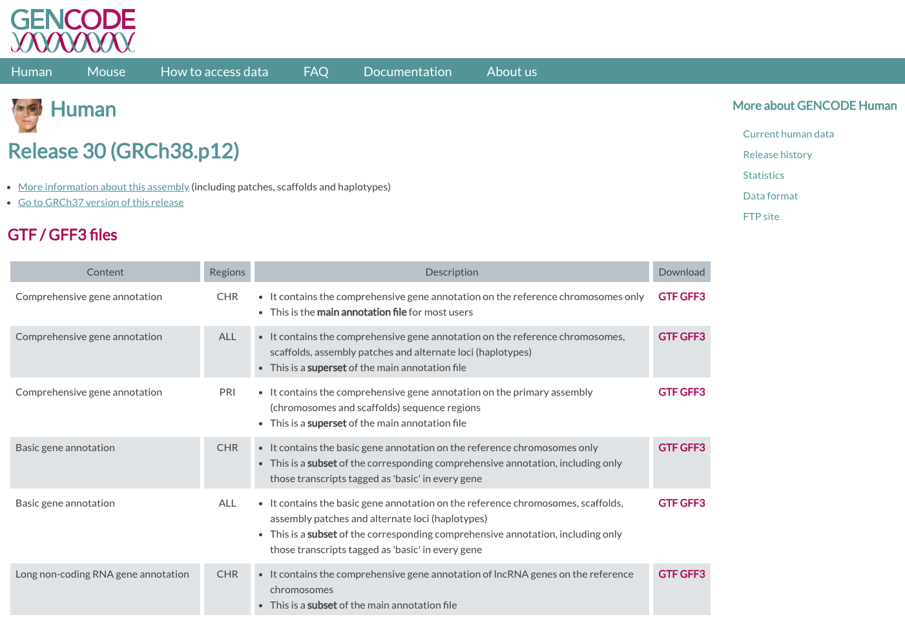
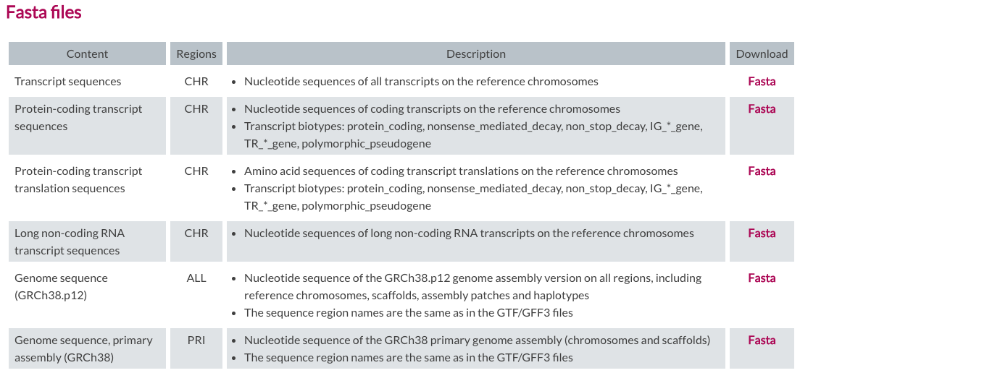
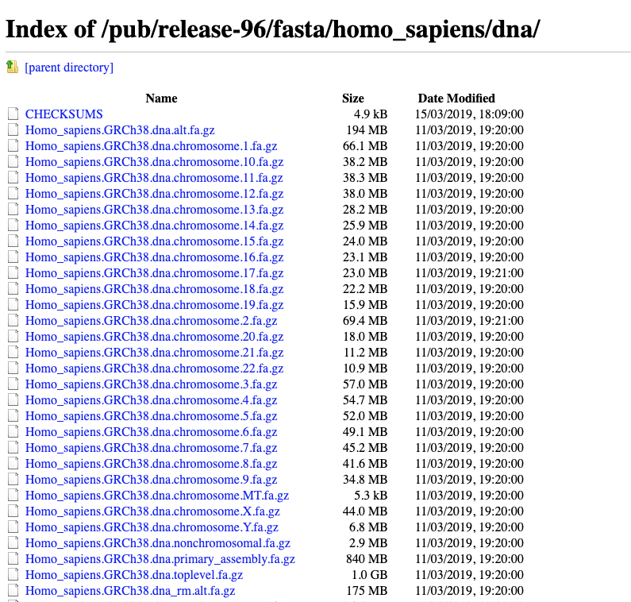
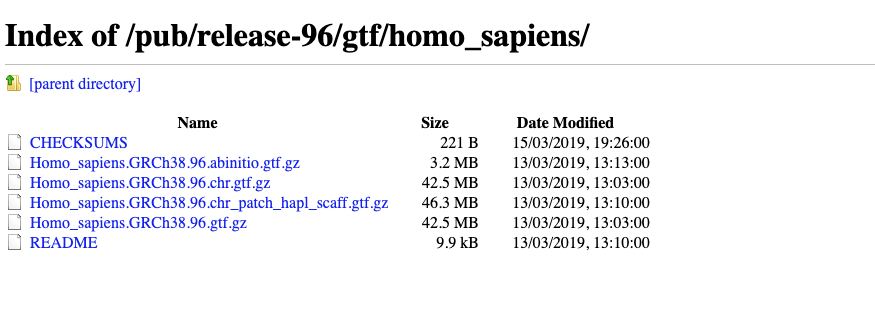

# Reference genome: FASTA and GTF/GFF

Before proceeding, we need to retrieve a **reference genome or transcriptome** from a public database, along with its **annotation**:
* A **FASTA file** contains the actual genome/transcriptome sequence.
* A **GTF/GFF file** contains the corresponding annotation.


## Public resources on genome/transcriptome sequences and annotations

* [GENCODE](https://www.gencodegenes.org/) contains an accurate annotation of the human and mouse genes derived either using manual curation, computational analysis or targeted experimental approaches. GENCODE also contains information on functional elements, such as protein-coding loci with alternatively splices variants, non-coding loci and pseudogenes.
* [Ensembl](https://www.ensembl.org/index.html) contains both automatically generated and manually curated annotations. They host different genomes and also comparative genomics data and variants. [Ensembl genomes](http://ensemblgenomes.org/) extends the genomic information across different taxonomic groups: bacteria, fungi, metazoa, plants, protists. Ensembl integrates also a genome browser.
* [UCSC Genome Browser](https://genome.ucsc.edu/) hosts information about different genomes. It integrates the GENCODE information as additional tracks. 

### Where to find the files

#### GENCODE

The current version for *Mus musculus* genome is release [**M24**](https://www.gencodegenes.org/mouse/release_M24.html).
<br>
The files you would need are:
* FASTA file for the [**Genome sequence, primary assembly**](ftp://ftp.ebi.ac.uk/pub/databases/gencode/Gencode_mouse/release_M24/GRCm38.primary_assembly.genome.fa.gz)
* FASTA file corresponding to the [**transcripts**](ftp://ftp.ebi.ac.uk/pub/databases/gencode/Gencode_mouse/release_M24/gencode.vM24.transcripts.fa.gz)
* GTF file of the [**Comprehensive gene annotation**](ftp://ftp.ebi.ac.uk/pub/databases/gencode/Gencode_mouse/release_M24/gencode.vM24.annotation.gtf.gz)

```{bash}
# genome
wget ftp://ftp.ebi.ac.uk/pub/databases/gencode/Gencode_mouse/release_M24/GRCm38.primary_assembly.genome.fa.gz

# transcriptome
wget ftp://ftp.ebi.ac.uk/pub/databases/gencode/Gencode_mouse/release_M24/gencode.vM24.transcripts.fa.gz

# annotation
wget ftp://ftp.ebi.ac.uk/pub/databases/gencode/Gencode_mouse/release_M24/gencode.vM24.annotation.gtf.gz
```

|GENCODE website|
| :---:  |
||
||


#### ENSEMBL

The current version of the *Mus musculus* genome in [Ensembl](https://www.ensembl.org/index.html) is [**release 99**](ftp://ftp.ensembl.org/pub/release-99/)

The files you would need are:
* FASTA file for the [**genome primary assembly**](ftp://ftp.ensembl.org/pub/release-99/fasta/mus_musculus/dna/Mus_musculus.GRCm38.dna.primary_assembly.fa.gz)
* FASTA file corresponding to the [**CDS regions / transcripts**](ftp://ftp.ensembl.org/pub/release-99/fasta/homo_sapiens/cds/Homo_sapiens.GRCh38.cds.all.fa.gz)
* GTF file for the [**annotation**](ftp://ftp.ensembl.org/pub/release-99/gtf/mus_musculus/Mus_musculus.GRCm38.99.chr.gtf.gz)

```{bash}
# genome
wget ftp://ftp.ensembl.org/pub/release-99/fasta/mus_musculus/dna/Mus_musculus.GRCm38.dna.primary_assembly.fa.gz

# transcriptome
wget ftp://ftp.ensembl.org/pub/release-99/fasta/homo_sapiens/cds/Homo_sapiens.GRCh38.cds.all.fa.gz

# annotation
wget ftp://ftp.ensembl.org/pub/release-99/gtf/mus_musculus/Mus_musculus.GRCm38.99.chr.gtf.gz
```

|Ensembl website|
| :---:  |
||
||
||

<br/>

## Our data set

To speed up the mapping process, we retrieved a subset of the FASTA and GTF files that correspond **only to chromosome 6**.
<br>
You can download them from:

```{bash}
#wget https://public-docs.crg.es/biocore/projects/training/RNAseq_2019/annotations.tar
#tar -xf annotations.tar
```

### FASTA file

The genome is generally represented as a FASTA file (.fa file) with the header indicated by the "**>**":

```{bash}
zcat annotations/Homo_sapiens.GRCh38.dna.chromosome.10.fa.gz| head -n 5

>chr10 dna:chromosome chromosome:GRCh38:10:1:133797422:1 REF
NNNNNNNNNNNNNNNNNNNNNNNNNNNNNNNNNNNNNNNNNNNNNNNNNNNNNNNNNNNN
NNNNNNNNNNNNNNNNNNNNNNNNNNNNNNNNNNNNNNNNNNNNNNNNNNNNNNNNNNNN
NNNNNNNNNNNNNNNNNNNNNNNNNNNNNNNNNNNNNNNNNNNNNNNNNNNNNNNNNNNN
NNNNNNNNNNNNNNNNNNNNNNNNNNNNNNNNNNNNNNNNNNNNNNNNNNNNNNNNNNNN
```

The size of the chromosome (in bp) is already reported in the header, but we can check it as follows:

```{bash}
zcat annotations/Homo_sapiens.GRCh38.dna.chromosome.10.fa.gz | grep -v ">" | tr -d '\n' | wc -m  

133797422
```

### GTF file

The annotation is stored in **G**eneral **T**ransfer **F**ormat (**GTF**) format (which is an extension of the older **[GFF format](https://genome.ucsc.edu/FAQ/FAQformat.html#format3)**): a tabular format with one line per genome feature, each one containing 9 columns of data. In general it has a header indicated by the first character **"#"** and one row per feature composed in 9 columns:

| Column number | Column name | Details |
| ----: | :---- | :---- |
| 1 | seqname | name of the chromosome or scaffold; chromosome names can be given with or without the 'chr' prefix. |
| 2 | source | name of the program that generated this feature, or the data source (database or project name) |
| 3 | feature | feature type name, e.g. Gene, Variation, Similarity |
| 4 | start | Start position of the feature, with sequence numbering starting at 1. |
| 5 | end | End position of the feature, with sequence numbering starting at 1. |
| 6 | score | A floating point value. |
| 7 | strand | defined as + (forward) or - (reverse). |
| 8 | frame | One of '0', '1' or '2'. '0' indicates that the first base of the feature is the first base of a codon, '1' that the second base is the first base of a codon, and so on.. |
| 9 | attribute | A semicolon-separated list of tag-value pairs, providing additional information about each feature. |


```{bash}
zcat annotations/gencode.v29.annotation_chr10.gtf.gz | head -n 10

##description: evidence-based annotation of the human genome (GRCh38), version 29 (Ensembl 94)
##provider: GENCODE
##contact: gencode-help@ebi.ac.uk
##format: gtf
chr10	HAVANA	gene	14061	16544	.	-	.	gene_id "ENSG00000260370.1"; gene_type "lincRNA"; gene_name "AC215217.1"; level 2; havana_gene "OTTHUMG00000174801.2";
chr10	HAVANA	transcript	14061	14604	.	-	.	gene_id "ENSG00000260370.1"; transcript_id "ENST00000562162.1"; gene_type "lincRNA"; gene_name "AC215217.1"; transcript_type "lincRNA"; transcript_name "AC215217.1-201"; level 2; transcript_support_level "3"; tag "basic"; havana_gene "OTTHUMG00000174801.2"; havana_transcript "OTTHUMT00000427447.1";
chr10	HAVANA	exon	14497	14604	.	-	.	gene_id "ENSG00000260370.1"; transcript_id "ENST00000562162.1"; gene_type "lincRNA"; gene_name "AC215217.1"; transcript_type "lincRNA"; transcript_name "AC215217.1-201"; exon_number 1; exon_id "ENSE00002606019.1"; level 2; transcript_support_level "3"; tag "basic"; havana_gene "OTTHUMG00000174801.2"; havana_transcript "OTTHUMT00000427447.1";
chr10	HAVANA	exon	14061	14299	.	-	.	gene_id "ENSG00000260370.1"; transcript_id "ENST00000562162.1"; gene_type "lincRNA"; gene_name "AC215217.1"; transcript_type "lincRNA"; transcript_name "AC215217.1-201"; exon_number 2; exon_id "ENSE00002584618.1"; level 2; transcript_support_level "3"; tag "basic"; havana_gene "OTTHUMG00000174801.2"; havana_transcript "OTTHUMT00000427447.1";
chr10	HAVANA	transcript	14138	16544	.	-	.	gene_id "ENSG00000260370.1"; transcript_id "ENST00000566940.1"; gene_type "lincRNA"; gene_name "AC215217.1"; transcript_type "lincRNA"; transcript_name "AC215217.1-202"; level 2; transcript_support_level "3"; havana_gene "OTTHUMG00000174801.2"; havana_transcript "OTTHUMT00000430636.1";
chr10	HAVANA	exon	16502	16544	.	-	.	gene_id "ENSG00000260370.1"; transcript_id "ENST00000566940.1"; gene_type "lincRNA"; gene_name "AC215217.1"; transcript_type "lincRNA"; transcript_name "AC215217.1-202"; exon_number 1; exon_id "ENSE00002578035.1"; level 2; transcript_support_level "3"; havana_gene "OTTHUMG00000174801.2"; havana_transcript "OTTHUMT00000430636.1";
```

Let's check the 9th field:
```{bash}
zcat annotations/gencode.v29.annotation_chr10.gtf.gz | cut -f9 | head -2
```

Let's check how many genes are in the annotation file:

```{bash}
zcat annotations/gencode.v29.annotation_chr10.gtf.gz | grep -v "#" | awk '$3=="gene"' | wc -l 
2240
```

And get a final counts of every feature:

```{bash}
zcat annotations/gencode.v29.annotation_chr10.gtf.gz | grep -v "#" | cut -f3 | sort | uniq -c 

  29578 CDS
  46414 exon
   2240 gene
   2750 start_codon
   2693 stop_codon
   6894 transcript
   9274 UTR

```

<br/>


