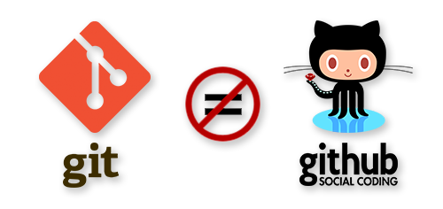

# Talk: FAIR and Reproducible practices in science

## Why reproducibility

- Helps future research: your own and done by others
- Facilitates spotting errors and avoids that misconceptions could continue on
- Fosters a culture of accountability and trust
- Contributes to saving resources. No need to reinvent the wheel

## Challenges to reproducibility

- Complex methodologies that can be difficult to fit into a reproducible environment
- Statistical deficiencies (small sample sizes, bias, improper choices)
- Societal and cultural issues
  - Lack of proper training in data management
  - Publish and perish pressure
  - Little reward to data sharing


## Version Control

Management of changes to documents, computer programs and other collections of information

- **when**, **who**, **what**


### Why should you use it?


![PhD Comics][phdcomics-notfinal][^1]

[phdcomics-notfinal]: ./images/phd101212s.gif

[^1]: [Source: PhD Comics: Not final](https://phdcomics.com/comics.php?f=1531)


![PhD Comics][phdcomics-story][^2]

[phdcomics-story]: ./images/phd052810s.png

[^2]: [Source: PhD Comics: A story in files](https://phdcomics.com/comics/archive.php?comicid=1323)


### Benefits

- transparency
- history of changes
- backup and restore
- recovery from errors
- easier collaborative work
- reproducibility


### Uses

You can use version control either alone or collaboratively for:

- papers
- lectures
- documentation
- scripts (bash, Python, R or whatever else)
- text/CSV/TSV files


### Version Control Systems

stand-alone tools that record changes to a file or set of files over time

- often referred to as **VCSs**


### Basic concept

- `commit`

Save files as logical sets of changes and write a good description of why you changed them

### What you can do

- review changes made over time
- revert files/the entire project back to a previous state
- see who last modified something
- find out where and how things went wrong
- remove content knowing that you can easily go back
- sandboxing

### Discussion: should we keep dates or versions in the filenames of a repo?

- Redundant if we are already tracking changes using the repo
- It can make sense when identifying a specific dataset

### Quick history

~ 40 years since first use

- Three main generations

### Local

e.g. `RCS`


### Centralized

e.g. `SUBVERSION`


### Distributed

e.g. `GIT`


### What is Git?

An **open source**, **distributed**, version control system

It is the most used thanks to its simplicity and GitHub



[GitHub](https://www.github.com) is a web-based Git repository hosting service, which offers all the functionalities of Git as well as adding its own features

### Git Features

- nearly every operation is local
- integrity, everything is checksummed
- generally only adds data
- every local repository is a backup


### Git hosting services

- social coding
- version control as a service
- in-browser editing
- additional collaborative features

An alternative to GitHub is [GitLab](https://www.gitlab.com), used mostly in-premise for private projects.


## Computational reproducibility

- Data
- Documentation
- **Software**


## Software recipes

- How to wrap all used software and their dependencies
- Whenever possible keep specific versions
- Help into deployment
- Keep as text files
- Store in VCS


## Containers

![Container Lashing with Rods][container-rods][^3]

[container-rods]: ./images/Container_lashing_with_rods.jpg

[^3]: [Source: Wikimedia Commons - Container lashing with rods](https://commons.wikimedia.org/wiki/File:Container_lashing_with_rods.jpg)


Software solutions:

- Docker (most popular)
- Podman (no sysadmin permissions needed)
- Singularity/Apptainer (popular in HPC environments)


Docker recipe example, `Dockerfile`:


```dockerfile
FROM debian:bookworm

ARG PERLBREW_ROOT=/usr/local/perl
ARG PERL_VERSION=5.40.0
# Enable perl build options. Example: --build-arg PERL_BUILD="--thread --debug"
ARG PERL_BUILD=--thread

# Base Perl and builddep
RUN set -x; \
  apt-get update && apt-get upgrade -y; \
  apt-get install -y perl bzip2 zip curl \
  build-essential procps

...

```

### Where to find Docker images

* [Docker Hub](https://hub.docker.com/) - Most popular and first registry
* [Biocontainers](https://biocontainers.pro) - Based on bioconda (more on it later)
* [Seqera Containers](https://seqera.io/containers/) - Creation of containers on demand

## Conda

Convenient package management system to set up environments


- `environment.yaml`. Recipe for conda environments

```bash
conda env create -f myenv.yaml

conda env create myenv
conda env export > myenv.yaml
```


```yaml
name: pod5
channels:
  - conda-forge
  - bioconda
dependencies:
  - jannessp::pod5==0.2.4
```


Tools for installing Conda:

- [Miniforge](https://conda-forge.org/download/) -> Free version of Conda tool
- [Mamba](https://mamba.readthedocs.io/en/latest/) -> Faster Conda
- [Pixi](https://prefix.dev/) -> Another faster Conda


## Python


- `requirements.txt`


```bash
pip install -r requirements.txt

pip freeze > requirements.txt

```


```
pandas==1.5.3
ena-upload-cli==0.6.2
```

Other tools:

- [Poetry](https://python-poetry.org/) - similar to how nodejs npm works
- [Uv](https://docs.astral.sh/uv/) - very versatile tool


## R

```{image} ./images/r_logo.png
:alt: R logo
:width: 300px
```

- RStudio (.Rproj files)


- [Working with R projects](https://communicate-data-with-r.netlify.app/docs/baser/workingprojects/)


- Renv (renv.lock, along with .Rprofile and renv/activate.R)

- [Collaborating with Renv](https://rstudio.github.io/renv/articles/collaborating.html)


## Workflows

- Different steps using different software
  - Rather simple cases: keep Bash scripts or Python pipelines (Scikit/Pandas/etc.)
  - If the project grows, it is always better to use a **workflow orchestrator**
    - [Nextflow](https://www.nextflow.io)
      - Keep details in config files (params.yaml, nextflow_schema.json)
      - Provenance (tracking data transformation along used software)
        - [nf-prov](https://github.com/nextflow-io/nf-prov)

```{image} ./images/nextflow_logo.png
:alt: Nextflow logo
:width: 600px
```

- [RO-Crate](https://www.researchobject.org/ro-crate/) - Effort to package research data with metadata. `nf-prov` project supports it.

- Register your workflow or refer to it: [WorkflowHub](https://workflowhub.eu/) 
    - Example: related to [RNAseq](https://workflowhub.eu/search?q=rnaseq#workflows)

## FAIR

![FAIR data principles][fair-image][^4]

[fair-image]: ./images/FAIR_data_principles.svg.png

[^4]: [Source: Wikimedia Commons - FAIR Data Principles](https://commons.wikimedia.org/wiki/File:FAIR_data_principles.svg)

- More information about the [FAIR principles](https://www.go-fair.org/fair-principles/)


### Findable

- **Example:** Dataset available in a public repository with files with clear and descriptive names. Documentation included. Also including tags and keywords to enable its findability.
- **Counter-example:** Dataset not made public. If public, kept in an obscure and non-understandable way without proper tags or documentation.

### Accessible

- **Example:** Data placed in a well-known format and that can be downloaded in a clear way.
- **Counter-example:** Data encoded in a little known format and with hurdles to download or read.

### Interoperable

- **Example:** Dataset using terminology, ontology or measurement units that are widely accepted by the community, so it can be compared and integrated with other projects from third parties.
- **Counter-example:** Dataset with project-specific choices that can be hardly mapped to other experiments of the field.

### Reusable

- **Example:** Dataset provided in a way that contained data can be used easily by third parties and regenerated if needed using available instructions.
- **Counter-example:** Dataset without any documentation, instructions or even context.


## RNA-Seq data repositories

**Public data repositories** exist that store data ("raw" and processed) produced by the community from a variety of experiments: microarrays, high-throughput sequencing, high throughput PCR, etc.

It is nowadays required by most journals to make data **publicly available** upon publication of study in a peer-reviewed journal.

The major repositories for gene expression data:
* [**GEO**](https://www.ncbi.nlm.nih.gov/geo/) 
* [**Array-express**](https://www.ebi.ac.uk/arrayexpress/)
* [**ENCODE**](https://www.encodeproject.org/)

These repositories  are linked to the repositories of NGS raw data (FASTQ files):
* [**SRA**](https://www.ncbi.nlm.nih.gov/sra) (Sequence Read Archive) 
* [**ENA**](https://www.ebi.ac.uk/ena) (European Nucleotide Archive) 
* [**DDBJ-DRA**](https://www.ddbj.nig.ac.jp/dra/index-e.html) 

### Some CLI suggestions

- CLI tool for downloading data: [FASTQ-dl](https://github.com/rpetit3/fastq-dl) ([Container](https://biocontainers.pro/tools/fastq-dl)) - Support both SRA and ENA. Can download multiples files from a project

- CLI tool for uploading to ENA: [ena-upload-cli](https://github.com/usegalaxy-eu/ena-upload-cli)  
    - First, you upload files to a repository (FTP/Aspera)
    - Then, upload metadata associated: STUDY, SAMPLE, EXPERIMENT, RUN
    - Map these 4 concepts to simple TSV files
    - There are checklists, specific metadata requirements, depending on the sample/experiments that are going to be uploaded: [Checklist templates](https://github.com/ELIXIR-Belgium/ENA-metadata-templates)

## FAIR in practice for RNAseq

- Reference: [FAIRification of an RNAseq dataset](https://training.galaxyproject.org/training-material/topics/fair/tutorials/fair-rna/tutorial.html)

We will use **[E-MTAB-8316](https://www.ebi.ac.uk/biostudies/arrayexpress/studies/E-MTAB-8316)** from ArrayExpress as example.

### Findable (RNAseq Examples)

**Example:**
- Dataset **E-MTAB-8316** (from Alivernini et al. 2020, Nature Medicine) has a globally unique and persistent identifier: `E-MTAB-8316` or full URL `https://www.ebi.ac.uk/biostudies/ArrayExpress/studies/E-MTAB-8316`
- Indexed in searchable repositories (ArrayExpress, ENA)
- Rich metadata allows discovery via keywords like "macrophage rheumatoid arthritis" combined with "rna-seq of coding rna"
- Uses resolution services like identifiers.org for regularized URLs

**Counter-example:**
- RNAseq data kept only on a lab's local server without public deposition
- FASTQ files named `sample1.fq`, `sample2.fq` with no associated metadata file


### Accessible (RNAseq Examples)

**Example:**
- Data retrievable via standard HTTP/HTTPS protocol using the persistent identifier
- Raw FASTQ files accessible via ENA (European Nucleotide Archive)
- Processed data (gene expression matrices) downloadable directly from ArrayExpress
- Protocol is open, free, and universally implementable

**Counter-example:**
- Data available only upon request with approval process
- FASTQ files in proprietary or obscure sequencing format
- Data behind paywall or institutional login requirement

### Interoperable (RNAseq Examples)

**Example:**
- Uses published ontologies: [NCBI taxonomy](https://www.ncbi.nlm.nih.gov/taxonomy) for species ("Homo sapiens")
- Complies with [MINSEQE](https://zenodo.org/records/5706412) (Minimum Information about a Sequencing Experiment) community standard — 5-star rating
- Machine-readable metadata formats:
  - **MAGE-TAB** (Sample and Data Relationship Format - SDRF)
  - **ENA SRA XML** format
- Controlled vocabularies via [Annotare](https://www.ebi.ac.uk/fg/annotare) submission tool

**Counter-example:**
- Custom gene identifiers not mapped to standard databases (Ensembl, RefSeq)
- Proprietary sample annotation system without ontology links
- Protocol descriptions using only lab-specific terminology

### Reusable (RNAseq Examples)

**Example:**
- Clear licensing: **CC BY 4.0** ([Creative Commons](https://creativecommons.org/) Attribution)
- Detailed provenance: links to publication, protocol documentation, sample metadata
- Complete data availability: raw FASTQ files + processed gene expression matrices
- Clear documentation of experimental design, protocols, and variables
- Associated with publication DOI: [10.1038/s41591-020-0939-8](https://dx.doi.org/10.1038/s41591-020-0939-8)

**Counter-example:**
- No license specified or restrictive license
- Missing protocol details (e.g., "library prep performed as usual")
- Only processed data provided without raw FASTQ files
- No link to methods publication


