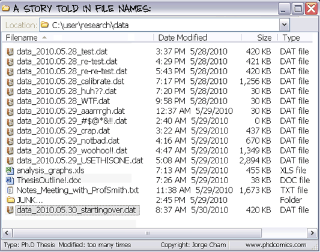
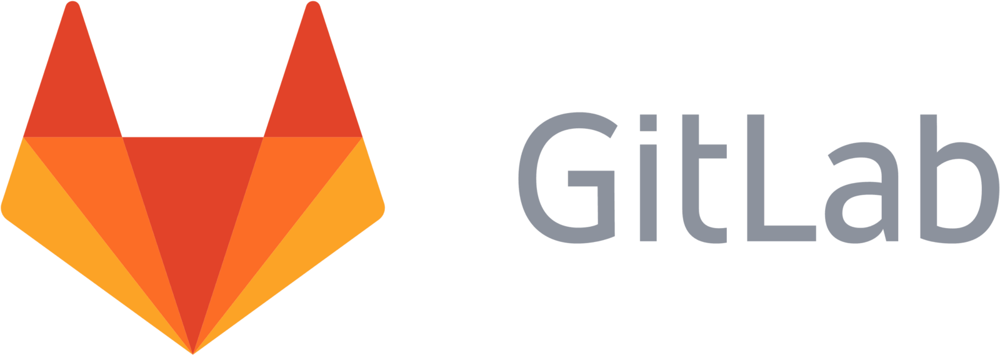

# Talk: FAIR and Reproducible practices in science

## Why reproducibility

- Helps future research: your own and done by others
- Facilitates spotting errors and avoids that misconceptions could continue on
- Fosters a culture of accountability and trust
- Contributes to saving resources. No need to reinvent the wheel

## Challenges to reproducibility

- Complex methodologies that can be difficult to fit into a reproducible environment
- Statistical deficiencies (small sample sizes, bias, improper choices)
- Societal and cultural issues
  - Lack of proper training in data management
  - Publish and perish push
  - Little reward to data sharing


## Version Control

Management of changes to documents, computer programs and other collections of information

- **when**, **who**, **what**


### Why you should you use it?




### Benefits

- transparency
- history of changes
- backup and restore
- recovery from errors
- easier collaborative work
- reproducibility


### Uses

(either alone or collaboratively)

- papers
- lectures
- documentation
- scripts (bash, Python, R or whatever else)
- text/CSV/TSV files


### Version Control Systems

stand-alone tools that record changes to a file or set of files over time

- <mdi-arrow-right-thick class="c-teal" /> often referred to as **VCSs**


### Basic concept

- <mdi-arrow-right-thick class="c-teal" /> `commit`

Save files as logical sets of changes and write a good description of why you changed them

### What you can do

- review changes made over time
- revert files/the entire project back to a previous state
- see who last modified something
- find out where and how things went wrong
- remove content knowing that you can easily go back
- sandboxing

### Discussion: should we keep dates or versions in the filenames of a repo?

- Redundant if we are already tracking changes using the repo
- It can make sense when identifying a specific dataset

### Quick history

~ 40 years since first use

- Three main generations

### Local

e.g. `RCS`


### Centralized

e.g. `SUBVERSION`


### Distributed

e.g. `GIT`


### What is Git?

An **open source**, **distributed**, version control system

It is the most used thanks to its simplicity and GitHub


GitHub is a web-based Git repository hosting service, which offers all the functionalities of Git as well as adding its own features

### Git Features

- nearly every operation is local
- integrity, everything is checksummed
- generally only adds data
- every local repository is a backup


### Git hosting services

- social coding
- version control as a service
- in-browser editing
- additional collaborative features

An alternative of GitHub is GitLab, used mostly in-premise for private projects.




## Computational reproducibility

- Data
- Documentation
- **Software**


## Software recipes

- How to wrap all used software and their dependencies
- Whenever possible keep specific versions
- Help into deployment
- Keep as text files
- Store in VCS


## Containers

- Dockerfile (Docker, Podman)
  - For Apptainer/Singularity not direct


## Containers

```
FROM debian:bookworm

ARG PERLBREW_ROOT=/usr/local/perl
ARG PERL_VERSION=5.40.0
# Enable perl build options. Example: --build-arg PERL_BUILD="--thread --debug"
ARG PERL_BUILD=--thread

# Base Perl and builddep
RUN set -x; \
  apt-get update && apt-get upgrade -y; \
  apt-get install -y perl bzip2 zip curl \
  build-essential procps

...

```

## Conda

- env.yaml

```
conda env create -f myenv.yaml

conda env create myenv
conda env export > myenv.yaml
```


```
name: pod5
channels:
  - conda-forge
  - bioconda
dependencies:
  - jannessp::pod5==0.2.4
```

Other tools:

- [Mamba](https://mamba.readthedocs.io/en/latest/) -> Faster Conda
- [Pixi](https://prefix.dev/) -> Another faster Conda


## Python

- requirements.txt

```
pip install -r requirements.txt

pip freeze > requirements.txt

```


```
pandas==1.5.3
ena-upload-cli==0.6.2
```

Other tools:

- [Poetry](https://python-poetry.org/) - similar to how nodejs npm works
- [Uv](https://docs.astral.sh/uv/) - very versatile tool


## R

- RStudio (.Rproj files)

- [Working with R projects](https://communicate-data-with-r.netlify.app/docs/baser/workingprojects/)


- Renv (renv.lock, along with .Rprofile and renv/activate.R)

- [Collaborating with Renv](https://rstudio.github.io/renv/articles/collaborating.html)


## Workflows

- Different steps using different software
  - Rather simple cases: keep Bash scripts or Python pipelines (Scikit/Pandas/etc.)
  - If the project grows, it is always better use a **workflow orchestrator**
    - [Nextflow](https://www.nextflow.io)
      - Keep details in config files (params.yaml, nextflow_schema.json)
      - Provenance (tracking data transformation along used software)
        - [nf-prov](https://github.com/nextflow-io/nf-prov)


## FAIR


10 years of FAIR ...

### Findable

- **Example:** Dataset available in a public repository with files with clear and descriptive names. Documentation included. Also including tags and keywords to enable its findability.
- **Counter-example:** Dataset not made public. If public, kept in an obscure and non-understandable way without proper tags or documentation.

### Accessible

- **Example:** Data placed in a well-known format and that can be downloaded in a clear way.
- **Counter-example:** Data encoded in a little known format and with hurdles to download or read.

### Interoperable

- **Example:** Dataset using terminology, ontology or measurement units that are widely accepted by the community, so it can be compared and integrated with other projects from third parties.
- **Counter-example:** Dataset with project-specific choices that can be hardly mapped to other experiments of the field.

### Reusable**

- **Example:** Dataset provided in a way that contained data can be used easily by third parties and regenerated if needed using available instructions.
- **Counter-example:** Dataset without any documentation, instructions or even context.

Reference: [FAIRification of an RNAseq dataset](https://training.galaxyproject.org/training-material/topics/fair/tutorials/fair-rna/tutorial.html)
