RNA-seq data analysis: Workflow & Approaches 
=================

Luca Cozzuto

What is the transcriptome?
----------------

The transcriptome is the set of all RNA molecules produced by a virus, a cell, or a population of cells, such as a tissue, organ, or organism.
The genetic information is stored in DNA in units called “genes”. 

Not all genes are active at all times.

Cells need to express specific genes to produce the proteins and RNA molecules necessary for their structure and function.

 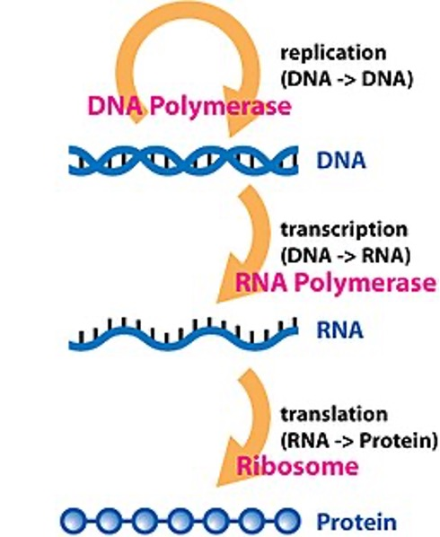 

History of Transcriptome Analysis Techniques
----------------

Prior to the 2000s, we were able to measure the expression of few genes using mainly to methods: the Northern Blot and the PCR.

 - The Northern Blot (1977, James Alwine, David Kemp, and George Stark) is a technique for detecting specific RNA molecules that uses RNA separation by gel electrophoresis, followed by transfer to a membrane, and then hybridization with a probe with a labeled complementary DNA or RNA to visualize the target.

 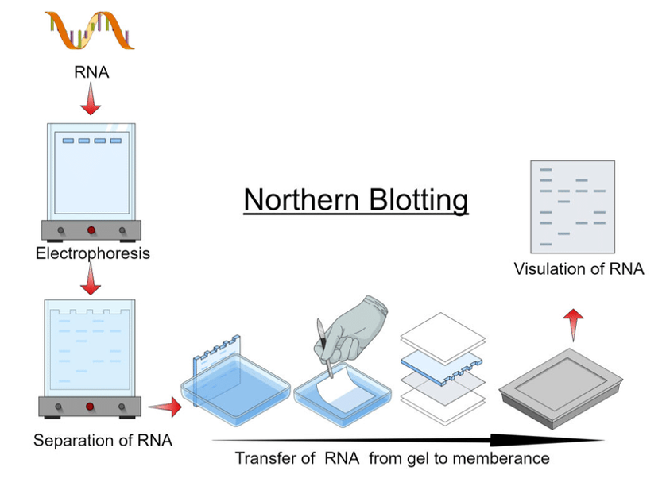 

 
 - Real Time-PCR and Real Time-qPCR (Mid 1990s).

PCR (Polymerase Chain Reaction) is a technique invented in 1983 that amplifies specific DNA sequences exponentially through repeated cycles of heating (DNA denaturation) and cooling (primer annealing and extension). RT-PCR (Reverse Transcription PCR) extends this by first converting RNA into complementary DNA (cDNA) using reverse transcriptase enzyme, then amplifying the cDNA with standard PCR. This allows detection and quantification of specific RNA molecules. Quantitative RT-PCR (qRT-PCR or RT-qPCR), developed in the 1990s, measures amplification in real-time, providing precise quantification of gene expression levels.

 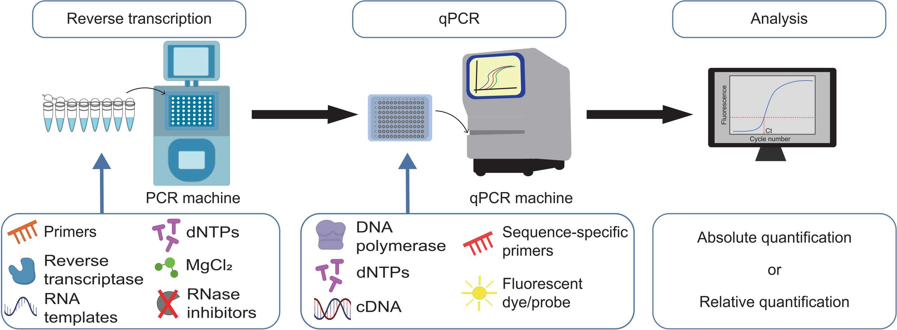 

> Image from: Bong D, Sohn J, Lee SV. Brief guide to RT-qPCR. Mol Cells. 2024 Dec;47(12):100141.

- In 2001, with the publication of the human genome, the whole list of protein genes became available. Some companies, like Agilent, started to manufacture chips containing thousands of DNA probes spotted in a grid pattern in what is known as a "microarray". Fluorescently-labeled RNA samples hybridize to complementary probes, allowing simultaneous measurement of expression levels for thousands of genes in a single experiment.

 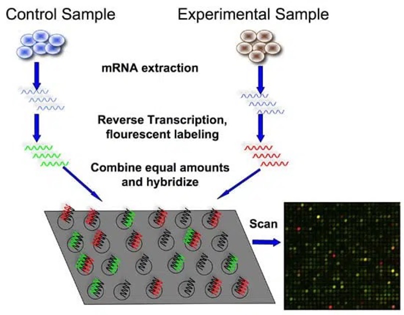 

> Image from: https://bitesizebio.com/7206/introduction-to-dna-microarrays/

- In 2005 and 2006, a new class of automatic sequencers entered the market, marking the beginning of the "next-generation sequencing" era. The 454 sequencer was based on pyrosequencing technology: a method that detects DNA synthesis by capturing flashes of light released each time a nucleotide is added to a growing DNA chain. A year later, the Solexa Genome Analyzer, later acquired by Illumina, used a different approach based on sequencing-by-synthesis with reversible terminators.

 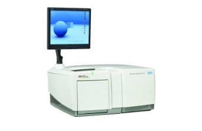 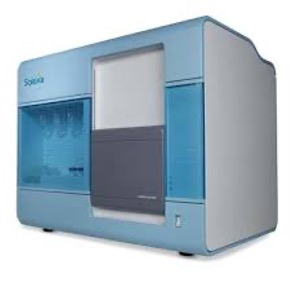

Using these technologies for sequencing libraries of Expressed Sequence Tags (EST) allows the analysis  of a large part of the transcriptome, or performing RNAseq analysis.   

- In 2006 and in 2008, two milestone papers were published using this concept:

1. Bainbridge MN, et al. **Analysis of the prostate cancer cell line LNCaP transcriptome using a sequencing-by-synthesis approach**. BMC Genomics. 2006 Sep 29;7:246. [doi: 10.1186/1471-2164-7-246](https://doi.org/10.1186/1471-2164-7-246).
2. Mortazavi A, et al. **Mapping and quantifying mammalian transcriptomes by RNA-Seq**. Nat Methods. 2008 Jul;5(7):621-8. [doi: 10.1038/nmeth.1226](https://doi:10.1038/nmeth.1226). 

The whole mRNA seq workflow is described in the following image 

> From Wang Z et al. **RNA-Seq: a revolutionary tool for transcriptomics**. Nat Rev Genet. 2009 Jan;10(1):57-63. [doi: 10.1038/nrg2484](https://doi:10.1038/nrg2484). 

  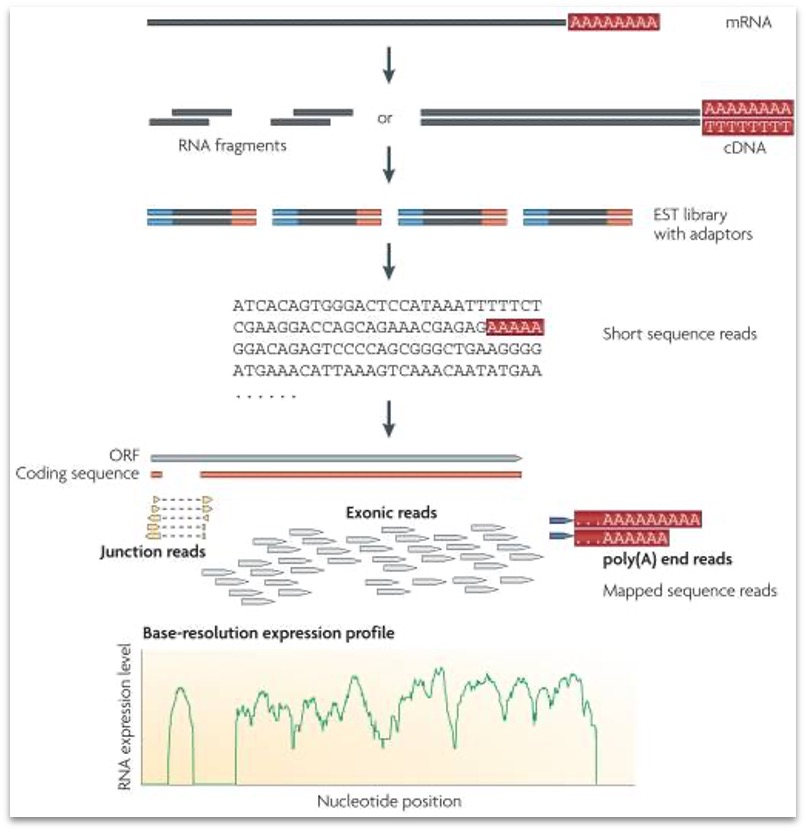

From that moment, different labs tried to apply the same technique to different transcriptome data. So we were then able to analyze:

| Method | Details |
|--------|---------|
| mRNA or better cDNA sequencing | after polyA enrichment |
| Total RNA sequencing | after ribo depletion, to include also non-coding RNAs |
| Small RNA sequencing | after size selection, snoRNAs, microRNAs, tRNAs… |
| RIP sequencing | after RNA immunoprecipitation, detecting ribo-protein binding sites |
| Meta-transcriptomics | for the whole transcriptome of a bacterial population |

During this course, we will focus on bulk RNAseq, because it is important for you to know that currently we are also able to detect the transcriptome of single cells and their spatial location.

  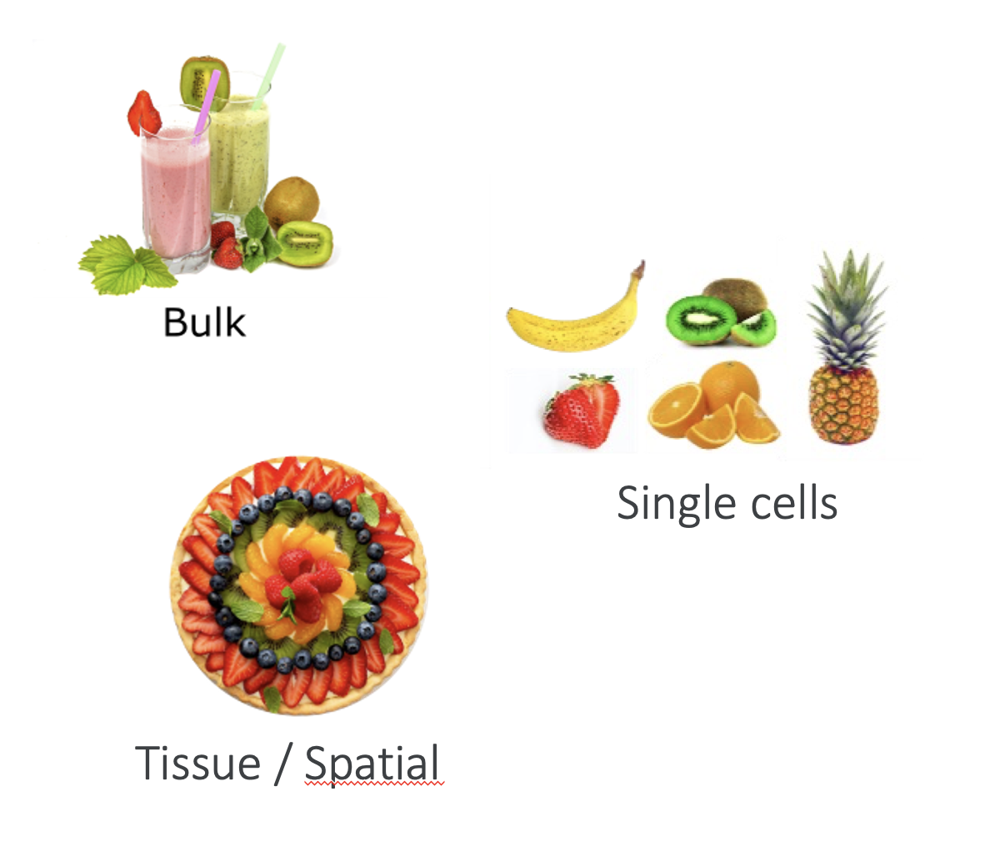

- Since the 2010s, a new generation of sequences able to produce reads longer than usual allowed us to improve the genome annotation and even to read the RNA directly without passing through the cDNA conversion. Again, this course will focus only on the use of short-read technology like Illumina's one.

  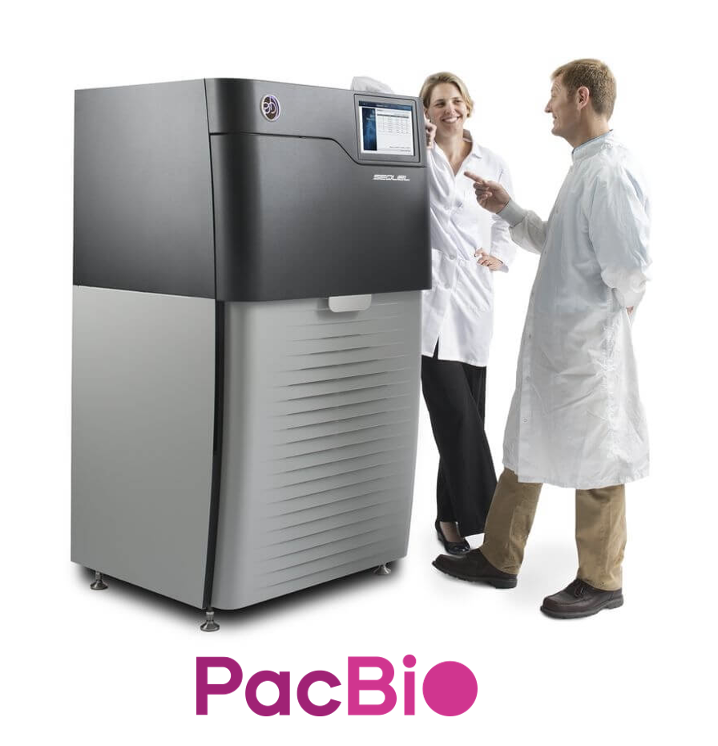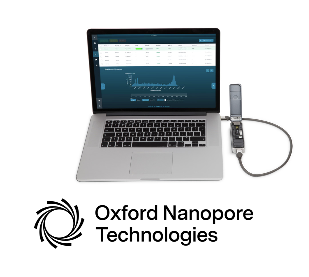

Aligning your NGS data
----------------

Once you get millions of short reads, you MUST inspect them for their quality, and then you can proceed to their alignment to the reference transcriptome. 

Currently, two main methods are available for this purpose:
- Splice-Aware Genome Aligners, such as STAR and Hisat2.
- Pseudo-Alignment or quasi-mappers, such as Salmon or Kallisto.

### Splice-Aware Genome Aligners

This class of aligner relies on the indexing of the transcriptome, seen as a combination of the genomic sequence in FASTA format and its annotation in GTF or GFF format. The index for STAR is based on uncompressed suffix arrays, which allows ultra-fast access and lookup. The index of HISAT2 is based on a hierarchical graph-based FM-index (Burrows-Wheeler Transform, similar to BWA). It uses a graph-based approach and it incorporates information about SNPs too. 

In brief, the aligner tries to align part of a read (seed), and then it checks for the presence of the rest of that sequence somewhere else in the genome. If some quality conditions are met, it will predict a splicing site or an aberrant alignment (like a gene fusion).

  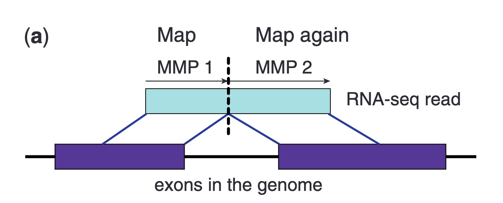

> From "Dobin A et al. **STAR: ultrafast universal RNA-seq aligner. Bioinformatics**. 2013 Jan 1;29(1):15-21. [doi: 10.1093/bioinformatics/bts635](https://10.1093/bioinformatics/bts635)."

The usage of an annotation allows guiding the alignment for already known splicing sites. Their detection indicates which splicing site is in use and allows inferring which transcript is being transcribed, or at least which combination of exons. Notably, the method allows the detection of novel exons and splicing sites since it maps to the whole genome. 
The aligned reads in SAM, BAM, or CRAM format can then be displayed in a genome browser and let scientists to manually validate the predictions and refine the novel annotations.

### Pseudo-Alignment or quasi-mappers

### Resume
Here is a table resuming pros and cons.

| **Aspect** | **Genome Aligners (STAR, HISAT2)** | **Pseudo-Aligners (Salmon, Kallisto)** |
|------------|-----------------------------------|----------------------------------------|
| **Mapping target** | Reference genome | Reference transcriptome |
| **Speed** | Moderate (2-4 hours per sample) | Very fast (5-15 minutes per sample) |
| **Memory required** | High (30-40 GB for human) | Low (4-8 GB) |
| **Novel transcript discovery** | ✅ Yes - can find new genes/isoforms | ❌ No - limited to known annotations |
| **Alternative splicing detection** | ✅ Excellent - detects splice junctions | ❌ Limited - annotation dependent |
| **Gene fusion detection** | ✅ Yes - can identify fusions | ❌ No |
| **Annotation dependency** | ✅ Can work without annotations | ❌ Requires high-quality transcriptome |
| **Output format** | BAM/SAM alignment files | Count matrices, TPM values |
| **Computational cost** | High - needs HPC cluster | Low - can run on laptop |
| **Accuracy** | High for alignment | Good for quantification |
| **Isoform quantification** | ⚠️ Challenging - needs other tool | ✅ Built-in probabilistic models |
| **Best for** | Discovery, splicing studies, poorly annotated genomes | Differential expression, well-annotated organisms |
| **Scalability** | Slower for many samples | Excellent - very fast |

