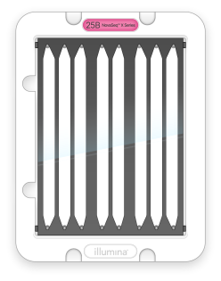
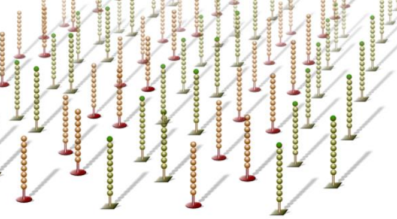
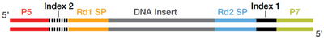
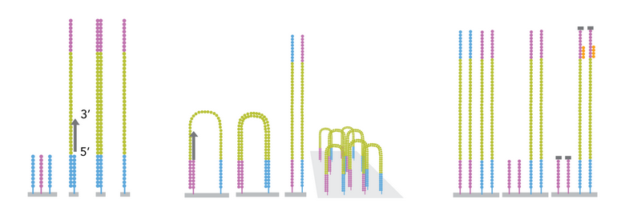
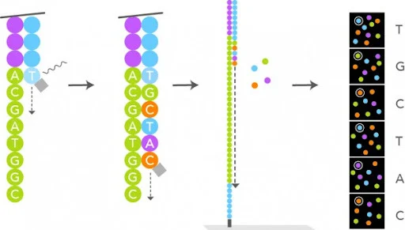
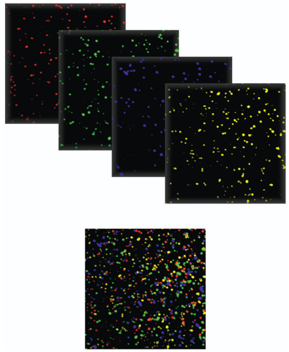
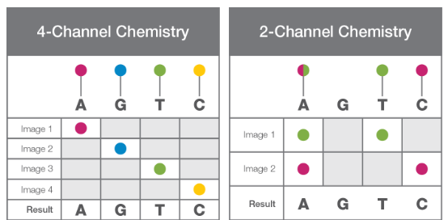
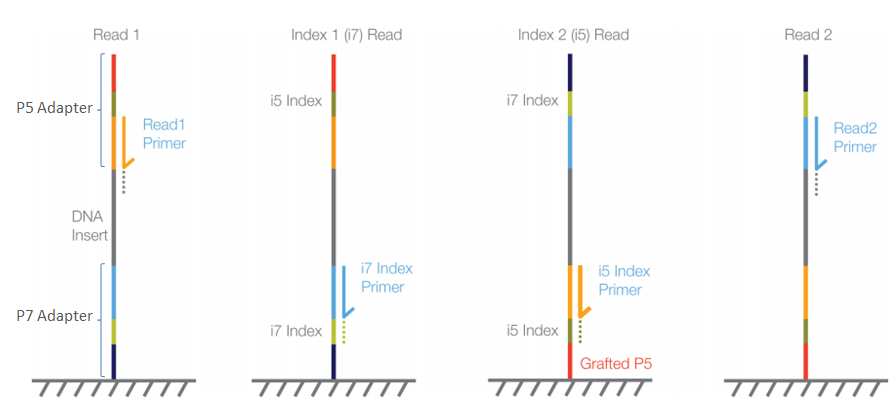
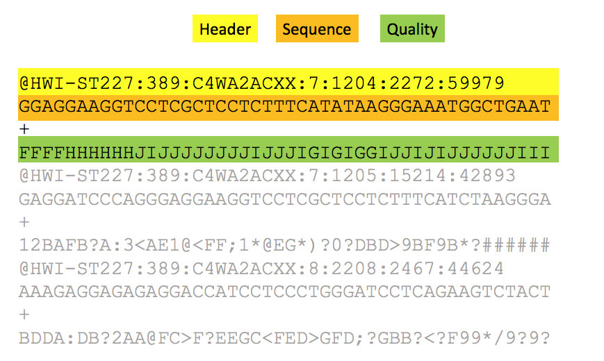

# Talk: Pre-processing of raw data and fastq format

## Flowcells, lanes, and library structure

Illumina sequencing happens on a **flowcell** —a glass slide with billions of oligos (short DNA sequences) covalently attached to its surface. There are two types of oligos attached named P7 and P5. Many flowcells are divided into **lanes** (typically 2, 4, or 8), which can act like independent *tracks* that sequence separate library pools. Lane information appears in run metadata, FASTQ headers, and output filenames (e.g., L001 for lane 1, L002 for lane 2). Before diving in into the sequencing per se, what is a library and how does interact with these surface oligos?

| | |
|:---:|:---:|
|  |  |
| *Figure 1: flowcell design. Image taken from [Illumina's knowledge base.](https://support-docs.illumina.com/IN/NovaSeqX/Content/IN/NovaSeqX/ConsumablesDetails.html)* | *Figure 2: Flowcell surface coated with oligos. Image taken from [Illumina publicly available presentation.](https://cbiit.github.io/brownbag-science/02-sequencing/Illumina_Sequencing_Overview_15045845_D.pdf)* |

Every Illumina library consists of your target **insert** (genomic DNA, amplicons, cDNA, etc.) flanked by adapters on both ends:

<div style="display:flex; justify-content:center;">

| |
|:---:|
|  |
| *Figure 3: library structure.  Image taken from [Illumina's knowledge base.](https://knowledge.illumina.com/library-preparation/general/library-preparation-general-reference_material-list/000003874)* | 

</div>

Its key regions are:

- **P5 and P7 sequences**: complementary to oligos covalently attached to the flow cell surface. They enable the molecules from the library to bind to the flowcell. Without them, your DNA couldn't bind or amplify.

- **Read 1 and Read 2 primer site**: where the sequencing primer binds to start Read 1 (R1) and Read 2 (R2) respectively. These regions are complementary to the sequencing primers, which enable the start of the sequecing for each read. 

- **i7 index and i5 index**: sample barcode(s) for demultiplexing. Currently, the most widely used strategy is to use combinations of i7+i5 indexes for barcoding but single indexes strategies are possible too. 

Now that the library structure is clear, let's see what occurs once our molecules enter the flowcell and covalently bind to oligos P7/P5.

## Cluster generation and sequencing by syntehsis (SBS)

Once the libraries are ready, they are loaded into the sequencer and the experiment starts. Below you can find an overview of the whole process. Of note, we won't go through each step in details, only those that are relevant to better understand the data quality assessment.

<div style="display:flex; justify-content:center;">

| |
|:---:|
|  |
| *Figure 4: sequencing experiment overview. Image generated together with Claude Code.* | 

</div>

### Cluster generation/amplification:

Libraries bind to the flow cell via either P5-to-P5 OR P7-to-P7 hybridization. Then, the bridge amplification process starts and it is identical for both orientations:

<div style="display:flex; justify-content:center;">

| |
|:---:|
|  |
| *Figure 5: cluster generation via bridge amplification. Image from [webpage.](https://uclouvain-cbio.github.io/WSBIM2122/sec-hts.html)* | 

</div>

**1. Bridge formation:** The free end bends over (~150 nm) and hybridizes to complementary surface oligo.​

**2. First amplification:** Polymerase extends both bridged strands → two double-stranded copies.​

**3. Denaturation:** Heat separates strands → two single-stranded copies (one P5-bound, one P7-bound).​

**4. Repeat ~1,000 times:** Each strand forms bridges → cluster of ~1,000 identical molecules in ~1 μm spot. 

**5. Cluster linearization:** Selective cleavage of reverse strands only so only molecules in forward orientation are kept to start the **sequencing by syntehsis (SBS)** procedure. 

**6. Cluster detection:** Instrument performs an initial imaging scan of every tile to register the precise XY pixel coordinates of each cluster. 

### Sequencing by synthesis (SBS):

Once clusters are ready, sequencing primers that hybridize to the Read 1 primer site are added. Then, a SBS cycle is carried out for every base in read 1. Each cycle consists of:

<div style="display:flex; justify-content:center;">

| |
|:---:|
|  |
| *Figure 6: sequencing imaging procedure. Image taken from [webpage.](https://www.lexogen.com/rna-lexicon-next-generation-sequencing/)* | 

</div>


**1. Nucleotide flow:** Fluorescent reversible-terminator nucleotides flood the flow cell.

**2. Incorporation:** Polymerase adds exactly one nucleotide per cluster (the next correct base).

**3. Imaging:** The instrument scans all lanes/tiles, recording fluorescence intensity/color at every cluster position. In the initial chemistry, there were 4 dyes - one per nucleotide type - and therefore, four images were generated per SBS cycle. This approach lead to a slower basecalling and preprocessing of the data. See below an example of what the sequencing experiment generates:

<div style="display:flex; justify-content:center;">

| |
|:---:|
|  | 
| *Figure 7: Pseudocolor image from the Illumina flow cell. Image from [Voelkerding et al, Clinical Chemistry, 2009](https://academic.oup.com/clinchem/article-abstract/55/4/641/5629392?redirectedFrom=fulltext&login=false)* 

</div>

Currently, this approach has evolved into a **2-Channel SBS**. In this case, only two dyes are used (red and green) and each nucleotide is identified as a combination of both:

| Dye combination | Nucleotide |
| :----: | :----: | 
| Red-only   | C |
| Green-only | T |
| Red+green  | A |
| No signal  | G |

In this case, only two images are generated and analysed per cycle and therefore, the basecalling and preprocessing are much faster than with the previous **4-Channel SBS** chemistry.

<div style="display:flex; justify-content:center;">

| |
|:---:|
|  | 
| *Figure 7: 2 channel vs 4 channel chemistry. Image taken from [Illumina's technical note.](https://emea.illumina.com/content/dam/illumina-marketing/documents/products/techspotlights/cmos-tech-note-770-2013-054.pdf)* 

</div>

**4. Cleavage:** Chemical cleavage removes the fluorescent dye and 3' terminator, freeing the 3'-OH for the next cycle.

Once the sequencing of read 1 has finished, the sequencing order for the remaining elements of our libraries is Read 1 → i7 index for **single-end**; Read 1 → i7 index → i5 index → Read 2 for **paired-end** datasets.

<div style="display:flex; justify-content:center;">

| |
|:---:|
|  | 
| *Figure 8: Sequencing order for paired-end reads (PE). Image taken from [Illumina's knowledge base.](https://knowledge.illumina.com/library-preparation/general/library-preparation-general-faq-list/000005679)* 

</div>

Although this technology is widely used, it also has important caveats that can affect the quality of the obtained data (and therefore, our analysis too!). 

- **Phasing and pre-phasing:** these are known chemistry limitations that occur whenever some molecules fail to incorporate the dyed nucleotide - called **phasing**; or when they incorporate them earlier than expected - called **pre-phasing**. These phenomenons are taken into account by the basecaller algorithm. 

- **Imperfect dye/terminator cleavage:** cleavage's efficiency might decrease during our sequencing run and it can lead to a) molecules retaining the 3' terminator and cannot add the next base (ie: phasing) and b) residual fluorescence which results into background noise and therefore, lower quality scores. 


:::{admonition} Limitation with 2-Channel SBS!
:class: important

If several early R1 cycles contain G (no fluorescence), the camera only sees background noise and as a result, there is poor cluster detection which leads to a decreased % of PF clusters (ie: those with sufficient signal quality across early cycles) and data quality. 
:::

All limitations described above result in a **quality score decline** towards the end of the read.

## From Images to FASTQ: RTA → BCL → FastQ
Every imaging step described in the previous section produces a massive amount of image data to analyse. The **RTA software**, which is executed on the instrument itself, processes them in real-time during the sequencing run. Briefly, it does:
1. Cluster position tracking (from early R1 cycles)
2. Intensity extraction per cluster (red, green values)
3. Base calling: (red,green) coordinates → A/C/G/T
4. Quality score calculation (signal purity, neighbour effects)
5. Binary BCL file output

It outputs a BCL file for each lane, tile and cycle. All **bcl files** are then placed in the output directory, together with additional reports generated by the sequencer. Here you can see an example of the contents of the output directory:

```
MyRun_2026-03-05/
├── RunInfo.xml (100 R1 + 8 i7 + 8 i5 + 150 R2 cycles)
├── Data/Intensities/BaseCalls/
│   ├── L001/s_1_*.bcl (lane 1 BCLs)
│   ├── L002/s_2_*.bcl (lane 2 BCLs)
│   └── Reports/Demultiplex_Stats.htm (%PF clusters)
```

These bcl files contain all of our sequencing data but it is binary (ie: not human readable and not readable by downstream algorithms) and data from all the samples in the same lane is mixed within the file. 

In this step, **bcl2fastq** is a publicly available algorithm developed by Illumina that performs simultaneously the conversion of sequencing data into **fastQ** format and **demultiplexing**. The inputs required are i) the path of the output folder of our sequencing run and, b) a samplesheet, where samples names are related to a specific barcode combination and lanes. 

Ideally, the algorithm should be able to classify all reads into specific samples. However, the index sequences might contain errors due to the limitations of SBS discussed previously. Therefore, **bcl2fastq** needs to tolerate errors, which is controled by the parameter *--barcode-mismatches*, with a default value of 1. As a result, if the observed index of a read differs by ≤1 position from expected, assign it to that sample. 

But what happens when two libraries sequenced together have similar expected indexes? See this example below:
```
Sample A i7: ATCGAT  
Sample B i7: ATCAAT  ← Only 1 position different!

We have a read from sample A with one sequencing error:
i7 index read: ATCGAT → ATC AAT (1 sequencing error)  

Then, bcl2fastq compares:
   • Distance to Sample A (ATCGAT): 1 mismatch ✓ (within limit)
   • Distance to Sample B (ATCAAT): 0 mismatches ✓ (perfect match!)

The read would be ambiguously assigned!
```

In this scenario, known as **barcode collision**, bcl2fastq will raise an error and it won't generate fastQ nor demultiplex the data. To determine the maximum number of mismatches that bcl2fastq should allow, the **hamming distance** between barcodes is calculated:

``` Minimum distance ≥ 2k + 1 (k = max mismatches allowed) ```

If no collision occurs, **bcl2fastq** generates the demultiplexed **fastq** files, which can then be trimmed, aligned, among other downstream analysis. 

## FASTQ Format: The Universal NGS Standard

Short (and long) sequencing reads coming from the sequencers are stored in **FASTQ** format files (with the extension **.fastq** / **.fq**).
This format contains the information about the sequence and the quality of each sequenced base. The quality encodes the **probability that the corresponding base call is incorrect**.

<!--  -->

<div style="display:flex; justify-content:center;">

| |
|:---:|
|  | 
| *Figure 9: FastQ format example* 

</div>

The FASTQ format contains four rows for every sequencing read:
1. Header containing **@** as the first character. If splitted by **:**, has information regarding:

    - Instrument
    - Run number
    - Flowcell
    - Lane
    - Tile number
    - etc...

2. The sequence content
3. A **spacer**
4. **Phred quality scores** encoded using ASCII characters

Phred scores encode the probability that a base call is wrong as a compact, human/logarithmically-scaled integer. Please check the formula below:

```Q = -10 × log₁₀(p); p = probability the called base is incorrect (0 < p < 1)```

These are the thresholds that we usually see in our sequencing data:

| Quality | p | Error per bases | Basecall accuracy | Comments for analysis 
| :----: | :----: | :----: | :----: | :----: | 
| 10 | 0.1    | 1 per 10    | 90%    | Poor quality | 
| 20 | 0.01   | 1 per 100   | 99%    | Acceptable quality |
| 30 | 0.001  | 1 per 1000  | 99.9%  | Good quality |
| 40 | 0.0001 | 1 per 10000 | 99.99% | Excellent quality |

## Further reading materials

In case you would like to read more about the topics covered in this section, please find below a publicly available list of reference materials:

- **Sequencing by synthesis**: 
    
    - [SBS overview](https://www.illumina.com.cn/content/dam/illumina-marketing/apac/china/documents/techspotlight_two-channel_sbs.pdf)
    - [SBS channel technology comparison](https://www.illumina.com.cn/content/dam/illumina-marketing/apac/china/documents/techspotlight_two-channel_sbs.pdf)
    - [Library structure](https://teichlab.github.io/scg_lib_structs/methods_html/Illumina.html)

- **BCL Files, RTA, and bcl2fastq**: 
    
    - [bcl2fastq user guide](https://support.illumina.com/content/dam/illumina-support/documents/documentation/software_documentation/bcl2fastq/bcl2fastq2-v2-20-software-guide-15051736-03.pdf)

- **FastQ format and phred quality scores**: 
    
    - [FastQ and quality scores overview](https://www.happykhan.com/posts/bioinfo-formats-fastq-detail)
    - [Understanding phred scores](https://www.youtube.com/watch?v=kgTf8-odrnY)


