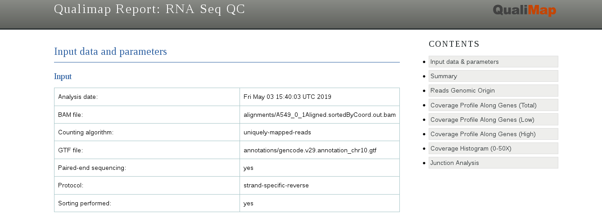
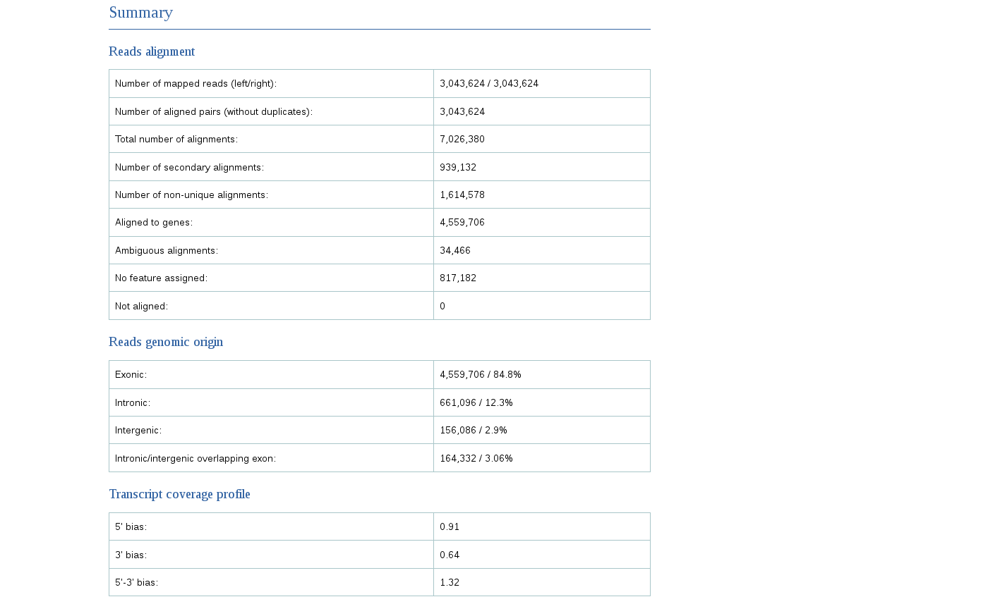
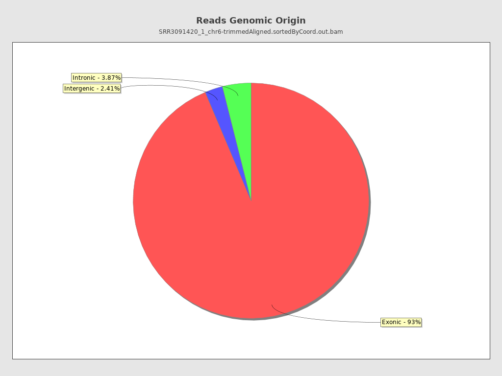
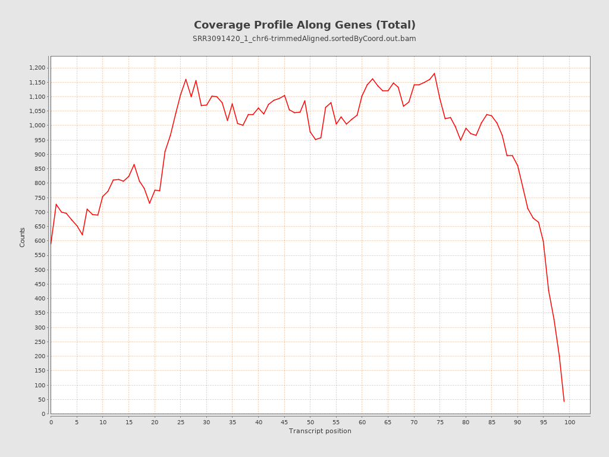

# Mapping using STAR
For the **STAR** running options, see [STAR Manual](http://labshare.cshl.edu/shares/gingeraslab/www-data/dobin/STAR/Releases/FromGitHub/Old/STAR-2.5.3a/doc/STARmanual.pdf).

<br/>

## Building the STAR index

To make an index for STAR, we need both the genome sequence in FASTA format and the annotation in GTF format. 
We will be building an index only for chromosome 10.

As STAR is very resource consuming, we will create an index for **chromosome 6 only**. We already downloaded the **FASTA** and **GTF** files needed for the indexing.

<br>

However, STAR requires **unzipped** .fa and .gtf files.

```{bash}
cd ~/rnaseq_course/reference_genome/
zcat Homo_sapiens.GRCh38.88.chr6.gtf.gz > Homo_sapiens.GRCh38.88.chr6.gtf
zcat Homo_sapiens.GRCh38.dna.chrom6.fa.gz > Homo_sapiens.GRCh38.dna.chrom6.fa
```

**Q. How much (in percentage) disk space is saved when those two files are kept zipped vs unzipped?**

**Once index is built, we have to not forget to remove those unzipped files!**


To index the genome with **STAR** for RNA-seq analysis, the **sjdbOverhang** option needs to be specified for detecting possible splicing sites. 
<br>
It usually equals the minimum read size minus 1; it tells **STAR** what is the maximum possible stretch of sequence that can be found on one side of a spicing site. In our case, since the read size is 51 bases, we can accept maximum 50 bases on one side and one base on the other of a splicing site; that is, to set up this parameter to **50**. 
<br>
This also means that for every different read-length to be aligned a new STAR index needs to be generated. Otherwise a drop in aligned reads can be experienced.

Building the STAR index (--runMode genomeGenerate):

```{bash}
cd ~/rnaseq_course/mapping
mkdir index_star_chr6

$RUN STAR --runMode genomeGenerate --genomeDir index_star_chr6 \
            --genomeFastaFiles ~/rnaseq_course/reference_genome/Homo_sapiens.GRCh38.dna.chrom6.fa \
            --sjdbGTFfile ~/rnaseq_course/reference_genome/Homo_sapiens.GRCh38.88.chr6.gtf \
            --sjdbOverhang 50 \
	    --outFileNamePrefix Hsapiens_chr6
```

Remove unzipped files:

```{bash}
rm ~/rnaseq_course/reference_genome/Homo_sapiens.GRCh38.dna.chrom6.fa
rm ~/rnaseq_course/reference_genome/Homo_sapiens.GRCh38.88.chr6.gtf
```
<br/>

## Aligning reads to the genome (and counting them at the same time!)
To use **STAR** for the read alignment (default --runMode option), we have to specify the following options:
* the index directory (**--genomeDir**)
* the read files (**--readFilesIn**)
* if reads are compressed or not (**--readFilesCommand**)

The following options are optional:
* type of output (**--outSAMtype**). Defaul is "BAM Unsorted"; STAR outputs unsorted Aligned.out.bam file(s). "The paired ends of an alignment are always adjacent, and multiple alignments of a read are adjacent as well. This ”unsorted” file cannot be directly used with downstream software such as HTseq, without the need of name sorting."
* the path for the output directory and prefix of all output files prefix (**--outFileNamePrefix**). By default, this parameter is ./, i.e. all output files are written in the current directory.
* (**--quantMode**). With **--quantMode GeneCounts** option STAR will count the number of reads per gene while mapping. A read is counted if it overlaps (1nt or more) one and only one gene. Both ends of the paired- end read are checked for overlaps. The counts coincide with those produced by htseq-count with default parameters. **This option requires annotations (GTF or GFF with –sjdbGTFfile option) used at the genome generation step, or at the mapping step.**" (from [STAR Manual](http://labshare.cshl.edu/shares/gingeraslab/www-data/dobin/STAR/Releases/FromGitHub/Old/STAR-2.5.3a/doc/STARmanual.pdf)) 

<br>

We can try to launch the mapping for one file:

```{bash}
cd ~/rnaseq_course/mapping

mkdir alignments

$RUN STAR --genomeDir index_star_chr6 \
      --readFilesIn ~/rnaseq_course/raw_data/? \
      --readFilesCommand zcat \
      --outSAMtype BAM SortedByCoordinate \
      --quantMode GeneCounts \
      --outFileNamePrefix alignments/?
```

If this was successful and not too slow and resource consuming, you can do it for all samples, in a **loop**:

```{bash}
for fastq in ~/rnaseq_course/raw_data/*chr6*fastq.gz
do echo $fastq
$RUN STAR --genomeDir index_star_chr6 \
      --readFilesIn $fastq \
      --readFilesCommand zcat \
      --outSAMtype BAM SortedByCoordinate \
      --quantMode GeneCounts \
      --outFileNamePrefix alignments/$(basename $fastq .fastq.gz)
```

**BACKUP !!**

If it was too resource consuming, you can download the aligned files in **BAM** format from:

```{bash}
wget https://public-docs.crg.es/biocore/projects/training/PHINDaccess2020/bam_chr6.tar.gz
```


Let's explore the output directory "alignments" (or "bam_chr6", if we used the backup).

```{bash}
ln -lh alignments
```

<br/>

## Read counts 
STAR outputs read counts per gene into **PREFIX**ReadsPerGene.out.tab file with 4 columns which correspond to different strandedness options:
column 1: gene ID
column 2: counts for unstranded RNA-seq
column 3: counts for the 1st read strand aligned with RNA (htseq-count option -s yes)
column 4: counts for the 2nd read strand aligned with RNA (htseq-count option -s reverse)

| | | | |   
| :----: | :----: | :----: |  :----: |
|gene id| read counts per gene (unstranded) | read counts per gene (read 1)|read counts per gene (read 2)| 
|N_unmapped|	26098|	26098|	26098|
|...|	...|	...|	...|
|ENSG00000261456.5|	13|	0|	13|
|...|	...|	...|	...|
|ENSG00000151240.16|	1652|	5|	1664|
|...|	...|	...|	...|


Select the output according to the strandedness of your data. Note, if you have stranded data and choose one of the columns 3 or 4, the other column (4 or 3) will give you the count of antisense reads. 

For example, in the stranded protocol shown in "Library preparation", Read 1 is mapped to the antisense strand (this is also true for single-end reads), while Read 2, to the sense strand.

**Which protocol, stranded or unstranded, was used for this RNA-seq data?**

```{bash}
more alignments/A549_0_1ReadsPerGene.out.tab

N_unmapped	26098	26098	26098
N_multimapping	337723	337723	337723
N_noFeature	211089	2547710	246034
N_ambiguous	151810	4514	32331
ENSG00000260370.1	0	0	0
ENSG00000237297.1	0	0	0
ENSG00000261456.5	13	0	13
ENSG00000232420.2	0	0	0
ENSG00000015171.19	6874	131	6743
ENSG00000276662.1	6	6	0
ENSG00000212331.1	0	0	0
ENSG00000151240.16	1652	5	1664
...
```

We can count the number of reads mapped to each strand by using a simple awk script:

```{bash}
grep -v "N_" alignments/A549_0_1ReadsPerGene.out.tab | awk '{unst+=$2;forw+=$3;rev+=$4}END{print unst,forw,rev}'

2343002 153677 2427536
```

It can be seen that only 153,677 Reads 1 (forward) were mapped to known genes; while 24,27,536 Reads 2 (reverse) were mapped to known genes.
This means that the protocol used for this mRNA-Seq experiment was stranded; and the reverse complement of mRNA was sequenced. 

<br/>

**EXERCISE** 
* Scroll the file alignments/A549_0_1ReadsPerGene.out.tab further to find genes for which read 1 count was much more than read 2 count. Why is it so? (look at the gene in Ensemble)
* Look up also a gene for which read 1 count was comparable with read 2 count. What can you tell about this gene?

<br/>

## BAM/SAM/CRAM format

The **BAM format** is a compressed version of the [**SAM format**](https://samtools.github.io/hts-specs/SAMv1.pdf) (which is a plain text) and cannot thus being seen as a text. To explore the BAM file, we have to convert it to the SAM format by using [**samtools**](http://samtools.sourceforge.net/). Note that we use the parameter **-h** to show also the header that is hidden by default. 

```{bash}
$RUN samtools view -h alignments/A549_0_1Aligned.sortedByCoord.out.bam | head -n 10
@HD	VN:1.4	SO:coordinate
@SQ	SN:chr10	LN:133797422
@PG	ID:STAR	PN:STAR	VN:2.7.0f	CL:STAR   --genomeDir indexes/chr10   --readFilesIn resources/A549_0_1chr10_1.fastq.gz   resources/A549_0_1chr10_2.fastq.gz      --readFilesCommand zcat      --outFileNamePrefix alignments/A549_0_1   --outSAMtype BAM   SortedByCoordinate      --quantMode GeneCounts   
@CO	user command line: STAR --genomeDir indexes/chr10 --readFilesIn resources/A549_0_1chr10_1.fastq.gz resources/A549_0_1chr10_2.fastq.gz --readFilesCommand zcat --outSAMtype BAM SortedByCoordinate --quantMode GeneCounts --outFileNamePrefix alignments/A549_0_1
D00137:453:HLFY2BCXY:2:1115:10428:98737	419	chr10	35442	3	13M174562N32M6S	=	236864	201473	AGCTGTTATTGAACAAGAAGGGATTGGTTGCCAGGAGATGAGATTAGCATT	@DDD?<1D1CGEE11<C@GHIIH?@E?G@CHH?FH@0GH@C<<<@1DFCHH	NH:i:2	HI:i:2	AS:i:74	nM:i:9
D00137:453:HLFY2BCXY:2:2208:10640:12788	419	chr10	37161	0	51M	=	37323	213	CCAATATTCAACATTCTTAAAGAAAAGAATGTTCAACCCAGAATTTCATAT	DABDDFHHIIIHCFHEHIEEHHHFFEHHIIH@GHHIIIIIIIIHIIHIIIH	NH:i:5	HI:i:5	AS:i:98	nM:i:1
D00137:453:HLFY2BCXY:2:2208:10640:12788	419	chr10	37161	0	51M	=	37323	213	CCAATATTCAACATTCTTAAAGAAAAGAATGTTCAACCCAGAATTTCATAT	DABDDFHHIIIHCFHEHIEEHHHFFEHHIIH@GHHIIIIIIIIHIIHIIIH	NH:i:5	HI:i:5	AS:i:98	nM:i:1
D00137:453:HLFY2BCXY:2:2208:10640:12788	339	chr10	37323	0	51M	=	37161	-213	GCACTAAACATGGAAAGGAACAACCGGTACCAGCCACTGCAAAATCATGCC	CHIHEIIHHHHHIIIHHGFCIIIHIIHIIHIIHGHIIGHIHHIIHHDDADD	NH:i:5	HI:i:5	AS:i:98	nM:i:1
D00137:453:HLFY2BCXY:2:2208:10640:12788	339	chr10	37323	0	51M	=	37161	-213	GCACTAAACATGGAAAGGAACAACCGGTACCAGCCACTGCAAAATCATGCC	CHIHEIIHHHHHIIIHHGFCIIIHIIHIIHIIHGHIIGHIHHIIHHDDADD	NH:i:5	HI:i:5	AS:i:98	nM:i:1
D00137:453:HLFY2BCXY:1:1214:7640:70489	419	chr10	37872	3	51M	=	37978	156	TGGGAGACTTTAACACCCCACTGTCAACATTAGACAGCTCAACAAGACAGA	DDDDDHDHIIIIIIIIIIIIIIHIIFHGIIIIIIIIIIIIGHIIIIIIIHI	NH:i:2	HI:i:1	AS:i:99	nM:i:0
```

The first part indicated by the first character **@** in each row is the header:

| Symbol|  |  |   
| :----: | :---- | :---- |
| **@HD** header line	| **VN:1.4** version of the SAM format|	**SO:coordinate** sorting order|
| **@SQ** reference sequence dictionary 	| **SN:chr10** sequence name|	**LN:133797422** sequence length|
| **@PG** program used|	**ID:STAR** **PN:STAR**	**VN:2.7.0f** version| **CL:STAR   --genomeDir indexes/chr10   --readFilesIn resources/A549_0_1chr10_1.fastq.gz   resources/A549_0_1chr10_2.fastq.gz      --readFilesCommand zcat      --outFileNamePrefix alignments/A549_0_1   --outSAMtype BAM   SortedByCoordinate      --quantMode GeneCounts** command line|
|**@CO** One-line text comment||**user command line: STAR --genomeDir indexes/chr10 --readFilesIn resources/A549_0_1chr10_1.fastq.gz resources/A549_0_1chr10_2.fastq.gz --readFilesCommand zcat --outSAMtype BAM SortedByCoordinate --quantMode GeneCounts --outFileNamePrefix alignments/A549_0_1**|

The rest is a read alignment. 

| Field|Value |   
| :----: | :---- |
|Query name 	|D00137:453:HLFY2BCXY:2:1115:10428:98737|
|FLAG 	|419 * |
|Reference name 	|chr10|
|Leftmost mapping position (1-based)	|35442|
|Mapping quality 	|3 *(p=0.5)* |
|CIGAR string |13M174562N32M6S *|
|Reference sequence name of the primary alignment of the mate |	= *same chromosome*|
|Position of the primary alignment of the mate| 	236864|
|observed fragment length| 	201473|
|Sequence |AGCTGTTATTGAACAAGAAGGGATTGGTTGCCAGGAGATGAGATTAGCATT|
|Quality	|@DDD?<1D1CGEE11<C@GHIIH?@E?G@CHH?FH@0GH@C<<<@1DFCHH|

\* FLAG 419 means: read paired, read mapped in proper pair, mate on the reverse strand, second in pair, not primary alignment. 
SIGAR string 13M174562N32M6S means 13 bases equal to the reference (M), 174562 bases were not mapping (that is, 1 insertion) (N), 32 bases were mapped (M), and 6 bases were soft clipped (S).
You can use [this website for the translation of FLAG and SIGAR values into plain English](http://blog.biochen.com/FlagExplain.html).

Extra fields are often present and differ among aligner tools [https://samtools.github.io/hts-specs/SAMtags.pdf](https://samtools.github.io/hts-specs/SAMtags.pdf). In our case we have:

| Field|Meaning |   
| :----: | :---- |
|NH:i:2|number of mapping to the reference|
|HI:i:2|which alignment is the reported one (in this case is the second one)|	
|AS:i:74|Alignment score calculate by the aligner|
|nM:i:9|number of difference with the reference*|

\* *Note that historically this has been ill-defined and both data and tools exist that disagree with this
definition.*

<br/>

Let's convert BAM to SAM:

```{bash}
$RUN samtools view -h alignments/A549_0_1Aligned.sortedByCoord.out.bam > alignments/A549_0_1.sam

ls -alht alignments/A549_0_1*[sb]am
-rw-r--r-- 1 lcozzuto Bioinformatics_Unit 1.5G May  2 18:34 A549_0_1.sam
-rw-r--r-- 1 lcozzuto Bioinformatics_Unit 320M Apr 30 18:55 A549_0_1Aligned.sortedByCoord.out.bam
```

You can see that the SAM file is 5 times larger than the BAM file. 
Yet, the more efficient way to store the alignment is to use the [**CRAM format**](https://samtools.github.io/hts-specs/CRAMv3.pdf). CRAM is fully compatible with BAM, and main repositories, such as GEO and SRA, accept alignments in the CRAM format. [UCSC Genome Browser can visualize both BAM and CRAM files](https://genome.ucsc.edu/goldenPath/help/cram.html). It is now a widly recommended format for storing alignments.
To convert **BAM** to **CRAM**, we have to provide unzipped and indexed version of the genome.

```{bash}
$RUN samtools faidx annotations/Homo_sapiens.GRCh38.dna.chromosome.10.fa

$RUN samtools view -C alignments/A549_0_1Aligned.sortedByCoord.out.bam -T annotations/Homo_sapiens.GRCh38.dna.chromosome.10.fa > alignments/A549_0_1.cram

ls -alht A549_0_1*.*am
-rw-r--r-- 1 lcozzuto Bioinformatics_Unit 1.5G May  2 18:59 A549_0_1.sam
-rw-r--r-- 1 lcozzuto Bioinformatics_Unit 167M May  2 18:58 A549_0_1.cram
-rw-r--r-- 1 lcozzuto Bioinformatics_Unit 320M Apr 30 18:55 A549_0_1Aligned.sortedByCoord.out.bam
```

You can see that a .cram file is as twice as smaller than a .bam file.
Let's remove the .sam file:
```{bash}
rm alignments/*.sam 
```

<br/>

## Alignment QC
The quality of the resulting alignment can be checked using the tool [**QualiMap**](http://qualimap.bioinfo.cipf.es/). To run QualiMap, we specify the kind of analysis (**rnaseq**), the presence of paired-end reads within the bam file (**-pe**) and the strand of the library (**-p strand-specific-reverse**). 

**IMPORTANT**: before running QualiMap ensure enough disk space for a temporary directory ./tmp that the program is required, running the following command:
```{bash}
export _JAVA_OPTIONS="-Djava.io.tmpdir=./tmp -Xmx6G"
```

<br/>

```{bash}
$RUN qualimap rnaseq -pe -bam alignments/A549_0_1Aligned.sortedByCoord.out.bam \
	-gtf annotations/gencode.v29.annotation_chr10.gtf \
	-outdir QC -p strand-specific-reverse
  
Java memory size is set to 1200M
Launching application...

OpenJDK 64-Bit Server VM warning: ignoring option MaxPermSize=1024m; support was removed in 8.0
QualiMap v.2.2.1
Built on 2016-10-03 18:14
....  
```

We can check the final report in a browser:

```{bash}
firefox QC/qualimapReport.html
```


The report gives a lot of useful information, such as the total number of mapped reads, the amount of reads mapped to exons, introns or intergenic regions, and the bias towards one of the ends of mRNA (that can give information about RNA integrity or a protocol used). 



Looking at the gene coverage we can see a bias towards 5'-end that is compatible with the kind of stranded protocol used.



Finally, we can see that the majority of reads map to the exons.



<br/>

**IMPORTANT for running QualiMap on many samples (for detail, see [QualiMap documentation](http://qualimap.bioinfo.cipf.es/doc_html/command_line.html#rna-seq-qc)**
* Make sure to give to the output folder the name corresponding to a running sample; e.g., ./QC/A549_0_1; otherwise you will end up with files and folders for the last running sample only. 
* If you run QualiMap in parallel for many samples, make sure to create a different tmp-folder for each sample; e.g., ./tmp/A549_0_1.
* QualiMap sorts BAM files by read names. To speed up this part of the program execution, you can use samtools to sort the BAM files in parallel and using multiple CPUs and then to give to QualiMap a BAM file sorted by read names and provide an option --sorted.

<br/>

